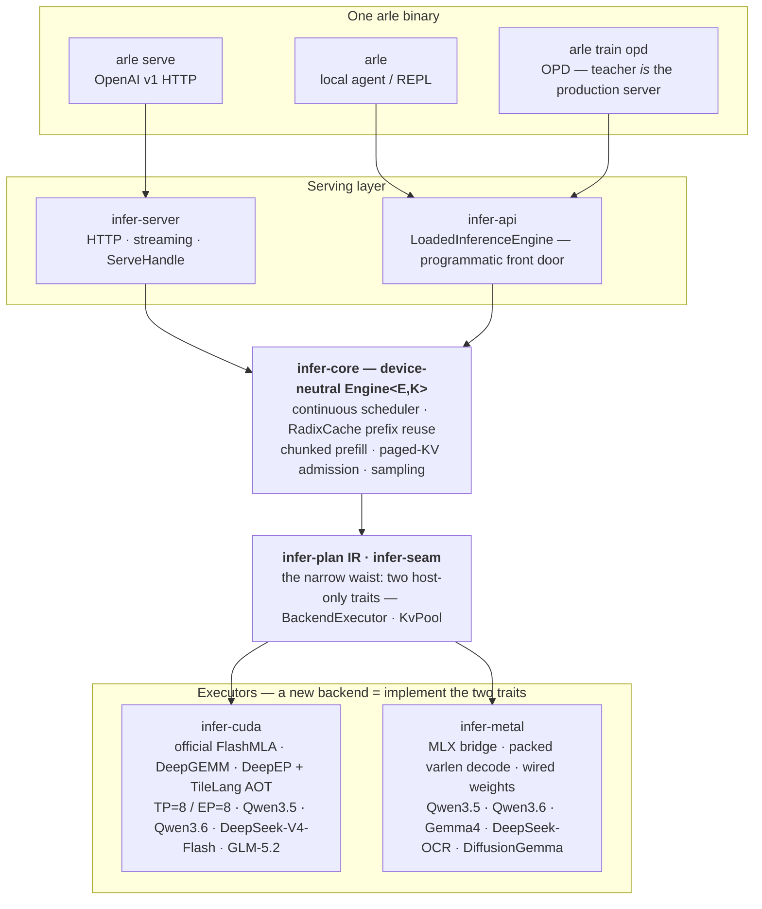

<p align="center">
  
</p>

<p align="center">
  <b>One pure-Rust binary that serves LLMs (OpenAI-compatible), runs local agents, and distills them on their own rollouts — on Apple Silicon <em>and</em> NVIDIA. No Python on the hot path.</b>
</p>

<p align="center">
  <sub>35B-A3B MoE at <b>85 tok/s</b> on a MacBook · <b>bit-identical</b> speculative decode · OPD lifts a 4B student <b>+27pp</b> on MATH-500</sub>
</p>

<p align="center">
  <a href="https://cklxx.github.io/arle/"></a>
  <a href="https://github.com/cklxx/arle/actions/workflows/ci.yml"></a>
  <a href="https://github.com/cklxx/arle/actions/workflows/metal-ci.yml"></a>
  <a href="LICENSE"></a>
  <a href="https://github.com/cklxx/arle/releases"></a>
</p>

<p align="center">
  <a href="#quick-start">Quick Start</a> ·
  <a href="docs/http-api.md">HTTP API</a> ·
  <a href="docs/support-matrix.md">Support Matrix</a> ·
  <a href="docs/onboarding.md">Onboarding</a> ·
  <a href="docs/architecture.md">Architecture</a> ·
  <a href="ROADMAP.md">Roadmap</a> ·
  <a href="CHANGELOG.md">Changelog</a>
</p>

<p align="center">
  <strong>English</strong> · <a href="README.zh-CN.md">简体中文</a>
</p>

---

## Quick Start

```bash
# Apple Silicon — Homebrew
brew install cklxx/tap/arle

# Apple Silicon or Linux x86_64 — one-line installer
curl -fsSL https://github.com/cklxx/arle/releases/latest/download/install.sh | sh

# Linux + NVIDIA — Docker, no compile
docker run --rm --gpus all -p 8000:8000 -v /path/to/Qwen3.5-4B:/model:ro \
  ghcr.io/cklxx/arle:latest serve --backend cuda --model-path /model

# Serve
arle serve --backend cuda  --model-path /path/to/Qwen3.5-4B --port 8000
arle serve --backend metal --model-path mlx-community/Qwen3.5-0.8B-MLX-4bit --port 8000
```

```python
from openai import OpenAI
client = OpenAI(base_url="http://localhost:8000/v1", api_key="not-needed")
print(client.chat.completions.create(
    model="qwen3.5-4b",
    messages=[{"role": "user", "content": "Hello from ARLE"}],
).choices[0].message.content)
```

Build from source, full install matrix, uninstall: [docs/install.md](docs/install.md) · more copy-paste: [`examples/`](examples/).

`arle` is one binary:

| Command | What it does |
|---|---|
| `arle` (no args) | Picks a model, serves it, hands the session to the [Eli](https://github.com/cklxx/eli) agent — or a built-in `python`/`shell` REPL if Eli's absent. `--agent arle` forces the REPL; `--gateway` runs Eli's serve mode. |
| `arle run --prompt "…"` | One-shot agent prompt. `--no-tools` to disable tools. |
| `arle serve --backend …` | OpenAI-compatible HTTP server. |
| `arle train opd` | **On-Policy Distillation** — teacher on the serving runtime, student in `train`. [Manual](docs/projects/2026-05-21-arle-opd-cuda-usage-manual.md). |
| `arle --doctor [--json]` | Backend / hardware / model-resolution self-check. |

<sub><b>Eli is an optional runtime dependency</b> — found via <code>$ELI_BIN</code>, <code>PATH</code>, or a sibling <code>../eli</code> build, never a Cargo dep. Without it <code>arle</code> uses its own REPL; with it, arle drives Eli through its keyless <code>local</code> provider, leaving <code>~/.eli/config.toml</code> untouched.</sub>

---

## Performance

Measured on the runtime, not projected — fresh `arle serve` benches, one binary.

**Apple Silicon — one M4 Pro laptop (48 GB), single user.** A 35B-A3B MoE decodes as fast as the 4B dense and 1.7× the 9B, because only ~3B params activate per token:

| Model · Metal 4-bit | Decode | TPOT | TTFT |
|---|---:|---:|---:|
| Qwen3.5-0.8B | **318 tok/s** | 3.2 ms | 0.17 s |
| Qwen3.5-4B | 84 tok/s | 11.9 ms | 0.82 s |
| Qwen3.5-9B | 50 tok/s | 20.0 ms | 1.45 s |
| **Qwen3.6-35B-A3B** · MoE | **85 tok/s** | 11.7 ms | 1.23 s |

<sub>512-in / 128-out · c=1 · temp=0 · M4 Pro · build <code>4ea77e11</code> · decode = single-stream generation rate · <a href="benchmarks/README.md">snapshot + method</a></sub>

**Speculative decode beats the HBM-bandwidth wall.** Qwen3.6-27B (OptiQ 4/8-bit): the model's own NextN/MTP head drafts, the base verifies, **output bit-identical to greedy** — **12.3 → 17.75 tok/s (+44%)**, past the 15.2 tok/s HBM floor no kernel can reach.

<sub>Quality held: PPL 7.82 (vs 8.56 uniform-4bit) · 68.8% draft acceptance · default-on, <code>--no-speculative</code> to disable.</sub>

**NVIDIA — DeepSeek-V4-Flash, 8×H20 (TP=8 / EP=8, FP8 MoE).** B=1 decode **53 tok/s** (prefill 23 ms); the concurrent batched-decode lane adds **+48%** at c=8. Qwen3.6 FP8 MoE now serves on CUDA too (batched paged decode, tok/s scales c=1→8).

<p align="center">
  
</p>
<p align="center"><sub>DSv4 B=1 decode, <b>33.5 → 53.3 tok/s</b> across the 2026-06-13 → 06-14 campaign — every step traced to a <code>docs/experience/wins/</code> entry.</sub></p>

**On-Policy Distillation lifts the student on its own rollouts** — the teacher *is* the production server. Qwen3.5-4B: MATH-500 **+27pp** (0.518 → 0.792, CI-separated) · BFCL-live abstention **0.60 → 1.00**. 27B on **Terminal-Bench**: pass@1 **+5.1pp** (20.5 → 25.6%), the gradient being output-format conformance.

<p align="center">
  
</p>
<p align="center"><sub>TB-OPD distill loss, 27B student · 41 records × 3 epochs · <b>0.2165 → 0.1796 → 0.1453</b>. <a href="docs/experience/wins/2026-06-20-opd-multiseed-math500-lock.md">MATH</a> · <a href="docs/experience/wins/2026-07-07-terminal-bench-opd-format-distill-lift.md">Terminal-Bench</a></sub></p>

**Stability:** CUDA **Stable** · Metal **Beta** (DFlash + Qwen3.6 NextN-MTP: bit-identical spec decode) · OPD train **Beta** (~2× vs HF TRL `GKDTrainer` — measured 2.04–2.49× on Qwen3-0.6B; LoRA fits 4 GB cards) · CPU dev-only. Models: Qwen3-dense + Qwen3.5/3.6 (hybrid · MoE) on CUDA + Metal · DeepSeek-V4-Flash + GLM-5.2 (CUDA 8×H20 TP=8/EP=8; GLM-5.2 verify pending) · Qwen3.6 + Gemma4 · DeepSeek-OCR VLMs + DiffusionGemma (Metal). Full tiers: [support-matrix](docs/support-matrix.md) · [stability-policy](docs/stability-policy.md).

---

## Why ARLE

Agent and RL workloads waste compute re-processing the same prompt + history + tool output every turn. ARLE fixes this once and shares the fix across serving and training:

- **KV stays hot across turns.** Prior-turn KV stays on GPU so only new tokens prefill; prefix pages are shared across requests via the host radix cache, demote to a host-RAM tier under pressure (opt-in disk spill), and promote back on the next hit instead of re-prefilling. ([support-matrix §4b](docs/support-matrix.md#4b-multi-turn-kv-reuse--tiered-kv-matrix))
- **Quantized KV on CUDA.** INT8/FP8/INT4 paged-KV kernels behind a `--kv-cache-dtype` serve flag — correctness-gated, opt-in (default stays BF16).
- **KV-recall = long-context memory (Metal, opt-in).** Past the window, decode attends only `sink + recent + top-k recalled` older blocks (scored by key relevance), not the whole history. On Qwen3.6-35B a mid-context passkey resolves at **9.6% of the KV, identical to full attention** — where sliding-window truncation forgets it ([note](docs/notes/2026-06-23-kv-as-infinite-memory.md)). Behind `--kv-recall` (default off).
- **One runtime, three surfaces.** Serving, the local agent, and OPD training run the same Rust + model code — the OPD teacher *is* the production server.



Deep dive: [onboarding](docs/onboarding.md) (30 min) · [architecture](docs/architecture.md) · [codebase-map](docs/codebase-map.md).

---

## Documentation

[http-api](docs/http-api.md) · [support-matrix](docs/support-matrix.md) · [architecture](docs/architecture.md) · [codebase-map](docs/codebase-map.md) · [environment](docs/environment.md) · [troubleshooting](docs/troubleshooting.md) · [comparison vs vLLM / SGLang / mistral.rs / llama.cpp](docs/comparison.md) · [CONTRIBUTING](CONTRIBUTING.md) · [docs/index.md](docs/index.md)

---

## License

[MIT](LICENSE)
