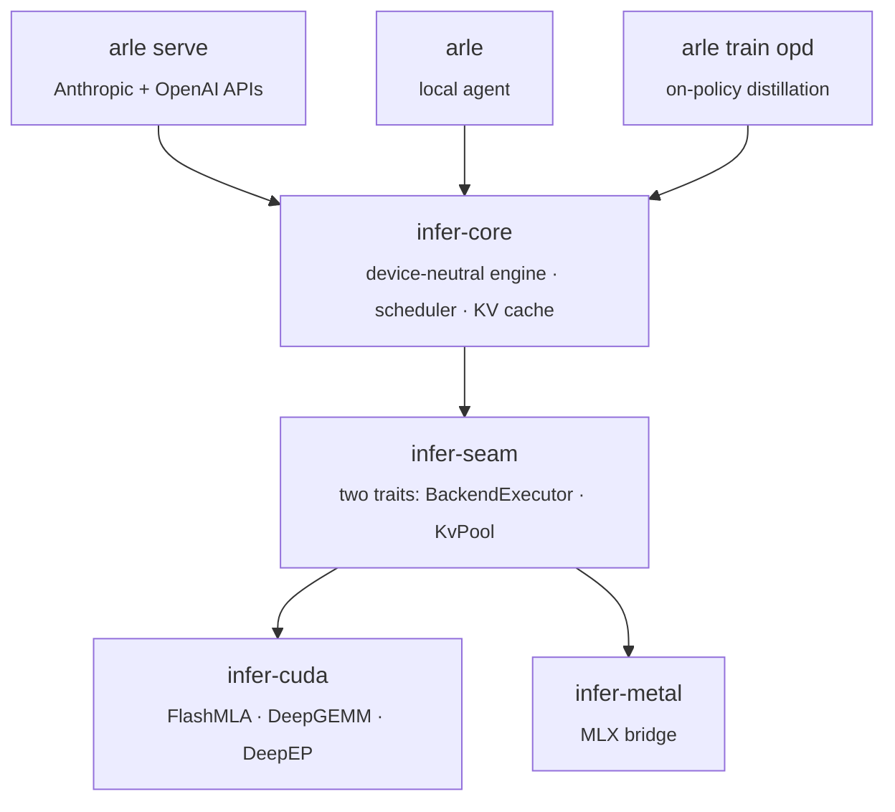

<p align="center">
 
</p>

<p align="center">
 <b>The local inference server for coding agents.</b><br>
 Pure Rust, one binary, Apple Silicon and NVIDIA. Anthropic and OpenAI APIs. The KV cache survives across turns, so turn 20 starts as fast as turn 2.
</p>

<p align="center">
 <a href="https://acupof-ai.github.io/arle/"></a>
 <a href="https://github.com/acupof-ai/arle/actions/workflows/ci.yml"></a>
 <a href="https://github.com/acupof-ai/arle/actions/workflows/metal-ci.yml"></a>
 <a href="LICENSE"></a>
 <a href="https://github.com/acupof-ai/arle/releases"></a>
</p>

<p align="center">
 <a href="#quick-start">Quick Start</a> ·
 <a href="#why-turns-stay-fast">Why turns stay fast</a> ·
 <a href="#performance">Performance</a> ·
 <a href="docs/http-api.md">HTTP API</a> ·
 <a href="docs/support-matrix.md">Support Matrix</a> ·
 <a href="docs/architecture.md">Architecture</a> ·
 <a href="CHANGELOG.md">Changelog</a>
</p>

<p align="center">
 <strong>English</strong> · <a href="README.zh-CN.md">简体中文</a>
</p>

---

## Quick Start

### 1. Install

```bash
# Apple Silicon (Homebrew)
brew install cklxx/tap/arle

# Apple Silicon or Linux x86_64 (one-line installer)
curl -fsSL https://github.com/acupof-ai/arle/releases/latest/download/install.sh | sh

# Linux + NVIDIA (Docker, no compile needed)
docker run --rm --gpus all -p 8000:8000 -v $PWD/models:/models:ro \
 ghcr.io/acupof-ai/arle:latest serve --backend cuda --model-path /models/Qwen3.6-27B
```

### 2. Serve a model

```bash
# MacBook: a 35B mixture-of-experts model in 4-bit (~19 GB), fetched from Hugging Face on first run
arle serve --backend metal --model-path mlx-community/Qwen3.6-35B-A3B-4bit --port 8000

# NVIDIA
arle serve --backend cuda --model-path /path/to/Qwen3.6-27B --port 8000
```

### 3. Point your agent at it

```bash
# Claude Code (Anthropic Messages API, streaming, tool use)
ANTHROPIC_BASE_URL=http://localhost:8000 ANTHROPIC_API_KEY=local claude

# Anything that speaks the OpenAI API (opencode, aider, the openai SDK, ...)
export OPENAI_BASE_URL=http://localhost:8000/v1 OPENAI_API_KEY=local
```

```python
from openai import OpenAI
client = OpenAI(base_url="http://localhost:8000/v1", api_key="local")
print(client.chat.completions.create(
 model="default",
 messages=[{"role": "user", "content": "Hello from ARLE"}],
).choices[0].message.content)
```

> **Source builds need a backend.** `cargo build --release` alone produces a CLI-only binary.
> Add `--features cuda` (NVIDIA) or `--no-default-features --features metal,no-cuda,cli` (Apple Silicon).
> See [docs/install.md](docs/install.md).

### One binary, four modes

| Command | What it does |
|---|---|
| `arle serve --backend …` | HTTP server: Anthropic `/v1/messages` and OpenAI `/v1/chat/completions`, both streaming. |
| `arle` | Interactive REPL with a built-in tool-using agent. |
| `arle run --prompt "…"` | One-shot agent execution. `--no-tools` to disable tools. |
| `arle train opd` | On-Policy Distillation: a student model trains on its own rollouts, scored by a teacher running on this same server. |
| `arle --doctor` | Backend / hardware / model self-check. |

Full install matrix, uninstall, and build from source: [docs/install.md](docs/install.md) · Examples: [`examples/`](examples/).

---

## Why turns stay fast

A coding agent re-sends the whole conversation every turn: system prompt, every prior tool result, every prior reply. Most local servers re-run prefill over all of it. ARLE keeps the prior turn's KV on the accelerator, shares prefix pages across requests through a radix cache, and re-prefills only the tokens the new turn added.

Same machine, same weights, 12-turn agent-shaped conversation (a 4.8K-token system prompt, then one ~350-token tool result per turn, 8.6K tokens by turn 12). Time to first token per turn:

| Qwen3.5-0.8B 4-bit · M4 Pro 48 GB | Turn 1 (cold) | Turns 2–12 (median) | Turn 12 |
|---|---:|---:|---:|
| **ARLE** `arle serve --backend metal` | 1.95 s | **180 ms** | 202 ms |
| mlx-lm `mlx_lm.server --prompt-cache-size 4` (0.31.2) | 1.26 s | 249 ms | 248 ms |

<sub>Greedy, identical request bytes for both servers, 2026-09-02 · script: <code>scripts/bench_multiturn_ttft.py</code> · method and raw rows: <a href="docs/experience/wins/2026-09-02-metal-prefix-restore-survives-turns.md">wins entry</a>. ARLE's cold prefill is slower on this model; the per-turn number is what a 20-turn session feels. The same table on Qwen3.6-35B-A3B is pending a machine without swap pressure.</sub>

Restored turns are greedy-identical to cold prefill (needle ladder 115–8000 tokens ×3, every length deterministic).

On CUDA the same cache demotes prefix pages to host RAM under memory pressure and promotes them back on the next hit. INT8/FP8 paged KV is available behind `--kv-cache-dtype` (Qwen3.5/3.6 family, opt-in).

---

## Performance

Measured on real hardware. Headline rows only; every number resolves to a snapshot in [benchmarks/](benchmarks/README.md) or a dated entry in [docs/experience/wins/](docs/experience/wins/).

### Apple Silicon (M4 Pro, 48 GB, single stream)

The 35B mixture-of-experts model decodes as fast as the 4B dense model: only ~3B parameters activate per token.

| Model (Metal 4-bit) | Decode | Time per token | Time to first token (512-token prompt) |
|---|---:|---:|---:|
| Qwen3.5-0.8B | **318 tok/s** | 3.2 ms | 0.17 s |
| Qwen3.5-4B | 84 tok/s | 11.9 ms | 0.82 s |
| Qwen3.5-9B | 50 tok/s | 20.0 ms | 1.45 s |
| **Qwen3.6-35B-A3B (MoE)** | **85 tok/s** | 11.7 ms | 1.23 s |

Speculative decoding on Qwen3.6-27B: the model's own multi-token-prediction head drafts, the base model verifies. Output is bit-identical to greedy, decode goes 12.3 → 17.75 tok/s (+44%), past the 15.2 tok/s memory-bandwidth ceiling a single-token decoder cannot cross.

### NVIDIA (one H20, 32K-token multi-turn agent prompts)

| Qwen3.6 · per-request decode tok/s | c=1 | c=8 | c=16 |
|---|---:|---:|---:|
| 35B-A3B MoE | 149.3 | 27.7 | 15.1 |
| 27B dense + block-drafter speculative decode (DSpark) | **91.8** | 20.5 | 11.2 |

Against SGLang 0.5.13 on the same GPU and the same quantized kernel (Qwen3.6-27B, 33K prompt, one request): decode 16.69 ms per token vs 17.16 ms (2.8% faster); prefill 25.0 s vs 21.0 s (19% slower, being worked on).

Also served on CUDA: DeepSeek-V4-Flash (2×, 4×, 8×H20; FP8 and 4-bit expert weights) and Qwen3.8-27B in NVFP4 (24% fewer bytes than FP8, +5 to +21% decode at c=1–16). Full rows, configs, and the CUDA-graph and quantization details: [docs/baselines.md](docs/baselines.md).

### On-Policy Distillation

The teacher is this server. The student trains on its own rollouts:

- Qwen3.5-4B: MATH-500 **+27pp** (0.518 → 0.792)
- Qwen3.5-27B: Terminal-Bench pass@1 **+5.1pp** (20.5 → 25.6%)

Method and raw data: [benchmarks/README.md](benchmarks/README.md) · [docs/experience/wins/](docs/experience/wins/).

---

## Architecture

One runtime, three surfaces, two backends. Serving, the local agent, and OPD training run the same Rust and model code; the OPD teacher is the production server.



A new backend implements the two seam traits; the scheduler, cache, and server do not change.

Deep dive: [docs/onboarding.md](docs/onboarding.md) (30 min) · [docs/architecture.md](docs/architecture.md) · [docs/codebase-map.md](docs/codebase-map.md).

---

## Status

| | CUDA | Metal | OPD Train |
|---|---|---|---|
| **Stability** | Stable | Beta | Beta |
| **Models** | Qwen3.5/3.6/3.8, DeepSeek-V4-Flash, GLM-5.2 | Qwen3-dense, Qwen3.5/3.6, DeepSeek-OCR | CUDA models |

Full tiers: [docs/support-matrix.md](docs/support-matrix.md) · [docs/stability-policy.md](docs/stability-policy.md).

---

## Documentation

[HTTP API](docs/http-api.md) · [Support Matrix](docs/support-matrix.md) · [Architecture](docs/architecture.md) · [Codebase Map](docs/codebase-map.md) · [Environment](docs/environment.md) · [Troubleshooting](docs/troubleshooting.md) · [Contributing](CONTRIBUTING.md) · [All docs](docs/index.md)

---

## License

[MIT](LICENSE)
