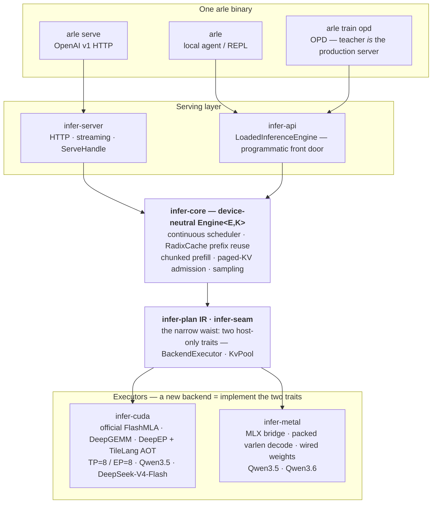

<p align="center">
  
</p>

<p align="center">
  <em>Pure-Rust runtime for serving, local agents, On-Policy Distillation, and evaluation. <code>arle serve</code> is the OpenAI-compatible serving path; <code>arle</code> is the unified front door.</em>
</p>

<p align="center">
  <a href="https://cklxx.github.io/arle/"></a>
  <a href="https://github.com/cklxx/arle/actions/workflows/ci.yml"></a>
  <a href="https://github.com/cklxx/arle/actions/workflows/metal-ci.yml"></a>
  <a href="LICENSE"></a>
  <a href="https://github.com/cklxx/arle/releases"></a>
</p>

<p align="center">
  <a href="#quick-start">Quick Start</a> ·
  <a href="docs/http-api.md">HTTP API</a> ·
  <a href="docs/support-matrix.md">Support Matrix</a> ·
  <a href="docs/onboarding.md">Onboarding</a> ·
  <a href="docs/architecture.md">Architecture</a> ·
  <a href="ROADMAP.md">Roadmap</a> ·
  <a href="CHANGELOG.md">Changelog</a>
</p>

<p align="center">
  <strong>English</strong> · <a href="README.zh-CN.md">简体中文</a>
</p>

---

## Quick Start

```bash
# Apple Silicon — Homebrew
brew install cklxx/tap/arle

# Apple Silicon or Linux x86_64 — one-line installer
curl -fsSL https://github.com/cklxx/arle/releases/latest/download/install.sh | sh

# Linux + NVIDIA — Docker, no compile
docker run --rm --gpus all -p 8000:8000 -v /path/to/Qwen3.5-4B:/model:ro \
  ghcr.io/cklxx/arle:latest serve --backend cuda --model-path /model

# Serve
arle serve --backend cuda  --model-path /path/to/Qwen3.5-4B --port 8000
arle serve --backend metal --model-path mlx-community/Qwen3.5-0.8B-MLX-4bit --port 8000
```

```python
from openai import OpenAI
client = OpenAI(base_url="http://localhost:8000/v1", api_key="not-needed")
print(client.chat.completions.create(
    model="qwen3.5-4b",
    messages=[{"role": "user", "content": "Hello from ARLE"}],
).choices[0].message.content)
```

Build from source, full install matrix, uninstall: [docs/install.md](docs/install.md) · more copy-paste: [`examples/`](examples/).

`arle` is one binary:

| Command | What it does |
|---|---|
| `arle` (no args) | Interactive agent REPL with `python` and `shell` tools. |
| `arle run --prompt "…"` | One-shot agent prompt. `--no-tools` to disable tools. |
| `arle serve --backend …` | OpenAI-compatible HTTP server. |
| `arle train opd` | **On-Policy Distillation** — teacher on the serving runtime, student in `train`. [Manual](docs/projects/2026-05-21-arle-opd-cuda-usage-manual.md). |
| `arle --doctor [--json]` | Backend / hardware / model-resolution self-check. |

---

## Status at a glance

| Backend | Platform | Status | Headline |
|---|---|:---:|---|
| **CUDA** | Linux + NVIDIA | **Stable** | 197 tok/s on L4 (Qwen3.5-4B BF16, c=16) |
| **Metal** | Apple Silicon | **Beta** | 85.6 tok/s on M4 Pro (Qwen3.6 35B-A3B 4-bit) |
| **Metal DFlash** | Apple Silicon | **Beta** | Bit-identical spec decode for Qwen3.5 |
| **OPD train (CUDA)** | Linux + NVIDIA | **Beta** | 2.49–2.91× faster than HF TRL `GKDTrainer`; LoRA fits 4 GB cards |
| **CPU** | Portable | **Dev-only** | Smoke tests only |

Models: **Qwen3.5 family** (CUDA + Metal) · **Qwen3.6** (Metal) · **DeepSeek-V4-Flash** (CUDA 8×H20, TP=8 / EP=8 FP8 — prefill 23 ms, B=1 decode 15 ms/token). Full tiers: [support-matrix](docs/support-matrix.md) · [stability-policy](docs/stability-policy.md).

---

## Why ARLE

Agent and RL workloads waste compute re-processing the same prompt + history + tool output every turn. ARLE fixes this once and shares the fix across serving and training:

- **KV stays hot across turns.** Prior-turn KV stays in its slot on GPU so only new tokens prefill; page-aligned prefix pages are shared across requests through the host radix cache. Under memory pressure, evicted prefix blocks demote into a host-RAM tier (default-on, 4 GiB; `--kv-t1-budget-bytes 0` opts out) with opt-in disk spill (`--kv-ssd-path`), and promote back on the next hit instead of re-prefilling — preempted requests get the same treatment (Qwen3-dense CUDA today, pod gate pending; DSv4/hybrid via #85 — [support-matrix §4b](docs/support-matrix.md#4b-multi-turn-kv-reuse--tiered-kv-matrix)).
- **Quantized KV on CUDA.** INT8/FP8/INT4 paged-KV kernels ship in `cuda-kernels`; the rewrite serve flag (`--kv-cache-dtype`) re-lands with the model-generic parity gate (#68).
- **One runtime, three surfaces.** Serving, the local agent, and OPD training run the same Rust + model code — the OPD teacher *is* the production server.



Deep dive: [onboarding](docs/onboarding.md) (30 min) · [architecture](docs/architecture.md) · [codebase-map](docs/codebase-map.md).

---

## Latest Updates

<!-- Breakthrough-only headlines (shipped capability / perf wins). Research notes + retractions live in docs/. -->

**2026-06-10 — Phase 0 debt cleared:** DSv4 256K boots + needle-exact @230K, admission on real KV budgets, KV-parity gate re-ported (FlashMLA decode licensed) — Phase 1 batched serving lane is next ([#55](https://github.com/cklxx/arle/issues/55)).

**2026-06-08 — DeepSeek-V4-Flash B=1: prefill 23 ms, decode 27 → 15 ms/token** (8×H20, TP=8 / EP=8, FP8 MoE). Official DSA indexer flattens decode across context (4.8× @4k), tensor-core DeepGEMM projections (−94% per stage), MTP batched verify **+71% decode tok/s** — byte-identical. [FINAL report](docs/experience/wins/2026-06-08-dsv4-decode-6ms-FINAL-consolidated.md).

<p align="center">
  
</p>

Older history: [CHANGELOG.md](CHANGELOG.md).

---

## Documentation

[http-api](docs/http-api.md) · [support-matrix](docs/support-matrix.md) · [architecture](docs/architecture.md) · [codebase-map](docs/codebase-map.md) · [environment](docs/environment.md) · [troubleshooting](docs/troubleshooting.md) · [comparison vs vLLM / SGLang / mistral.rs / llama.cpp](docs/comparison.md) · [CONTRIBUTING](CONTRIBUTING.md) · [docs/index.md](docs/index.md)

---

## License

[MIT](LICENSE)
