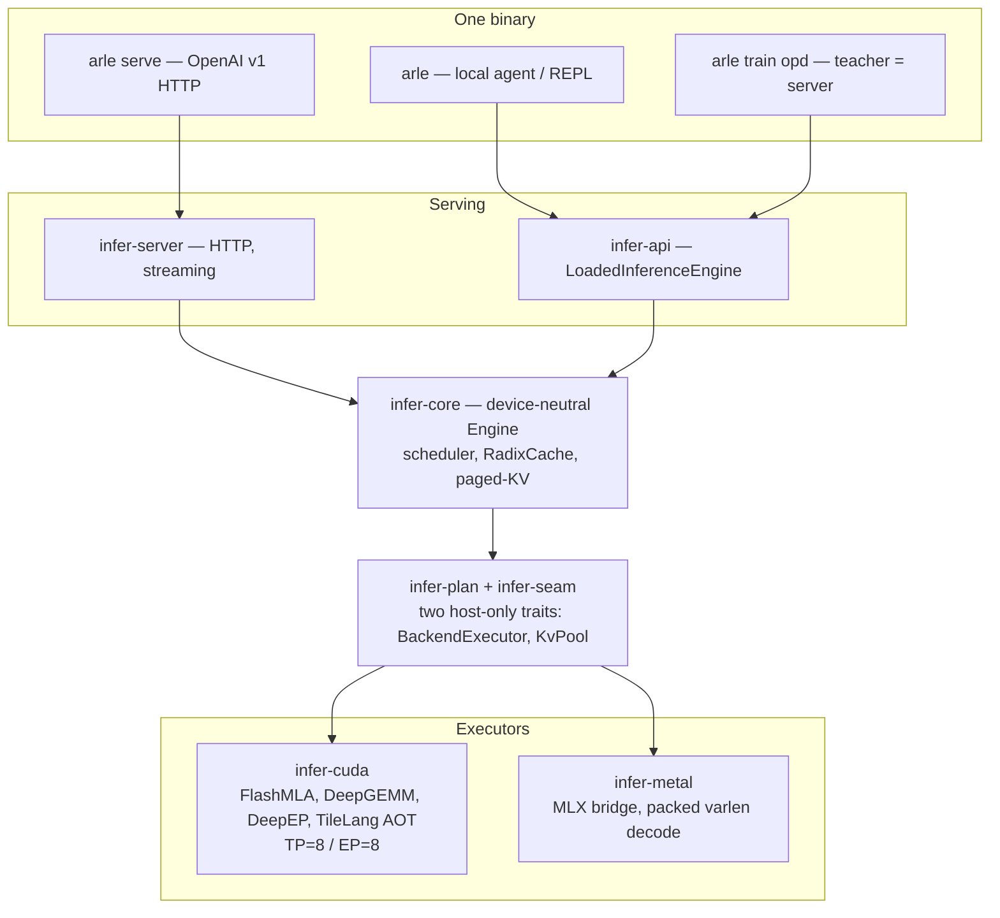

<p align="center">
  
</p>

<p align="center">
  <b>Pure-Rust LLM engine: serving, agents, and on-policy distillation — on Apple Silicon and NVIDIA. No Python on the hot path.</b>
</p>

<p align="center">
  <sub>35B MoE at <b>85 tok/s</b> on a MacBook · <b>bit-identical</b> speculative decode · OPD lifts 4B student <b>+27pp</b> on MATH-500</sub>
</p>

<p align="center">
  <a href="https://cklxx.github.io/arle/"></a>
  <a href="https://github.com/cklxx/arle/actions/workflows/ci.yml"></a>
  <a href="https://github.com/cklxx/arle/actions/workflows/metal-ci.yml"></a>
  <a href="LICENSE"></a>
  <a href="https://github.com/cklxx/arle/releases"></a>
</p>

<p align="center">
  <a href="#quick-start">Quick Start</a> ·
  <a href="#performance">Performance</a> ·
  <a href="#why-arle">Why ARLE</a> ·
  <a href="docs/http-api.md">HTTP API</a> ·
  <a href="docs/support-matrix.md">Support Matrix</a> ·
  <a href="docs/architecture.md">Architecture</a> ·
  <a href="ROADMAP.md">Roadmap</a> ·
  <a href="CHANGELOG.md">Changelog</a>
</p>

<p align="center">
  <strong>English</strong> · <a href="README.zh-CN.md">简体中文</a>
</p>

---

## Quick Start

### Install

```bash
# Apple Silicon (Homebrew)
brew install cklxx/tap/arle

# Apple Silicon or Linux x86_64 (one-line installer)
curl -fsSL https://github.com/cklxx/arle/releases/latest/download/install.sh | sh

# Linux + NVIDIA (Docker, no compile needed)
docker run --rm --gpus all -p 8000:8000 -v $PWD/models:/models:ro \
  ghcr.io/cklxx/arle:latest serve --backend cuda --model-path /models/Qwen3.5-4B
```

### Serve

```bash
# NVIDIA CUDA
arle serve --backend cuda --model-path /path/to/Qwen3.5-4B --port 8000

# Apple Silicon (Metal)
arle serve --backend metal --model-path mlx-community/Qwen3.6-35B-A3B-4bit --port 8000
```

### Use

```python
from openai import OpenAI

client = OpenAI(base_url="http://localhost:8000/v1", api_key="not-needed")
print(client.chat.completions.create(
    model="default",
    messages=[{"role": "user", "content": "Hello from ARLE"}],
).choices[0].message.content)
```

> **Source builds need a backend.** `cargo build --release` alone produces a CLI-only binary.
> Add `--features cuda` (NVIDIA) or `--no-default-features --features metal,no-cuda,cli` (Apple Silicon).
> See [docs/install.md](docs/install.md).

### One binary, four modes

| Command | What it does |
|---|---|
| `arle` | Interactive REPL + local agent (Eli-compatible). |
| `arle run --prompt "…"` | One-shot agent execution. `--no-tools` to disable tools. |
| `arle serve --backend …` | OpenAI-compatible HTTP server. |
| `arle train opd` | **On-Policy Distillation** — teacher runs on the serving runtime. |
| `arle --doctor` | Backend / hardware / model self-check. |

Full install matrix, uninstall, and build from source: [docs/install.md](docs/install.md) · Examples: [`examples/`](examples/).

---

## Performance

Measured on real hardware, not projected.

### Apple Silicon (M4 Pro, 48 GB, c=1)

A 35B-A3B MoE decodes as fast as the 4B dense — only ~3B params activate per token.

| Model (Metal 4-bit) | Decode | TPOT | TTFT |
|---|---:|---:|---:|
| Qwen3.5-0.8B | **318 tok/s** | 3.2 ms | 0.17 s |
| Qwen3.5-4B | 84 tok/s | 11.9 ms | 0.82 s |
| Qwen3.5-9B | 50 tok/s | 20.0 ms | 1.45 s |
| **Qwen3.6-35B-A3B (MoE)** | **85 tok/s** | 11.7 ms | 1.23 s |

### Speculative decode beats the HBM wall

Qwen3.6-27B (OptiQ 4/8-bit): the model's own NextN/MTP head drafts, the base verifies — **output is bit-identical to greedy**, **12.3 → 17.75 tok/s (+44%)**, past the 15.2 tok/s HBM floor no kernel can reach.

### NVIDIA (8×H20, TP=8/EP=8)

| Model | B=1 decode | Prefill |
|---|---:|---:|
| DeepSeek-V4-Flash (FP8 MoE) | **53 tok/s** | 23 ms |
| Qwen3.6-35B-A3B (FP8 MoE) | batched paged decode, tok/s scales c=1→8 | — |

### On-Policy Distillation

Teacher = production server. Student trains on its own rollouts:

- Qwen3.5-4B: MATH-500 **+27pp** (0.518 → 0.792)
- Qwen3.5-27B: Terminal-Bench pass@1 **+5.1pp** (20.5 → 25.6%)

Method and raw data: [benchmarks/README.md](benchmarks/README.md) · [docs/experience/wins/](docs/experience/wins/).

---

## Why ARLE

Agent and RL workloads re-process the same prompt + history + tool output every turn. ARLE fixes this once and shares the fix across serving and training.

**KV stays hot across turns.** Prior-turn KV stays on GPU; prefix pages are shared across requests via the host radix cache, demote to host RAM under memory pressure, and promote back on next hit — no re-prefill.

**Quantized KV on CUDA.** INT8/FP8/INT4 paged-KV behind `--kv-cache-dtype`. Correctness-gated, opt-in (default BF16).

**KV-recall for long context (Metal).** Past the sliding window, decode attends only `sink + recent + top-k recalled` older blocks — 9.6% of KV, identical quality to full attention. Behind `--kv-recall`.

**One runtime, three surfaces.** Serving, the local agent, and OPD training run the same Rust + model code. The OPD teacher *is* the production server.

---

## Architecture



A new backend = implementing the two seam traits. No changes to scheduler, cache, or server.

Deep dive: [docs/onboarding.md](docs/onboarding.md) (30 min) · [docs/architecture.md](docs/architecture.md) · [docs/codebase-map.md](docs/codebase-map.md).

---

## Status

| | CUDA | Metal | OPD Train |
|---|---|---|---|
| **Stability** | Stable | Beta | Beta |
| **Models** | Qwen3-dense, Qwen3.5/3.6, DeepSeek-V4-Flash, GLM-5.2 | Qwen3-dense, Qwen3.5/3.6, Gemma4, DeepSeek-OCR, DiffusionGemma | CUDA models |

Full tiers: [docs/support-matrix.md](docs/support-matrix.md) · [docs/stability-policy.md](docs/stability-policy.md).

---

## Documentation

[HTTP API](docs/http-api.md) · [Support Matrix](docs/support-matrix.md) · [Architecture](docs/architecture.md) · [Codebase Map](docs/codebase-map.md) · [Environment](docs/environment.md) · [Troubleshooting](docs/troubleshooting.md) · [Comparison](docs/comparison.md) · [Contributing](CONTRIBUTING.md) · [All docs](docs/index.md)

---

## License

[MIT](LICENSE)
