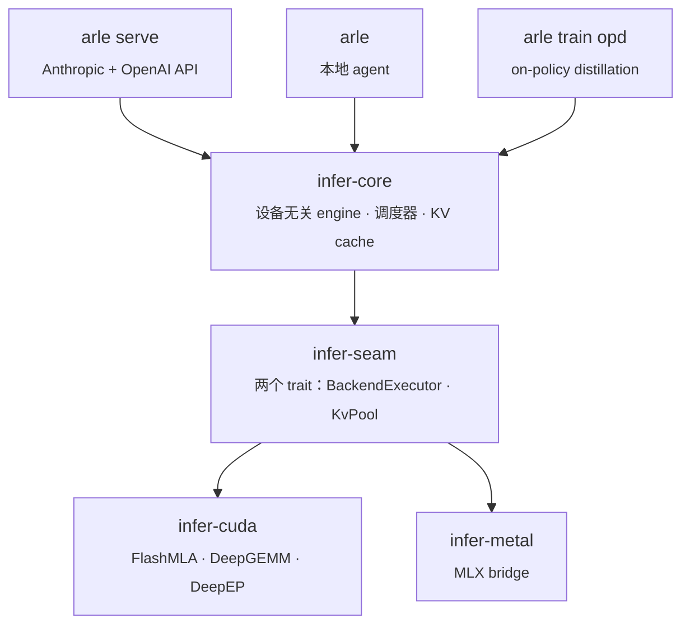

<p align="center">
 
</p>

<p align="center">
 <b>给 coding agent 用的本地推理服务器。</b><br>
 纯 Rust，单个二进制，Apple Silicon 与 NVIDIA。Anthropic 与 OpenAI 两套 API。KV cache 跨轮常驻，第 20 轮和第 2 轮一样快。
</p>

<p align="center">
 <a href="https://acupof-ai.github.io/arle/"></a>
 <a href="https://github.com/acupof-ai/arle/actions/workflows/ci.yml"></a>
 <a href="https://github.com/acupof-ai/arle/actions/workflows/metal-ci.yml"></a>
 <a href="LICENSE"></a>
 <a href="https://github.com/acupof-ai/arle/releases"></a>
</p>

<p align="center">
 <a href="#快速开始">快速开始</a> ·
 <a href="#为什么多轮不变慢">为什么多轮不变慢</a> ·
 <a href="#性能">性能</a> ·
 <a href="docs/http-api.md">HTTP API</a> ·
 <a href="docs/support-matrix.md">支持矩阵</a> ·
 <a href="docs/architecture.md">架构</a> ·
 <a href="CHANGELOG.md">变更日志</a>
</p>

<p align="center">
 <a href="README.md">English</a> · <strong>简体中文</strong>
</p>

---

## 快速开始

### 1. 安装

```bash
# Apple Silicon（Homebrew）
brew install cklxx/tap/arle

# Apple Silicon 或 Linux x86_64（一行安装）
curl -fsSL https://github.com/acupof-ai/arle/releases/latest/download/install.sh | sh

# Linux + NVIDIA（Docker，无需编译）
docker run --rm --gpus all -p 8000:8000 -v $PWD/models:/models:ro \
 ghcr.io/acupof-ai/arle:latest serve --backend cuda --model-path /models/Qwen3.6-27B
```

### 2. 启动服务

```bash
# MacBook：35B 混合专家模型 4-bit（约 19 GB），首次运行自动从 Hugging Face 拉取
arle serve --backend metal --model-path mlx-community/Qwen3.6-35B-A3B-4bit --port 8000

# NVIDIA
arle serve --backend cuda --model-path /path/to/Qwen3.6-27B --port 8000
```

### 3. 把 agent 指过来

```bash
# Claude Code（Anthropic Messages API，流式，工具调用）
ANTHROPIC_BASE_URL=http://localhost:8000 ANTHROPIC_API_KEY=local claude

# 任何说 OpenAI API 的工具（opencode、aider、openai SDK……）
export OPENAI_BASE_URL=http://localhost:8000/v1 OPENAI_API_KEY=local
```

```python
from openai import OpenAI
client = OpenAI(base_url="http://localhost:8000/v1", api_key="local")
print(client.chat.completions.create(
 model="default",
 messages=[{"role": "user", "content": "你好，ARLE"}],
).choices[0].message.content)
```

> **源码构建必须选后端。** 单独 `cargo build --release` 只得到一个纯 CLI 二进制。
> 加 `--features cuda`（NVIDIA）或 `--no-default-features --features metal,no-cuda,cli`（Apple Silicon）。
> 见 [docs/install.md](docs/install.md)。

### 一个二进制，四种用法

| 命令 | 含义 |
|---|---|
| `arle serve --backend …` | HTTP 服务：Anthropic `/v1/messages` 与 OpenAI `/v1/chat/completions`，均支持流式。 |
| `arle` | 交互式 REPL，内置带工具的 agent。 |
| `arle run --prompt "…"` | 一次性 agent 执行。`--no-tools` 关闭工具。 |
| `arle train opd` | On-Policy Distillation：student 在自己的 rollout 上训练，teacher 就跑在这台服务器上。 |
| `arle --doctor` | 后端 / 硬件 / 模型自检。 |

完整安装矩阵、卸载与源码构建：[docs/install.md](docs/install.md) · 示例：[`examples/`](examples/)。

---

## 为什么多轮不变慢

coding agent 每一轮都会把整段对话重发一遍：系统提示、之前所有工具结果、之前所有回复。多数本地服务器会把这些全部重新 prefill。ARLE 把上一轮的 KV 留在加速器上，前缀页经 radix cache 跨请求共享，每轮只 prefill 新增的 token。

同一台机器、同一份权重，12 轮 agent 形状的对话（4.8K token 系统提示，之后每轮追加约 350 token 工具输出，第 12 轮 8.6K token）。每轮首 token 时间：

| Qwen3.5-0.8B 4-bit · M4 Pro 48 GB | 第 1 轮（冷） | 第 2 到 12 轮（中位数） | 第 12 轮 |
|---|---:|---:|---:|
| **ARLE** `arle serve --backend metal` | 1.95 s | **180 ms** | 202 ms |
| mlx-lm `mlx_lm.server --prompt-cache-size 4`（0.31.2） | 1.26 s | 249 ms | 248 ms |

<sub>greedy，两台服务器收到的请求字节完全一致，2026-09-02 · 脚本：<code>scripts/bench_multiturn_ttft.py</code> · 方法与原始行：<a href="docs/experience/wins/2026-09-02-metal-prefix-restore-survives-turns.md">wins 记录</a>。ARLE 在这个模型上的冷 prefill 更慢；每轮那个数字才是一次 20 轮会话的体感。Qwen3.6-35B-A3B 上的同一张表待一台没有 swap 压力的机器复测。</sub>

恢复前缀后的输出与冷 prefill 逐字一致（needle 阶梯 115 到 8000 token ×3，每个长度均确定）。

CUDA 上同一套 cache 在内存压力下把前缀页下沉到主机内存，下次命中再提回。INT8/FP8 分页 KV 通过 `--kv-cache-dtype` 开启（Qwen3.5/3.6 系列，默认关闭）。

---

## 性能

真实硬件实测。这里只放头条行；每个数字都能在 [benchmarks/](benchmarks/README.md) 的快照或 [docs/experience/wins/](docs/experience/wins/) 的带日期记录里找到来源。

### Apple Silicon（M4 Pro，48 GB，单流）

35B 混合专家模型的 decode 和 4B dense 一样快：每个 token 只激活约 3B 参数。

| 模型（Metal 4-bit） | Decode | 每 token 时间 | 首 token 时间（512 token 提示） |
|---|---:|---:|---:|
| Qwen3.5-0.8B | **318 tok/s** | 3.2 ms | 0.17 s |
| Qwen3.5-4B | 84 tok/s | 11.9 ms | 0.82 s |
| Qwen3.5-9B | 50 tok/s | 20.0 ms | 1.45 s |
| **Qwen3.6-35B-A3B（MoE）** | **85 tok/s** | 11.7 ms | 1.23 s |

Qwen3.6-27B 上的推测解码：模型自带的多 token 预测头出草稿，基座模型校验。输出与 greedy 比特一致，decode 12.3 → 17.75 tok/s（+44%），越过单 token 解码器无法跨过的 15.2 tok/s 内存带宽上限。

### NVIDIA（单卡 H20，32K token 多轮 agent 提示）

| Qwen3.6 · 单请求 decode tok/s | c=1 | c=8 | c=16 |
|---|---:|---:|---:|
| 35B-A3B MoE | 149.3 | 27.7 | 15.1 |
| 27B dense + 块草稿推测解码（DSpark） | **91.8** | 20.5 | 11.2 |

对比 SGLang 0.5.13，同一块卡、同一个量化 kernel（Qwen3.6-27B，33K 提示，单请求）：decode 每 token 16.69 ms 对 17.16 ms（快 2.8%）；prefill 25.0 s 对 21.0 s（慢 19%，在做）。

CUDA 上另有 DeepSeek-V4-Flash（2×、4×、8×H20；FP8 与 4-bit 专家权重）和 NVFP4 的 Qwen3.8-27B（比 FP8 少 24% 字节，c=1 到 16 decode +5% 到 +21%）。完整行、配置、CUDA graph 与量化细节：[docs/baselines.md](docs/baselines.md)。

### On-Policy Distillation

teacher 就是这台服务器。student 在自己的 rollout 上训练：

- Qwen3.5-4B：MATH-500 **+27pp**（0.518 → 0.792）
- Qwen3.5-27B：Terminal-Bench pass@1 **+5.1pp**（20.5 → 25.6%）

方法与原始数据：[benchmarks/README.md](benchmarks/README.md) · [docs/experience/wins/](docs/experience/wins/)。

---

## 架构

一套运行时、三个表面、两个后端。serving、本地 agent、OPD 训练跑同一份 Rust 与模型代码；OPD 的 teacher 就是生产服务。



新后端只需实现 seam 的两个 trait；调度器、cache、server 不用改。

深入阅读：[docs/onboarding.md](docs/onboarding.md)（30 分钟）· [docs/architecture.md](docs/architecture.md) · [docs/codebase-map.md](docs/codebase-map.md)。

---

## 状态

| | CUDA | Metal | OPD 训练 |
|---|---|---|---|
| **稳定度** | Stable | Beta | Beta |
| **模型** | Qwen3.5/3.6/3.8、DeepSeek-V4-Flash、GLM-5.2 | Qwen3-dense、Qwen3.5/3.6、DeepSeek-OCR | CUDA 模型 |

完整等级：[docs/support-matrix.md](docs/support-matrix.md) · [docs/stability-policy.md](docs/stability-policy.md)。

---

## 文档

[HTTP API](docs/http-api.md) · [支持矩阵](docs/support-matrix.md) · [架构](docs/architecture.md) · [代码地图](docs/codebase-map.md) · [环境变量](docs/environment.md) · [排障](docs/troubleshooting.md) · [贡献指南](CONTRIBUTING.md) · [全部文档](docs/index.md)

---

## 许可证

[MIT](LICENSE)
