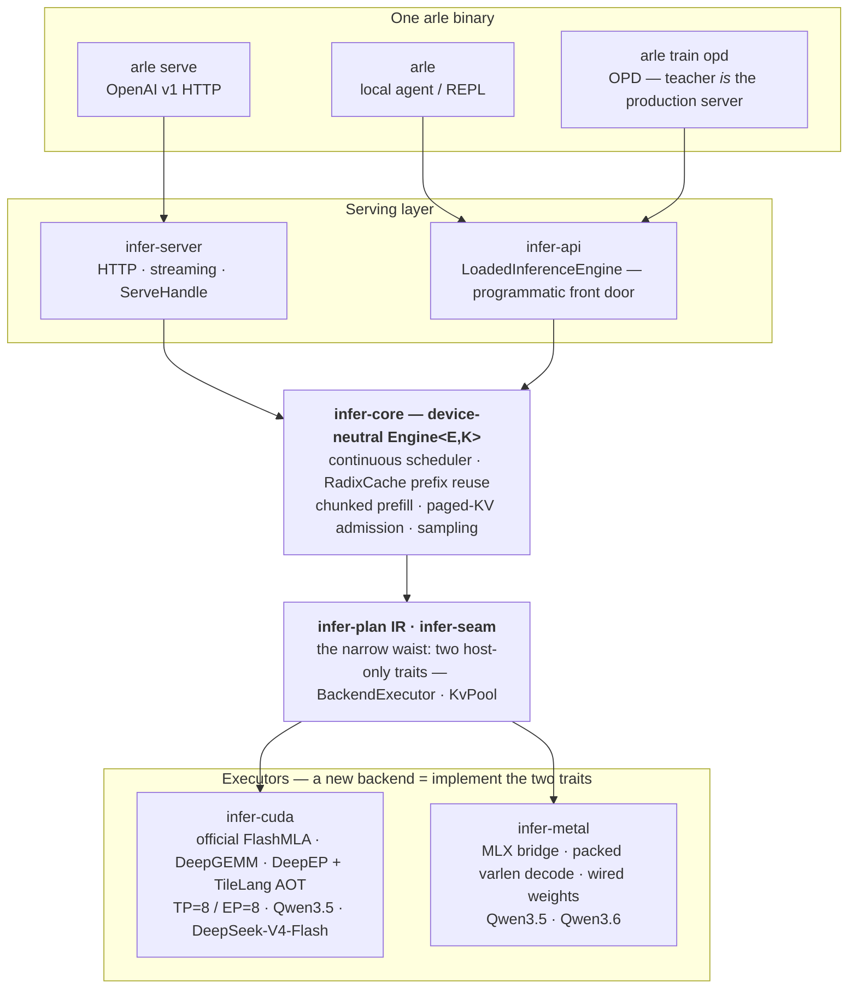

<p align="center">
  
</p>

<p align="center">
  <em>Pure-Rust 运行时,统一服务、本地 agent、On-Policy Distillation 训练与评测。<code>arle serve</code> 是 OpenAI 兼容的服务入口;<code>arle</code> 是统一的用户入口。</em>
</p>

<p align="center">
  <a href="https://cklxx.github.io/arle/"></a>
  <a href="https://github.com/cklxx/arle/actions/workflows/ci.yml"></a>
  <a href="https://github.com/cklxx/arle/actions/workflows/metal-ci.yml"></a>
  <a href="LICENSE"></a>
  <a href="https://github.com/cklxx/arle/releases"></a>
</p>

<p align="center">
  <a href="#快速开始">快速开始</a> ·
  <a href="docs/http-api.md">HTTP API</a> ·
  <a href="docs/support-matrix.md">支持矩阵</a> ·
  <a href="docs/onboarding.md">新人指南</a> ·
  <a href="docs/architecture.md">架构</a> ·
  <a href="ROADMAP.md">路线图</a> ·
  <a href="CHANGELOG.md">变更日志</a>
</p>

<p align="center">
  <a href="README.md">English</a> · <strong>简体中文</strong>
</p>

---

## 快速开始

```bash
# Apple Silicon — Homebrew
brew install cklxx/tap/arle

# Apple Silicon 或 Linux x86_64 — 一行安装
curl -fsSL https://github.com/cklxx/arle/releases/latest/download/install.sh | sh

# Linux + NVIDIA — Docker,无需编译
docker run --rm --gpus all -p 8000:8000 -v /path/to/Qwen3.5-4B:/model:ro \
  ghcr.io/cklxx/arle:latest serve --backend cuda --model-path /model

# 启动服务
arle serve --backend cuda  --model-path /path/to/Qwen3.5-4B --port 8000
arle serve --backend metal --model-path mlx-community/Qwen3.5-0.8B-MLX-4bit --port 8000
```

```python
from openai import OpenAI
client = OpenAI(base_url="http://localhost:8000/v1", api_key="not-needed")
print(client.chat.completions.create(
    model="qwen3.5-4b",
    messages=[{"role": "user", "content": "你好,ARLE"}],
).choices[0].message.content)
```

源码构建、完整安装矩阵与卸载:[docs/install.md](docs/install.md) · 更多即用样例:[`examples/`](examples/)。

`arle` 是唯一的二进制:

| 命令 | 含义 |
|---|---|
| `arle`(无参) | 交互式 agent REPL,内置 `python` 与 `shell` 工具。 |
| `arle run --prompt "…"` | 一次性 prompt。`--no-tools` 关闭工具。 |
| `arle serve --backend …` | OpenAI 兼容 HTTP 服务。 |
| `arle train opd` | **On-Policy Distillation** —— teacher 跑在服务运行时,student 跑 `train`。[使用手册](docs/projects/2026-05-21-arle-opd-cuda-usage-manual.md)。 |
| `arle --doctor [--json]` | 后端 / 硬件 / 模型解析自检。 |

---

## 当前状态一览

| 后端 | 平台 | 状态 | 关键数字 |
|---|---|:---:|---|
| **CUDA** | Linux + NVIDIA | **Stable** | L4 上 197 tok/s(Qwen3.5-4B BF16,c=16) |
| **Metal** | Apple Silicon | **Beta** | M4 Pro 上 85.6 tok/s(Qwen3.6 35B-A3B 4-bit) |
| **Metal DFlash** | Apple Silicon | **Beta** | Qwen3.5 推测解码,比特一致 |
| **OPD 训练(CUDA)** | Linux + NVIDIA | **Beta** | 比 HF TRL `GKDTrainer` 快 2.49–2.91×;LoRA 4 GB 显卡可跑 |
| **CPU** | 通用 | **仅开发用** | 冒烟测试 |

模型:**Qwen3.5 全家族**(CUDA + Metal)· **Qwen3.6**(Metal)· **DeepSeek-V4-Flash**(CUDA 8×H20,TP=8 / EP=8 FP8 —— prefill 23 ms,B=1 decode 15 ms/token)。完整等级:[support-matrix](docs/support-matrix.md) · [stability-policy](docs/stability-policy.md)。

---

## 为什么是 ARLE

agent 与 RL 工作负载每轮都在重复处理同样的 prompt + 历史 + 工具输出。ARLE 把这件事解决一次,serving 与训练共享:

- **跨轮 KV 常驻。** 上一轮 KV 留在 GPU,内存压力下才下沉 host / 盘;共享前缀按页复用 —— 不重复计算、不重复占内存。
- **KV 分层有预算。** Metal 自动确定内存前缀层大小,SSD 快照 20 GiB LRU 预算(CRC32C 校验的 64 KiB 段);`--kv-memory-max-bytes 0` / `--no-kv-disk` 可关。
- **CUDA 量化 KV。** `--kv-cache-dtype int8|fp8|tq4`。
- **一套运行时、三个表面。** serving、本地 agent、OPD 训练共用同一套 Rust + 模型代码 —— OPD teacher 就是生产 server。



架构详解:[docs/onboarding.md](docs/onboarding.md)(新人 30 分钟)· [docs/architecture.md](docs/architecture.md) · [docs/codebase-map.md](docs/codebase-map.md)。

---

## 最新动态

<!-- 最近 1-2 条,更早历史见 CHANGELOG.md。 -->

**2026-06-10 — Phase 0 还债收口:** DSv4 256K 可启动、needle 230K 精确命中、admission 按真实 KV 预算、KV-parity gate 移植完成(FlashMLA decode 已 license),下一步 Phase 1 批量化 serving lane([#55](https://github.com/cklxx/arle/issues/55))。

**2026-06-08 — DeepSeek-V4-Flash B=1:prefill 23 ms,decode 27 → 15 ms/token**(8×H20,TP=8 / EP=8,FP8 MoE)。官方 DSA indexer 让 decode 不再随上下文增长(4.8× @4k),tensor-core DeepGEMM 投影(每段 −94%),MTP batched verify **decode tok/s +71%** —— 逐字节一致。[最终报告](docs/experience/wins/2026-06-08-dsv4-decode-6ms-FINAL-consolidated.md)。

<p align="center">
  
</p>

完整历史:[CHANGELOG.md](CHANGELOG.md)。

---

## 文档

[http-api](docs/http-api.md) · [support-matrix](docs/support-matrix.md) · [architecture](docs/architecture.md) · [codebase-map](docs/codebase-map.md) · [environment](docs/environment.md) · [troubleshooting](docs/troubleshooting.md) · [对比 vLLM / SGLang / mistral.rs / llama.cpp](docs/comparison.md) · [CONTRIBUTING](CONTRIBUTING.md) · [docs/index.md](docs/index.md)

---

## 许可证

[MIT](LICENSE)
