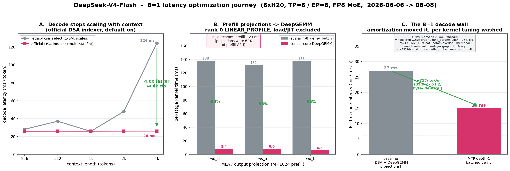
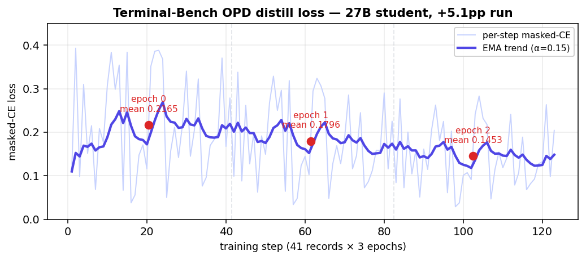
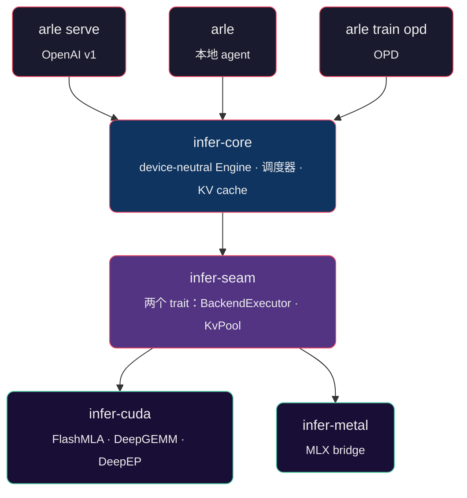

<p align="center">
 
</p>

<p align="center">
 <em>Pure-Rust 运行时,统一服务、本地 agent、On-Policy Distillation 训练与评测。<code>arle serve</code> 是 OpenAI 兼容的服务入口;<code>arle</code> 是统一的用户入口。</em>
</p>

<p align="center">
 <a href="https://cklxx.github.io/arle/"></a>
 <a href="https://github.com/cklxx/arle/actions/workflows/ci.yml"></a>
 <a href="https://github.com/cklxx/arle/actions/workflows/metal-ci.yml"></a>
 <a href="LICENSE"></a>
 <a href="https://github.com/cklxx/arle/releases"></a>
</p>

<p align="center">
 <a href="#快速开始">快速开始</a> ·
 <a href="docs/http-api.md">HTTP API</a> ·
 <a href="docs/support-matrix.md">支持矩阵</a> ·
 <a href="docs/onboarding.md">新人指南</a> ·
 <a href="docs/architecture.md">架构</a> ·
 <a href="CHANGELOG.md">变更日志</a>
</p>

<p align="center">
 <a href="README.md">English</a> · <strong>简体中文</strong>
</p>

---

## 快速开始

```bash
# Apple Silicon — Homebrew
brew install cklxx/tap/arle

# Apple Silicon 或 Linux x86_64 — 一行安装
curl -fsSL https://github.com/cklxx/arle/releases/latest/download/install.sh | sh

# Linux + NVIDIA — Docker,无需编译
docker run --rm --gpus all -p 8000:8000 -v /path/to/Qwen3.5-4B:/model:ro \
 ghcr.io/cklxx/arle:latest serve --backend cuda --model-path /model

# 启动服务
arle serve --backend cuda --model-path /path/to/Qwen3.5-4B --port 8000
arle serve --backend metal --model-path mlx-community/Qwen3.5-0.8B-MLX-4bit --port 8000
```

```python
from openai import OpenAI
client = OpenAI(base_url="http://localhost:8000/v1", api_key="not-needed")
print(client.chat.completions.create(
 model="qwen3.5-4b",
 messages=[{"role": "user", "content": "你好,ARLE"}],
).choices[0].message.content)
```

源码构建、完整安装矩阵与卸载:[docs/install.md](docs/install.md) · 更多即用样例:[`examples/`](examples/)。

`arle` 是唯一的二进制:

| 命令 | 含义 |
|---|---|
| `arle`(无参) | 交互式 agent REPL,内置 `python` 与 `shell` 工具。 |
| `arle run --prompt "…"` | 一次性 prompt。`--no-tools` 关闭工具。 |
| `arle serve --backend …` | OpenAI 兼容 HTTP 服务。 |
| `arle train opd` | **On-Policy Distillation** —— teacher 跑在服务运行时,student 跑 `train`。使用手册。 |
| `arle --doctor [--json]` | 后端 / 硬件 / 模型解析自检。 |

---

## 性能

数字都是运行时实测，不是估算 —— 新鲜的 `arle serve` bench，一个二进制。

**Apple Silicon —— 一台 M4 Pro 笔记本(48 GB),单用户。** 35B-A3B MoE 的 decode 和 4B dense 一样快、是 9B 的 1.7×,因为每个 token 只激活 ~3B 参数:

| 模型 · Metal 4-bit | Decode | TPOT | TTFT |
|---|---:|---:|---:|
| Qwen3.5-0.8B | **318 tok/s** | 3.2 ms | 0.17 s |
| Qwen3.5-4B | 84 tok/s | 11.9 ms | 0.82 s |
| Qwen3.5-9B | 50 tok/s | 20.0 ms | 1.45 s |
| **Qwen3.6-35B-A3B** · MoE | **85 tok/s** | 11.7 ms | 1.23 s |

<sub>512-in / 128-out · c=1 · temp=0 · M4 Pro · build <code>4ea77e11</code> · decode = 单流生成速率 · <a href="benchmarks/README.md">快照 + 方法</a></sub>

**推测解码击穿 HBM 带宽墙。** Qwen3.6-27B(OptiQ 4/8-bit):模型自带的 NextN/MTP 头出草稿、base 校验,**输出与 greedy 比特一致** —— **12.3 → 17.75 tok/s(+44%)**,越过任何 kernel 都够不到的 15.2 tok/s HBM 下限。

<sub>质量不掉:PPL 7.82(vs uniform-4bit 8.56)· 68.8% 草稿接受率 · 默认开,<code>--no-speculative</code> 可关。</sub>

**NVIDIA —— 单卡 H20,32K 多轮 agent prompt**(不是短 prompt 合成负载):

| Qwen3.6 · 1×H20 · decode / total tok/s | c=1 | c=8 | c=16 |
|---|---:|---:|---:|
| 35B-A3B MoE | 61.7 / 6,707 | 22.7 / 27,968 | 13.6 / 33,859 |
| 27B dense + DSpark 草稿器 | **100.7** / 7,837 | 20.9 / 25,074 | 11.1 / 26,790 |

<sub><code>decode tok/s</code> 是单流延迟,<code>total tok/s</code> 是吞吐(prompt+生成 / 墙钟)· DSpark 在 c=1 是普通 decode 的 2.9×,到 c=16 抹平 —— GPU 有空闲算力时 verify 才免费 · 见 <a href="docs/baselines.md">baselines</a></sub>

**DeepSeek-V4-Flash,8×H20(TP=8 / EP=8,FP8 MoE)。** B=1 decode **53 tok/s**(prefill 23 ms);并发批量 decode lane 在 c=8 再 **+48%**。

**对比 SGLang。** 同一份权重、同一块卡、同一个量化 kernel —— SGLang 跑的是我们 checkpoint 的重打包版。Qwen3.6-27B,单卡 H20,33K prompt,单请求:decode 每 token **16.69 ms vs 17.16**,快 2.8%;33K prefill **25.0 s vs 21.0**,慢 19% —— 这是当前在做的事。数据见 [docs/baselines.md](docs/baselines.md)。

<p align="center">
 
</p>
<p align="center"><sub>DSv4 B=1 decode,<b>33.5 → 53.3 tok/s</b>,2026-06-13 → 06-14 campaign —— 每一步都对应一条 <code>docs/experience/wins/</code> 记录。</sub></p>

**On-Policy Distillation 在 student 自己的 rollout 上真能提升它** —— teacher 就是生产服务本身。Qwen3.5-4B:MATH-500 **+27pp**(0.518 → 0.792,CI 完全分离)· BFCL-live abstention **0.60 → 1.00**。27B 在 **Terminal-Bench** 上:pass@1 **+5.1pp**(20.5 → 25.6%),蒸馏的梯度是输出格式规范性。

<p align="center">
 
</p>
<p align="center"><sub>TB-OPD 蒸馏 loss,27B student · 41 records × 3 epochs · <b>0.2165 → 0.1796 → 0.1453</b>。<a href="docs/experience/wins/2026-06-20-opd-multiseed-math500-lock.md">MATH</a> · <a href="docs/experience/wins/2026-07-07-terminal-bench-opd-format-distill-lift.md">Terminal-Bench</a></sub></p>

**稳定度:** CUDA **Stable** · Metal **Beta**(DFlash + Qwen3.6 NextN-MTP:推测解码比特一致)· OPD 训练 **Beta**(比 HF TRL `GKDTrainer` 快 ~2×,Qwen3-0.6B 实测 2.04–2.49×;LoRA 4 GB 显卡可跑)· CPU 仅开发用。模型:Qwen3-dense + Qwen3.5/3.6(hybrid·MoE)on CUDA + Metal;DeepSeek-V4-Flash + GLM-5.2(CUDA 8×H20 TP=8/EP=8;GLM-5.2 verify pending)· Qwen3.6 + Gemma4 · DeepSeek-OCR VLMs + DiffusionGemma(Metal)。完整等级:[support-matrix](docs/support-matrix.md) · [stability-policy](docs/stability-policy.md)。

---

## 为什么是 ARLE

agent 与 RL 工作负载每轮都在重复处理同样的 prompt + 历史 + 工具输出。ARLE 把这件事解决一次,serving 与训练共享:

- **跨轮 KV 常驻。** 上一轮 KV 留在 GPU,只 prefill 新 token;前缀页经 host radix cache 跨请求共享,内存压力下下沉到 host-RAM 层(可选盘 spill),下次命中再提回,不重复 prefill。([support-matrix §4b](docs/support-matrix.md#4b-multi-turn-kv-reuse--tiered-kv-matrix))
- **CUDA 量化 KV。** INT8/FP8/INT4 paged-KV kernel,`--kv-cache-dtype` serve flag —— 正确性 gate 过、opt-in(默认仍 BF16)。
- **一套运行时、三个表面。** serving、本地 agent、OPD 训练共用同一套 Rust + 模型代码 —— OPD teacher 就是生产 server。



一套运行时、三个表面、两个可插拔后端。新后端只需实现 seam 的两个
trait，无需改动 scheduler、cache 或 server。

架构详解:[docs/onboarding.md](docs/onboarding.md)(新人 30 分钟)· [docs/architecture.md](docs/architecture.md) · [docs/codebase-map.md](docs/codebase-map.md)。

---

## 文档

[http-api](docs/http-api.md) · [support-matrix](docs/support-matrix.md) · [architecture](docs/architecture.md) · [codebase-map](docs/codebase-map.md) · [environment](docs/environment.md) · [troubleshooting](docs/troubleshooting.md) · [CONTRIBUTING](CONTRIBUTING.md) · [docs/index.md](docs/index.md)

---

## 许可证

[MIT](LICENSE)
