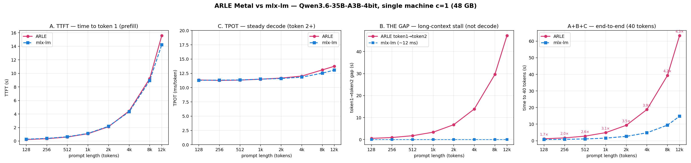

# Bench: ARLE Metal vs mlx-lm — single-machine TTFT/TPOT sweep 128→12k (Qwen3.6)

> **Correction (2026-06-01).** The first version of this entry reported a "TPOT
> decode collapse, ARLE ~40× slower at 12k." **That was a benchmark metric bug,
> not engine behavior.** With the metric fixed (steady-state TPOT from token 2
> onward) ARLE decode is **at parity with mlx-lm** at every length. Post-mortem:
> [`errors/2026-06-01-metal-bench-tpot-metric-artifact.md`](../errors/2026-06-01-metal-bench-tpot-metric-artifact.md).

## Goal
Single-machine (c=1) prompt-length sweep, 128 → 12 288 tokens, charting **TTFT**
(time to first token) and **TPOT** (time per output token) for ARLE Metal vs the
mlx-lm reference on the canonical Metal model. Hard constraint: never co-resident
two 19 GB models on the 48 GB box (a prior run hung that way).

## Hypothesis
TTFT is comparable once the prefix cache is defeated; TPOT is where the backends
diverge with context. → **Refuted on TPOT**: both are flat and equal. The real
ARLE-specific long-context cost is the *prefill-tail* (token1→token2 gap), not
decode.

## Params / Env
- Model: `mlx-community/Qwen3.6-35B-A3B-4bit` (same HF snapshot; 40 layers,
  2 KV heads, head_dim 256 → KV ~0.94 GB @12k).
- HW: Apple Silicon, 48 GB unified; macOS. c=1, greedy (temp 0), 64 output tokens.
- **Prefix cache defeated** on the ARLE side: per-request unique nonce prefix
  (`make_prompt`) so prefill is always uncached and lengths non-nested.
- ARLE: `metal_serve --max-running-requests 1 --max-batch-tokens 4096`, auto wired
  limit, streaming `/v1/completions`. TTFT + steady-state TPOT from client SSE.
- mlx-lm (engine): in-process `stream_generate`; TTFT = prompt_tokens/prompt_tps,
  TPOT = 1000/generation_tps.
- **TPOT = steady state, token 2 onward.** The token1→token2 interval is excluded
  (it carries ARLE's front-loaded prefill tail — see Learnings + the post-mortem).
  Reported separately as `first_interval`.
- **Memory safety**: one 19 GB model resident at a time — ARLE `metal_serve` fully
  terminated and RAM reclaimed before the mlx-lm phase loads its copy; in-script
  watchdog SIGKILLs the model if free RAM < 1.0 GB. Lowest free RAM ≈ 5.4 GB; no hang.
- Driver `scripts/bench_mlx_vs_arle_sweep.py`, chart `scripts/plot_mlx_vs_arle_sweep.py`.

## Results

Three measured phases per request (client SSE timing; server `request_trace`
`ttft_ms` agrees with client TTFT to <1 %, so these are ground truth):
A = TTFT (token 1), B = token1→token2 gap, C = steady decode (token 2+).
e2e@40 = A + B + 38·C (the latency a 40-token answer actually takes).

| prompt | A: ARLE TTFT | A: mlx TTFT | C: ARLE TPOT | C: mlx TPOT | B: ARLE gap | e2e@40 ARLE | e2e@40 mlx | ratio |
|--------|----:|----:|----:|----:|----:|----:|----:|:--:|
| 128  | 0.22 s | 0.28 s | 11.3 ms | 11.3 ms | 0.55 s | 1.20 s | 0.72 s | 1.7× |
| 512  | 0.60 s | 0.63 s | 11.3 ms | 11.3 ms | 1.76 s | 2.78 s | 1.08 s | 2.6× |
| 2k   | 2.12 s | 2.18 s | 11.7 ms | 11.6 ms | 6.77 s | 9.33 s | 2.63 s | 3.6× |
| 4k   | 4.44 s | 4.32 s | 12.0 ms | 11.8 ms | 13.9 s | 18.8 s | 4.78 s | 3.9× |
| 8k   | 9.23 s | 8.93 s | 13.1 ms | 12.5 ms | 29.6 s | 39.3 s | 9.42 s | 4.2× |
| 12k  | 15.6 s | 14.2 s | 13.7 ms | 13.1 ms | 47.2 s | 63.3 s | 14.7 s | 4.3× |

## Learnings
- **Decode (C, TPOT) is at parity.** 11.3 → 13.7 ms/token across 128 → 12k, within
  1–5 % of mlx-lm and ~flat in context (the fused no-mask SDPA decode path,
  `mask_mode=""` at S=1, is already the default at c=1). ARLE is **not** slower at
  decode; speculative decoding is the wrong lever here.
- **TTFT (A) is at near-parity** (ARLE ≤ 1.1× mlx-lm) — but this is *misleading*,
  see B.
- **The entire ARLE long-context disadvantage is phase B — the token1→token2 gap —
  and it is a deferred-`async_eval` stall, root-caused from server traces (not
  inferred):**
  - Per-chunk trace of an 8k request: prefill runs in 2 chunks (cursor 0→4096
    `terminal=false`, 4096→8035 `terminal=true`); the terminal chunk *samples
    token 1* and the client receives it at **9.6 s** (= sum of the two chunk
    elapsed times). So token 1 comes out right after a single prefill pass — TTFT
    looks competitive.
  - **But the prefill MLX graph was only `async_eval`-kicked-off, not
    materialized.** The very next step (first decode) logs
    `async_eval_kickoff_us=29590` at `cache_len=8036` — i.e. **30 s spent
    draining the 8k prefill compute that token 1's sample had merely enqueued.**
    Subsequent decode steps' kickoff falls 29.6 s → 12.5 → 11.8 → 11.4 ms as the
    lazy graph drains, then flatten to ~12 ms. `recompute=false` — it is **not** a
    re-prefill; it is the prefill's own GPU work, deferred past the first emitted
    token by the `async_eval` boundary.
  - mlx-lm synchronizes prefill *inside* TTFT (its 8.9 s TTFT is real compute),
    then decodes at a flat 12 ms. ARLE splits one prefill into "kickoff 9.6 s
    (reported as TTFT) + materialize 30 s (hidden in the token1→2 gap)" ≈ 40 s
    total prefill vs mlx's ~14 s.
- **Fix direction (no speculative decoding needed):** force `eval()` of the
  terminal prefill chunk's graph *before/at* token-1 sampling so prefill compute
  lands inside TTFT (as mlx does), instead of deferring it to the first decode
  step. Expected to collapse phase B → e2e long-context latency drops ~3–4×.
  Landing site: `request_state.rs:194-215` (terminal `prefill_tokens` →
  `record_sampled_token`); the relevant lazy boundary is the `async_eval` import
  at `request_state.rs:12`. Correctness-neutral (same math, earlier sync). Filed
  as the next Metal work item; NOT attempted in this entry.
- **The metric bug that started this.** v1 computed decode rate as
  `(out-1)/(last-first)`, which folds the giant token1→2 prefill-tail interval into
  "decode" → a fake O(context) collapse (1.4 tok/s @8k instead of the real ~76).
  Fixed to measure from token 2 onward. Unit-tested: synthetic 28 s tail + flat
  12.6 ms decode → new metric 79 tok/s (correct), old 1.4 tok/s (bug reproduced).

## Rule
Report TTFT and TPOT separately on a prompt-length sweep. **Define TPOT as
steady-state (drop the token1→token2 interval)** — on a pipelined scheduler that
first interval carries prefill, and folding it in manufactures a fake decode
regression. Measure both engines the same way (both over HTTP or both in-engine);
never mix HTTP-observed against engine-internal for a head-to-head. Defeat the
prefix cache with per-request nonces. RAM-tight cross-backend A/B runs strictly
sequentially with a watchdog; never co-resident two large models.
