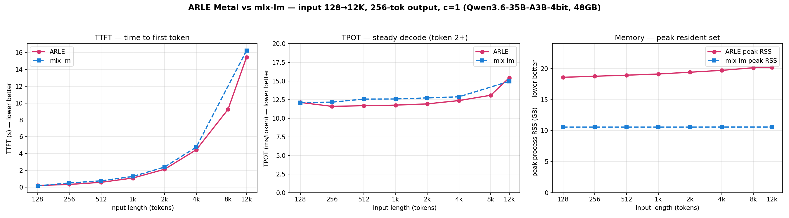

# Bench: ARLE Metal vs mlx-lm — TTFT / TPOT / memory sweep, input 128→12K

## Goal
Single-machine (c=1) head-to-head vs `mlx_lm.server` on the canonical Metal model,
sweeping input length 128→12 288, charting the three metrics that matter for local
serving: **TTFT**, **steady-state TPOT**, and **peak memory**. Same model, same
client, sequential (never two 19 GB models co-resident on the 48 GB box).

## Params / Env
- Model: `mlx-community/Qwen3.6-35B-A3B-4bit` (same HF snapshot both sides).
- HW: Apple Silicon, 48 GB unified; macOS. c=1, greedy (temp 0), 256 output tokens.
- TPOT = steady state, token 2 onward (the token1→token2 interval is dropped — it
  carries prefill tail on a pipelined scheduler; folding it in fakes a slowdown,
  see `errors/2026-06-01-metal-bench-tpot-metric-artifact.md`).
- ARLE: `metal_serve --max-running-requests 1 --max-batch-tokens 4096` (post the
  memory-first prefix-cache fix `6f6b0701`). mlx-lm: `mlx_lm.server`, default config.
- Memory: per-request peak sampled at 0.5 s — process RSS (incl. children) and
  system used. Sequential single-model + RAM watchdog (floor 1.2 GB).
- Driver `scripts/bench_ttft_tpot_mem.py`; figure + raw JSON under `assets/`.

## Results

| input | ARLE TTFT (s) | mlx TTFT (s) | ARLE TPOT (ms) | mlx TPOT (ms) | ARLE peak RSS (GB) | mlx peak RSS (GB) |
|------:|---:|---:|---:|---:|---:|---:|
| 128   | 0.20 | 0.16 | 12.1 | 12.1 | 18.6 | 10.6 |
| 256   | 0.33 | 0.50 | 11.6 | 12.2 | 18.8 | 10.6 |
| 512   | 0.58 | 0.76 | 11.7 | 12.6 | 18.9 | 10.6 |
| 1k    | 1.09 | 1.27 | 11.8 | 12.6 | 19.1 | 10.6 |
| 2k    | 2.13 | 2.39 | 11.9 | 12.7 | 19.4 | 10.6 |
| 4k    | 4.45 | 4.77 | 12.4 | 12.9 | 19.7 | 10.6 |
| 8k    | 9.25 | —    | 13.1 | —    | 20.1 | —    |
| 12k   | 15.46 | 16.25 | 15.4 | 14.9 | 20.2 | 10.6 |

## Learnings
- **TTFT: at parity, marginally ARLE's favor** across 512→12k (a few % faster);
  mlx slightly faster at 128. The previously-fixed 30 s long-context stall is gone
  — the ARLE TTFT curve now tracks mlx's prefill curve.
- **TPOT: at parity** (~12 ms both, rising to ~15 ms at 12k = the physical KV-read
  floor). Wins trade sign within noise.
- **Memory: mlx-lm is materially leaner.** mlx process RSS is FLAT at **10.6 GB**
  regardless of context; ARLE is **18.6 → 20.2 GB** (≈ +8–10 GB). mlx mmaps weights
  + grows KV on demand; ARLE pins weights via wired-limit + pre-allocates the KV
  pool. This is a real, honest ARLE disadvantage on single-machine memory
  efficiency — the next optimization target (wired-limit / KV pre-alloc sizing).
- **Net:** latency is system-level even (decode parity, TTFT parity); mlx wins on
  memory footprint. ARLE "caught up" on latency, not ahead.

## Problems
- mlx-lm @8192 returned <3 tokens once (likely early-stop / sampling degeneracy on
  that prompt) — point dropped, left blank in the figure. NOT fabricated.

## Rule
A serving head-to-head is three curves, not one: TTFT, steady TPOT (token 2+),
and peak memory — report all three. Memory footprint is a first-class axis on a
fixed-RAM box and is where ARLE currently trails mlx-lm; latency is at parity.
