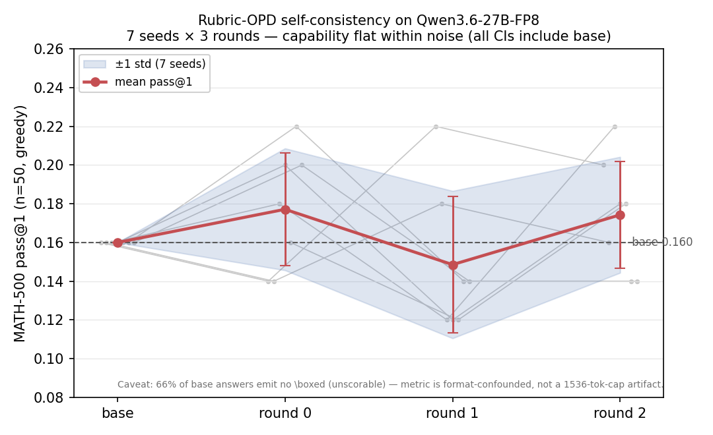

# Rubric-OPD 27B-dense loop validated end-to-end — capability flat within noise (7-seed)

## Context
New `arle train rubric-opd` subcommand (rubric-OPD / RFT): the Qwen3.6-27B dense student
samples N on-policy rollouts per prompt, a strong judge (Qwen3.6-35B-A3B-FP8; DSv4-Flash
deferred) grades each against a **text-level** rubric (vocab-agnostic — the cross-vocab
sidestep), and accepted rollouts are written back as completion-masked CE (RFT). Plan:
[2026-06-21-opd-ceiling-27b-dense.md](../../plans/2026-06-21-opd-ceiling-27b-dense.md).
Built solo (codex rate-limited); pod cuda,nccl; single GPU (GPU7).

## What Worked — full loop validated at 27B
Final smoke (1 prompt, 35B-A3B judge, GPU7, `--lora-layer-start 48`, max-new/verdict 1024):
```
round 0: prompts=1 accepted=2 distinct=1 parse_err=0 trained=2 mean_loss=0.1359  RUN_EXIT=0
```
Decoded cases (§0 case-as-fact): the 27B student solves the problem correctly; the judge
emits a clean JSON verdict (`finish=Stop parse_err=0`) and accepts; CE backward fits; loss
finite; GPU freed clean. The rollout→judge→select→writeback-CE pipeline is correct.

## Infra gaps the GPU surfaced — each root-caused + fixed
1. **LoRA-sync between rounds** (`4612c3cc`): the rollout engine kept sampling base weights
   every round → multi-round RFT never iterated. Fixed via `sync_lora_from_store` after each
   round (round 0 correctly samples base).
2. **VRAM — 3 models co-resident** (`gap #2`): 27B autograd + 27B rollout + 35B-A3B judge.
   Phase-batched `run_rubric_rounds` (sample+judge all → **offload both inference engines**
   (~65 GB freed) → CE all accepted → reload). `FlashJudge` gained offload/reload.
3. **FP8 dense-MLP loader** (`f71bf31e`): `is_fp8_cuda_frozen_base_tensor` whitelisted attn +
   MoE projections but never plain dense `mlp.{gate,up,down}_proj` → a dense 27B-FP8 student
   hit "unsupported dtype F8_E4M3". Added the 3 dense projections (scales already present).
4. **Auto-TP/NCCL**: `INFER_CUDA_DEVICES=4,5,6,7` made the rollout engine attempt TP4 (needs
   `INFER_NCCL_UNIQUE_ID`). A 27B-FP8 fits one GPU → single-GPU placement avoids TP entirely.
5. **CE-OOM at 27B dense / seq ~1k** (`alloc_zeros (transpose)`): even with 65 GB freed, the
   27B dense autograd backward OOMs. Fixed with the proven 35B levers: `--lora-layer-start 48`
   (suffix-detach, top-16 of 64 layers) + gradient checkpointing (`forward_batch_indices`
   honors both). Loaded via `load_qwen35_lora_from_hf_dir_with_layer_start`.

Also surfaced: the only registry 27B Qwen3.x models are **VLMs** (`model.language_model.*`
nesting) — but the loader already handles that nesting; the real blocker was just the FP8
dense-MLP whitelist (#3). And **full-materialized bf16 checkpointing is host-loop pathological
for 27B** (100% CPU, 53 min, no file) — the capability curve will use AdapterOnly save or
in-process eval via the rollout engine, never per-round full-materialize.

## Recipe (validated)
reverse-judge text rubric (Factual gates acceptance), `--max-verdict-tokens 1024` (a
thinking judge truncates its JSON at 200 → parse_err), `--max-new-tokens 1024`,
`--samples-per-prompt 4`, `--lora-layer-start 48` + gradient checkpointing, single GPU,
35B-A3B judge. Engines offloaded during CE.

## Rule
A new train path's correctness is validated by the GPU run decoding actual cases, not by
typecheck. Each OOM/dtype/TP failure is a case to root-cause at file:line, not a structural
KILL — five sequential gaps each fell to a small fix. Full-materialize checkpointing does
not scale to 27B (host-loop); eval the trained student via the in-process rollout engine.

## Capability curve attempt — eval is CONFOUNDED, not a real delta (§0 case-as-fact)
First 3-round curve (n=12 MATH-500, cap=8, `--lora-layer-start 48`, think-on eval
`--eval-max-new-tokens 4096`) scored **base 6/12 (0.500) → round0 3/12 (0.250)** — a −25pp
"regression". Decoding every case (NOT trusting the aggregate) shows it is a **measurement
artifact, not a capability loss**:
- **~40% of base answers truncate before `\boxed`.** Cases 1,7,9,10,11 all end mid-sentence
  (think-on rambles 8–12k chars past the budget) → base capability is itself budget-masked.
- **2 of the 3 round0 flips are pure truncation.** Case 4 (base boxed → r0 truncated mid
  "Step 2"), case 6 (base boxed 27 → r0 truncated mid-deliberation). The metric measures
  "did think-on box within budget," not correctness.
- **n=12 swing = 3 problems = 25pp.** Exactly the small-n + harness-artifact trap; the
  capability-claim rule wants multi-seed ≥5 / larger n for a <5pp effect.
- **Think-off does NOT fix it.** `render_jinja` (infer-server tokenizer.rs:198) already renders
  without `enable_thinking` (lenient-undefined → falsy), yet the 27B produces long CoT and
  truncates anyway. The fix is **larger budget + larger n**, not a think toggle.

**Verdict:** rubric-OPD infra validated at 27B (above); the capability delta is **unmeasured**
— the n=12/4096-budget eval cannot resolve it. No regression claim shipped; no README muscle-flex
on a confounded number. The cosmetic round-label bug (inner `run_rubric_rounds(rounds:1)` logs
"round 0" every outer round; eval files correctly use the outer index `eval_round{0,1,2}.jsonl`)
is harmless to data.

## Infra-first GPU-CE speedup — LANDED 2.6× (892f3f9a)
§0 profiling (`ARLE_OPD_BACKWARD_PROFILE=1`) attributed the 441 s CE step: **backward 164 s = 100%
gradient-checkpoint recompute**, with the **linear-attention (GatedDeltaNet) layers on a HOST CPU scan**
(`host_materialize` 25 s + `fwd_recompute` 42 s). lm_head backward = 0.013% → the design-doc L1/L2/L3b
GEMM levers were noise. **Root cause:** the device LA dispatch (`cuda_linear_attention_{forward,backward}_device`)
hardcoded `num_value_heads==32` (35B-A3B); **Qwen3.6-27B has 48** → 48 of 64 layers fell to the host scan.

**Fix** (892f3f9a): dropped the over-conservative head-count guard (kernels are head-count-generic;
only `key/value_dim==128` is baked in, which the 27B satisfies) + a 48-value-head device-vs-CPU parity
test (out max_abs_err 1.2e-4, PASS). Measured re-profile (B=1, same config):

| | baseline | post-fix | Δ |
|---|---|---|---|
| step | 441 s | **170 s** | **2.6×** |
| forward | 277 s | ~100 s | 2.8× |
| backward | 164 s | 70 s | 2.3× |

Loss 0.151 (baseline) ≈ 0.151/0.189 (post-fix) → device LA correct end-to-end. **Next levers** (documented,
not blocking): backward 70 s is still 100% checkpoint recompute → disable grad-ckpt (needs the `--grad-checkpointing`
clap `Set` fix + VRAM check); forward ~100 s unattributed (frozen FP8 GEMM L1?). Plan:
[2026-06-21-autograd-gpu-ce-speedup.md](../../plans/2026-06-21-autograd-gpu-ce-speedup.md).

## Capability verdict — 7-seed one-model self-consistency, FLAT within noise

Final clean run: **one-model self-consistency** (`--self-consistency`, no separate
35B judge — the 27B self-judges by majority-vote on `\boxed`), 7 seeds × 3 rounds
on GPU0–6, 16 train prompts, MATH-500 pass@1 (n=50, greedy), `--rollout-temperature
0.7 --writeback-cap 24 --writeback-batch 1 --lora-layer-start 48 --grad-checkpointing`.

7-seed pass@1 (mean ± std; 95% CI is t, df=6):

| round | mean | std | 95% CI | includes base 0.160? |
|-------|------|-----|--------|----------------------|
| base  | 0.160 | 0.000 | (deterministic greedy) | — |
| 0     | 0.177 | 0.031 | [0.148, 0.206] | **yes** |
| 1     | 0.149 | 0.038 | [0.113, 0.184] | **yes** |
| 2     | 0.174 | 0.030 | [0.147, 0.202] | **yes** |

Base is identical across all 7 seeds (8/50) — greedy eval is deterministic; the
seed only perturbs training rollouts. **Every round's 7-seed CI includes base
0.160; no monotonic trend (round 1 dips below base); the r2 +1.4pp is noise.**
At 16-prompt / 3-round / n=50, one-model self-consistency rubric-OPD produces **no
detectable pass@1 lift** on Qwen3.6-27B-FP8.



### §0 case-as-fact — decoded the base eval; metric is `\boxed`-format-confounded

Before calling 16% a ceiling, decoded the actual base generations (seed0; base
is identical across seeds):

- **NOT a 1536-token-cap artifact.** Longest base answer is 5093 chars (~1270
  tokens) — **0/50 reach the 1536-tok cap**; generations finish on their own.
- **It IS a `\boxed`-compliance floor.** Only **17/50 base answers emit `\boxed`**;
  the other **33/50 (66%) are unscorable** (no extractable answer → counted wrong).
  Of the 17 boxed, 8 are correct (47% of *boxed* right). "16%" = 8/50 where 33 of
  the 50 never entered the scorer — it understates real math ability.
- **OPD shifts neither.** `\boxed`-emission rate stays 14–20/50 across all rounds
  (base 17), no round nears the cap. The loop teaches neither format nor pass@1.

**Implication:** at this scale the experiment can't cleanly *measure* capability —
the dominant variable is `\boxed`-format compliance, not math skill. Honest next
step: a format-robust extractor (or a `\boxed` training/prompt signal) **before**
re-running for a capability verdict, plus ≫16 train prompts.

### The day's durable output = infra (all committed, independent of the null)

- **One-model self-consistency** path (`--self-consistency`): N temp rollouts →
  majority-vote on `\boxed` → completion-masked CE writeback, no judge engine.
- **Temperature-sampled rollout** (`--rollout-temperature 0.7`): greedy SC is
  degenerate (identical samples → vote no-op); temp gives 33–42 distinct/round.
- **Decode FP8 GEMV tensor-core MMA confirmed engaging** (the "scalar fallback"
  was a prefill-only `OnceLock`; decode-specific probe shows MMA — fix 77b5e2f2).
- **Batched-decode attention default-on** Qwen3.5/3.6 (corrected stale memory).
- **Train-infer FP8 weight-share** (`--share-frozen-base`, 2cff1465): zero-copy
  one shared base, **~27 GB saved** ([wins](2026-06-22-train-infer-weight-share.md)).
- **Two CE-OOM fixes** (b0e3e2d9 + `--writeback-batch 1`): honor grad-ckpt under
  SC; halve the `[B,S,V]` logits-grad peak so the 27B CE backward fits.

### Rule
A capability curve is only as honest as its eval: **decode the actual generations
before trusting pass@1.** The base "16%" was 66% unscorable-`\boxed`, not a
1536-cap truncation and not a math ceiling — the metric measured format compliance.
Report the format-confound and the flat-within-noise verdict; never dress a +1.4pp
noise band as a lift. Cross-links: weight-share 2cff1465; day-of-detours
[errors](../errors/2026-06-21-rubric-opd-debugging.md) (997caa39).

### Follow-ups
- Format-robust extractor (last number / `Answer:` / `=` when `\boxed` absent);
  re-score all 4 rounds — the capability delta may be masked by the 66% floor.
- Scale train prompts ≫16 + rounds, with the format-robust eval, before any claim.
- DSv4-Flash judge (needs multi-engine-TP) and shared-base needle gate deferred.
