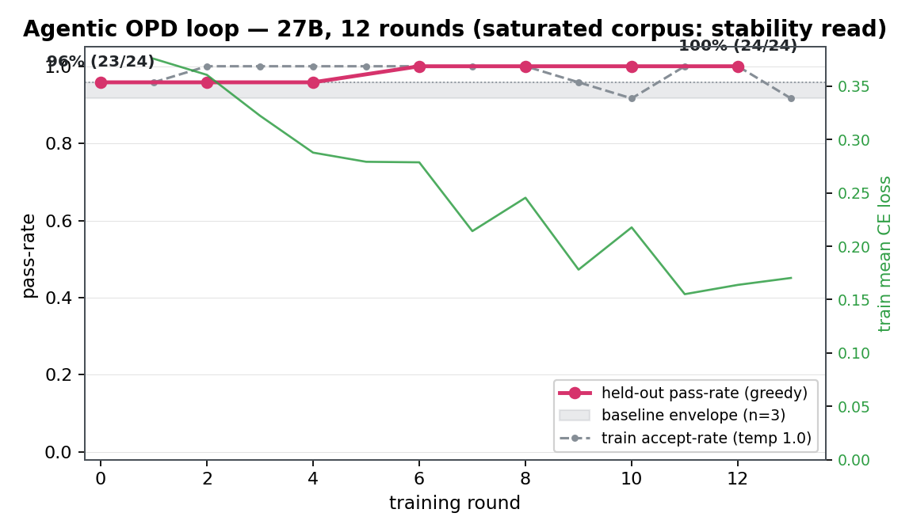

# Agent-OPD 27B loop, 12 rounds end-to-end: eval channel live, zero OOM, loss 0.376 → 0.155

## Goal

First full-shape run of the agentic-OPD capability-curve harness
([plan](../../plans/2026-07-03-agentic-opd-27b-capability-curve.md)): 12 train
tasks × best-of-2 rollouts per round, held-out execution-eval (n=24, greedy)
every 2 rounds plus a 3-repeat baseline envelope — the loop the 37.3×
optimization campaign ([full20](2026-07-03-opd-full20-curve.md)) was built
for, now with real multi-task rollouts and the eval channel exercised.

## Hypothesis

The loop is shape-stable beyond the 1-toy-task smoke: multi-task best-of-N
rollouts, per-round masked-CE writebacks at seq 1200–1400 (post
tape-margin fix), and interleaved eval passes run without OOM or drift.

## Params / Env

27B Qwen3.6-FP8 student, `--share-frozen-base` (zero-copy FP8 base), LoRA
attention-qv r16/α32, lr 1e-5, rollout temp 1.0 seed 0, max-turns 10,
max-tokens 768, writeback-cap 8, window 2048. Single H20 (GPU 4), binary @
`ab2ec1a8`+`ffebfbd3`. Corpus: synthetic hard-v2, 12 train / 24 held-out
(`scripts/gen_agent_opd_tasks.py`, self-check 36/36). Run: `scripts/
agent_opd_curve.sh full0703`; stopped by ckl after round 12 of 16 (remaining
rounds carried no information — corpus saturated, stability already
licensed; final-round adapter save forfeited, unused).

## Results

| round | mean_loss | rollouts passed | held-out pass-rate |
|---|---|---|---|
| 0 | 0.3758 | 23/24 | base 0.9583 (23/24) · envelope n=3: 0.9167–0.9583 |
| 1 | 0.3607 | 24/24 | eval[2] 0.9583 |
| 2 | 0.3224 | 24/24 | |
| 3 | 0.2878 | 24/24 | eval[4] 0.9583 |
| 4 | 0.2792 | 24/24 | |
| 5 | 0.2787 | 24/24 | eval[6] **1.0000** |
| 6 | 0.2142 | 24/24 | |
| 7 | 0.2455 | 24/24 | eval[8] 1.0000 |
| 8 | 0.1781 | 23/24 | |
| 9 | 0.2177 | 22/24 | eval[10] 1.0000 |
| 10 | 0.1551 | 24/24 | |
| 11 | 0.1638 | 24/24 | eval[12] 1.0000 |

- **Zero OOM / CUDA errors through 12 rounds** (~96 writebacks at seq
  1200–1400) — verifies the `should_checkpoint` 3× margin fix under
  sustained load (the pre-fix binary OOM'd on the FIRST writeback at
  seq≈1350; synthetic probe seq=1400 FAIL→PASS across the fix).
- Loss 0.3758 → 0.1551 with the familiar on-policy variance blips (rounds
  7, 9) — same trajectory-noise pattern as the toy full20.
- Held-out pass-rate finished ABOVE the 3-repeat baseline envelope max
  (0.9583) at 1.0000 for four consecutive evals (+4.2pp). **Not a licensed
  capability claim**: +1 task on n=24, single seed — below the <5pp
  multi-seed bar. Recorded as "no degradation, suggestive polish".
- Wall-clock: ~5 min/round (rollouts ≈7 s each, writeback ≈14 s/pair:
  fwd 2.6 s + bwd 11 s), eval ≈8.8 s/task.

## Problems

The corpus itself is the finding: five difficulty escalations all left the
untrained 27B at ceiling — the capability-curve lane on synthetic small
repos is **KILLED**
([errors entry](../errors/2026-07-03-agent-opd-toy-corpus-saturation-kill.md)).
Phase 2 (teacher-rescue on real SWE-Pro) is spec'd in the plan.

## Learnings

- The stability license for a memory fix is per-writeback (the
  `should_checkpoint` gate reads free VRAM every call) — once ~a dozen
  rounds cover the seq range, further rounds add nothing; stop the run.
- An eval curve pinned at ceiling still earns its keep once: it proves the
  eval channel (baseline → per-round Δ → dumps) end-to-end before the lane
  that needs it exists.

Raw: pod `/host/aopd_curve/agent-opd-full0703/{train.log,eval/}`; local
copies alongside
[assets/agent-opd-27b-stability-curve.json](assets/agent-opd-27b-stability-curve.json).
