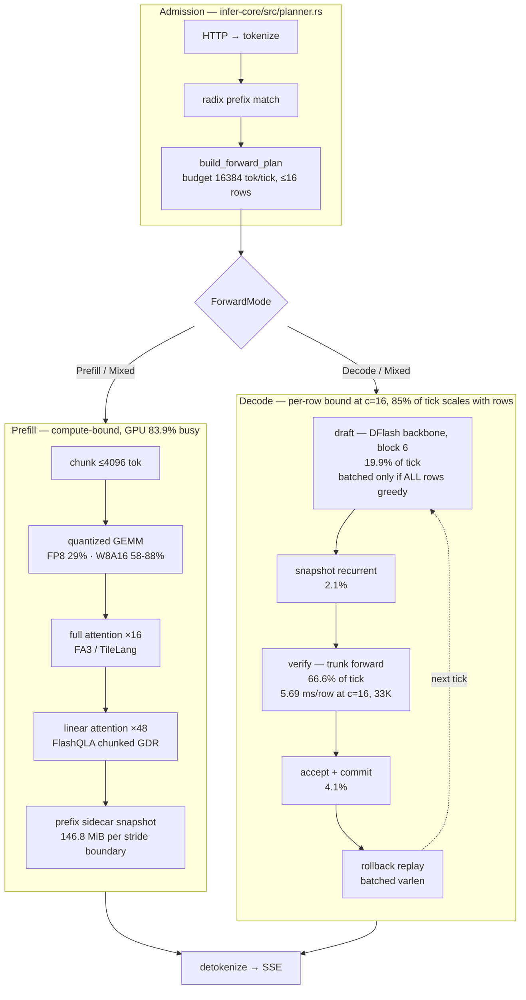

# Qwen3.6-27B — performance chain, 1×H20

Where a request's wall clock goes, stage by stage, with the measurement behind
each number. Companion to [`architecture-dsv4.md`](architecture-dsv4.md), which
describes the DSv4 execution paths; this document describes the Qwen3.6-27B
**cost** of those paths.

**Reading rules.**

- Every number carries its date, its commit, and how it was obtained. A number
  without those three is not in this document.
- Prefill numbers state **cold or warm**. The same 33K prompt runs 35.1 s cold
  and 0.525 s warm through the prefix cache (2026-08-01) — a prefill figure
  without that label means nothing.
- Decode and prefill are opposite regimes and never share a conclusion. Prefill
  is compute-bound at 83.9% GPU-busy (§1.1); a plain decode **step** is 16.7%
  idle (§2.1), while the 50.5% figure in §4.1 is a bench **window** whose idle
  is inter-request stalls — the two are not interchangeable. A measurement that
  does not name its phase supports no claim about the other
  ([error](experience/errors/2026-08-07-measured-prefill-concluded-about-decode.md)).
- Shares are **of the window that was measured**. A window aimed at one phase
  reports that phase's share of the window, not of the run
  ([correction](experience/errors/2026-08-07-named-a-call-site-whose-gate-was-off.md)).

**Provenance of every measurement table.** The recurring failure in this
document has been a table measured at one configuration and read as current.
Each row below carries the date, the batch, and whether a later default flip
invalidated it. **Check this table before ranking anything off a number.**

| § | table | date | batch | context | status |
|---|---|---|---|---|---|
| §1.1 | FP8 prefill budget | 08-01 | 1 | 33K cold | **stale** — pre chunked-GDR default flip; use §1.2 |
| §1.2 | W8A16 prefill vs SGLang | 08-05 | 1 | 33K cold | current |
| §2.1 | plain decode step budget | 08-01 | 1 | short | **stale** — its #2 kernel was deleted 08-03; only the 8.9 ms weight-read floor survives |
| §2.2 | W8A16 decode ledger vs SGLang | 08-03 | 1 | short | **before-state only** — the program it motivated shipped the same day, 26.88 → 21.37 ms |
| §2.3 | decode throughput vs batch | 08-07 `70760bc09` | 1–16 | 32K | current; the column is `B / TPOT`, decode-only, not end-to-end `out tok/s` |
| §2.4 | sampling penalty | 08-07 `7b8a66603` | 1, 8, 16 | 32K | current |
| §3 | DSpark tick phase split | 08-07 `7b8a66603` | 11.0 rows at nominal 16 | short | split current; the `22 ms + 2.48/row` fit is superseded by a per-row fit |
| §4.1 | launch-gap histogram | 08-07 | c=16 window | short | current, and it is a **window** not a step |
| §4.2 | prefix sidecar | 08-07 | 1–16 | short | current |
| §4.4 | memory ledger | 08-07 | 16 slots | — | current |
| §5.0 | anchor row | 08-07 `70760bc09` | 1, 8, 16 | 32K | current |
| §5.2 | vs SGLang, W8A16 | 08-06 | — | 33K | current |
| ceiling | c=16 window, anchor workload | 08-08 `70760bc09` | 9 rows/tick at nominal 16 | 32.5K | current, but the window undersamples decode 2–6× — see the note there |
| §2.0 | c=16 window, **decode-shaped** workload | 08-08 `70760bc09` | **16.0 rows/tick**, four counts | 2.5K | **current — the decode baseline**, window reconciled to +6.8% |

Eleven of the fourteen are batch 1 or batch-1-derived. Thirteen of the fourteen
run the **anchor** workload, which is 279:1 prompt:output and in which all
decode together is 2–6% of GPU time — so read decode numbers off **§2.0**, the
one decode-shaped capture, and prefill numbers off the anchor. The two
workloads disagree by 17× on full-attention's share of a decode tick, so a
decode lever must be priced at the context it will run at.

**Model and device constants** used throughout:

| | |
|---|---|
| layers | 64 = **16 full-attention** + **48 linear** (gated delta) |
| full-attn KV cell | 65536 B/token (16 layers × 4 kv-heads × 256 head-dim) |
| recurrent state | 146.8 MiB per slot = 48 × (3 MiB gdr f32 + 60 KiB conv bf16) |
| weights, FP8 | 31.2 GB |
| H20 SMs | 78 |
| H20 HBM read | **3.5 TB/s achievable** (measured 2026-07-10), 4.02 TB/s spec |
| H20 FP8 / BF16 peak | ~296 / ~148 TFLOPS |

---

## Where the ceiling is — the roofline of the shape production actually runs

Every kernel measurement in this document was taken at **batch 1**: §2.1 is an
`nsys` capture of plain single-row decode steps, §2.2 compares against SGLang
decoding `bs=1` inside a graph. Production serves DSpark verify at c=16 and 32K
context, and **that shape has never been captured**. This section derives what
it should cost, because the derivation changes which levers are worth pulling.

**Scope of the metric.** FLOPs below are GEMM only — `2 × 22.3e9` per token,
using the same 22.3 B GEMM-parameter count §1.2 uses for the prefill roofline.
Attention FLOPs are excluded: they run bf16 against a 148 TFLOPS peak and cannot
be scored against the 296 TFLOPS FP8 denominator. Bandwidth is the 3.5 TB/s
achievable figure from the constants table.

### The batching crossover is at 7 rows, and c=16 is past it

DSpark verify pushes `rows × 6` draft tokens through **one** weight read. A GEMM
stops being memory-bound when compute time overtakes that read:

```
N* = 296 TFLOPS / (2 x 3.5 TB/s) = 42.3 tokens = 7.05 rows at block 6

rows  tokens   weight read   GEMM compute   bound
   1       6       8.91 ms        0.90 ms   memory
   8      48       8.91 ms        7.23 ms   memory
  11      66       8.91 ms        9.94 ms   COMPUTE
  16      96       8.91 ms       14.46 ms   COMPUTE
```

**Past ~7 rows, adding a row stops amortizing anything and starts costing real
FLOPs.** The anchor runs at 16 rows — 2.3× past the crossover. The headroom in
"share the weight read across more tokens" is largely spent on this workload.

### At the anchor's context, most of the traffic was never amortizable

Per decode step at c=16 and 32K, from the constants table and §4.4:

```
                                                  GB   amortizable?
weights, FP8                                    31.2   yes, shared by all rows
full-attn KV  65536 B/tok x 32768 x 16 rows     34.4   no, per row
recurrent state  146.8 MiB x 16                  2.5   no, per row
                                          total 68.0   46% amortizable
```

**The per-row KV read already exceeds the weight read.** Decode at the anchor
workload is not weight-bound; it is KV-bound, and no amount of batching touches
the larger half. The measured verify slope doubling — 2.48 ms/row at short
context, **5.18 ms/row at 33K** (§3) — is this term appearing.

### Consequence: the headroom is roofline at the batched shape, not batching

Measured verify against its own floor, `max(weight read, GEMM compute)` plus the
per-row KV read where context makes it non-negligible:

```
                measured   floor   off roofline
c=1   short       24.5 ms  8.9 ms      2.7x
c=11  short       49.3 ms  9.9 ms      5.0x
c=16  short       61.7 ms 14.5 ms      4.3x
c=16  32K        104.9 ms 18.7 ms      5.6x
```

The gap grows with batch. That is the opposite of what a batch-independent cost
produces, and it is invisible in every capture this document contains, all of
which are batch 1.

### Measured: the mechanism is confirmed and the size is not

`nsys`, 2026-08-08, `70760bc09`, GPU 6, c=16 on the 32K anchor dataset, a 30 s
window at bench elapsed 118–148 s. **This is the document's first decode
capture above batch 1.** Full entry:
[`errors/2026-08-08-anchor-is-a-prefill-benchmark-decode-levers-ranked-off-it.md`](experience/errors/2026-08-08-anchor-is-a-prefill-benchmark-decode-levers-ranked-off-it.md).

**FA3 decode-verify runs at 29.2% of achievable bandwidth.**

```
KV traffic / tick   9 rows x 32550 tok x 65536 B  =  19.20 GB
FA3 time / tick                                      18.79 ms
achieved                                             1.02 TB/s   = 29.2% of 3.5
per-layer cross-check  9 x 32550 x 4096 B / 1.174 ms = 1.02 TB/s  (agrees)
```

The off-roofline half of the claim holds, and the earlier derived range of
0.38–0.68 TB/s was too pessimistic.

**The size does not hold.** In the same window:

```
GPU busy 28676 ms of 29642 ms wall (96.7%), idle 3.26%
  FP8 GEMM, prefill shapes        59.4%  ███████████████████████████████
  FA3 prefill                     16.3%  ████████
  norms + pack_quantize           12.3%  ██████
  GDN / gated-delta               10.6%  █████
  FA3 decode-verify                0.39% ▏
  all decode ticks together        0.98% ▏
```

> **The window undersamples decode 2–6×; use the run-level bound, not these
> two rows.** The bench has a queueing ramp — TTFT p50 4.2 s against p99
> 164 s — and this window sits at bench elapsed 118–148 s, where many requests
> are still in their first prefill. Reconciling against run totals (15,981
> generated tokens, 414 steps, so decode ticks are bounded by
> `15981 / max-tokens-per-tick ≤ D ≤ 414`, i.e. **143 ≤ D ≤ 414**):
>
> | | this window | run-level bound |
> |---|---:|---:|
> | all decode ticks | 0.98% | **2.1 – 6.1%** |
> | FA3 decode-verify | 0.39% | **0.86 – 2.5%** |
>
> The conclusion survives — decode is a single-digit share of GPU time on this
> workload — but the window figures are 2–6× low and must not be quoted. The
> 29.2% bandwidth measurement is unaffected: it is internal to a tick and does
> not depend on how many ticks the window caught. This is the same error the
> reading rules at the top of this document warn about, made again.

Six decode ticks against ~55 chunked-prefill passes, a ratio the run-level
bound says is inverted relative to the whole run. **Removing FA3 decode-verify
entirely would move this row by 1–3%.**

### The anchor workload is prefill-bound, and this document ranks decode off it

The cause is in the dataset, not the runtime. Over the full 128-request run:

| | |
|---|---|
| prompt tokens | 4,452,150 (mean 34,782/req) |
| output tokens | 15,965 |
| ratio | **279 : 1** |

Long-agent 32K × 8 turns is, by GPU work, a **prefill benchmark**. §2 and the
ceiling analysis above are both ranked against a workload where all decode
together is a **2–6%** share of GPU time.

The dataset is not a mistake: `gen_bench_prompts.py` states it models measured
coding-agent traces (TraceLab, 4,265 Claude Code / Codex sessions — 119K prefix,
875 append, 214 output, 8.8 steps per request). Prefix caching recovers most of
it — measured hit rate **0.876**, so 4.45 M prompt tokens become **616 K** of
real prefill work, still **38.6 : 1** against output. **For the workload ARLE
targets, prefill genuinely dominates.** The error was not the benchmark; it was
pricing decode levers on it.

§0.1's "decode is 95.1% of a c=16 request's latency" measures wall clock after
first token with 128 requests queued on 16 slots — `itl_p50` is **0.0197 ms**
against `itl_mean` **176.99 ms**, and `e2e_p99` is 199 s. That is queueing, not
decode compute. The two views must not be added to one conclusion.

**What follows.** Decode levers must be priced on a decode-shaped workload
(short prompts, long generations) and prefill levers on this one. Ranking both
off the anchor is how a 29%-of-roofline kernel became a ~0.4% lever.

### What the capture also corrected

| finding | measurement |
|---|---|
| **rows per tick is 9, not the nominal 16** | three independent counts: `rms_norm_batched_offset` gridX 54 ÷ block 6; `prefill_attention_paged_hd256` 144/tick = 9 × 16 layers; `add_native` gridX 270 = 54 × 5. Most slots are in prefill, not decode. Repeats the earlier 11.0-at-nominal-16. |
| **`gated_delta_rule_prefill_recurrent_kernel` is alive on the decode path** | 7.75 ms/tick, 16.6% of tick busy, 48 launches. The §1.1 stale note is right about prefill and wrong if read as "this kernel no longer runs". |
| `accept_rate` **0.478** | against 0.31 recorded 2026-08-06; acceptance is not the constraint here |
| decode ticks have no launch-gap problem | 11,422 gaps all in 0–5 µs; every bin ≥20 µs is empty inside a tick |
| the sidecar still fires | 1,123 D2H, max payload 3,145,728 B, 1.69 GB in the window |

Inside one decode tick, 6 ticks agreeing to ±0.1%:

```
tick span 50.12 ms | busy 46.62 ms | 1489 kernels
FA3 full-attn        19.81 ms  42.5%   n=192  ██████████████████████
FP8 GEMM             14.64 ms  31.4%   n=352  ████████████████
GDN / gated-delta     8.80 ms  18.9%   n=144  ██████████
norms + elementwise   3.37 ms   7.2%   n=689  ████
```

### Corrections to the previous version of this section

`b3198fb22` framed performance as a product of three factors — time occupancy,
roofline efficiency, arithmetic intensity — and ranked levers by factor. Ten
things in it were wrong, found by four adversarial reviews of that commit:

| claim | defect |
|---|---|
| "a product of three factors" | never formable as tabulated: two cells were levels, the third (`1.23×`) an elasticity. The product was never written because it does not close. |
| ③ ceiling ~12× | `32.8% / 2.6%` divides an all-three-ideal by a fully-measured state, so it multiplied batching headroom by occupancy and roofline headroom. ③'s own share is ~3×, and the KV term above cuts it further. |
| ① = 50.5% busy | that is §4.1's 19.92 s **window**, whose idle is 79 inter-request stalls; the per-step figure is 16.7% (§2.1). The section advertised one and computed with the other — violating this document's own reading rule at the top. |
| "every >2× win is in ③" | false in this file: FlashQLA took linear attention **7.231 → 0.441 s, 16.4×** (§1.2), and it is a kernel replacement. |
| "rank by factor before size" | refuted by that same example: 16.4× on a module worth 23% of prefill yielded −26% end to end. **Factor size × share governs.** A lever's ceiling belongs to the lever, not to a category. |
| "22 ms intercept is the part adding rows does not amortize" | inverted. Per-token verify cost is `22/(R·A) + slope/A`; the intercept **is** the term that falls as rows grow. The slope is what does not. |
| the `22 ms + 2.48 ms/row` model itself | superseded on the current binary (`baselines.md:162`) by a pure per-row fit, **5.69 verify + 3.04 draft**, 85% of the tick. §3 now carries the current one. |
| "36% of verify at c=16" | no measurement produces it: it multiplies a short-context slope by a nominal row count the same capture measured as 11.0. |
| 27e9 params for FLOPs | §1.2 uses 22.3e9 GEMM params for the same purpose. |
| "acceptance may collapse with batch" | already withdrawn in `baselines.md:137` — `accept` tracks cache state, not concurrency (0.532 vs 0.313 at matched c=16). Do not re-file it. |

The ①②③ tags are dropped from §6 for the reason in the "rank by factor" row.
What survives from
that section is the physical observation it was built on: a batch-1 decoder at
100% of achievable bandwidth is still a nearly idle machine. What was wrong was
concluding that batching therefore had the headroom — on this workload it is
already past the crossover, and the headroom moved to the per-row KV read that
batching cannot touch.

---

## 0. The chain

**How to read the figures.** Three things have to be visible at once — what a
stage contains, how long it takes, and how it sits inside the end-to-end time —
and they are carried by two different figure types, which must not be confused:

| type | when | encoding |
|---|---|---|
| **timeline** | the stages really are sequential (§0.1 request, §3 tick) | bar **start** is start time, bar **length** is duration; the row is the whole |
| **budget** | the parts interleave (§1.1 prefill, §2.1 decode step) | every bar starts at the same origin; only **length** means anything |

Drawing an interleaved budget as a timeline would assert an execution order
that does not exist, so those figures are labelled at the point of use. The
flowchart carries containment and routing only — box size means nothing there,
and percentages inside nodes are labels.

**Every share in this document is taken against the sum of the rows shown**, and
the sum is printed. Where that differs from a previously published share, the
difference and its cause are stated on the spot.

**What is in this document.** A number earns a place here if it can change a
decision — what to work on next, or what not to. Everything else stays in the
wins/errors entry it came from and is linked. The four largest numbers in the
chain are all unattributed, and are marked as such rather than filled with a
hypothesis; see *Measurement debt*.



Prefill and decode rows share a tick (`ForwardMode::Mixed`), but the executor
still decomposes the mixed plan into per-row prefill submissions followed by a
batched decode dispatch (`infer-cuda/src/executor/qwen35.rs:2932`).

### 0.1 Where a request's own latency goes

Anchor workload, 214 output tokens, warm prefix. Bar position is start time and
bar length is duration, both to scale — these two stages really are sequential.

```
c=1                       s   share
prefill (TTFT warm)    0.84   31.7%  ███████████████████
decode 214 x 8.46 ms   1.81   68.3%                     █████████████████████████████████████████
                                     total 2.65 s

c=16                      s   share
prefill (TTFT warm)    1.22    4.9%  ███
decode 214 x 110.52 ms 23.65  95.1%     █████████████████████████████████████████████████████████
                                     total 24.87 s
```

Concurrency moves a request's latency almost entirely into decode. Aggregate
*throughput* on the same workload runs the other way — prefill tokens dominate
the token count, which is why total tok/s scales 10453 → 33780 while decode
tok/s scales 118 → 145 (§2.3). The two views answer different questions and
neither substitutes for the other.

**The four largest costs are measured and none of them is attributed.** Each is
sized precisely and its cause is unknown. Quantized GEMM, DeepGEMM FP8, and
launch gaps have all been measured and priced out (§6).

| cost | size | what is known | what is not | § |
|---|---|---|---|---|
| per-row verify term at c=16 | **5.69 ms/row, 85% of the tick, 9.2× off roofline** | the GDN lane is excluded by a same-binary A/B, so what remains is the FA3 KV read | FA3's achieved bandwidth on this shape — no capture above batch 1 exists | ceiling |
| sampling penalty | −30 to −40% decode tok/s at c ≥ 8 | the concurrency shape is a per-row loop; acceptance-vs-concurrency is withdrawn | the size of the batched-draft gate's share | §2.4 |
| prefill GPU idle | 3.97 s vs SGLang 0.19 s | GPU-busy is within 0.93 s on identical kernels | what the idle is waiting on | §1.2 |
| sidecar writes | 9.4% of wall, 83 GB per bench | the cost, exactly | the restore hit rate, so whether it is earned | §4.2 |

They are ranked by size at the batch that is served, which is why the per-row
verify term leads despite the prefill idle being the larger raw number — see
*Where the ceiling is* above.

---

## 1. Prefill

### 1.1 FP8 weights — 33K cold, single request

`nsys`, 2026-08-01, 28.6 s wall / 24.0 s GPU-busy (**83.9%**).

> **STALE — do not rank prefill work off this table.** Measured before chunked
> GDR went default-on (`c2eb5de9e`, 08-02). Its #1 row is a kernel that no
> longer runs **on the prefill path** at the shipped defaults: FlashQLA chunked
> replaced `gated_delta_rule_prefill_recurrent` there and measured **1.06 s
> against its 9.37 s**, which moves 33% of the budget and reorders everything
> below it. The kernel itself is still live — the 08-08 capture measures it at
> **7.75 ms per decode tick, 16.6%**, 48 launches, despite the name.
> Two more prefill changes landed after (`0ac780495`, `301d0c074`), and
> `b0368426a` routed batch==1 prefill to FA3, which also moves the TileLang
> row. Same flag as [`baselines.md`](baselines.md) carries. A re-measure needs
> one `nsys` capture. **§1.2 is the current prefill decomposition** — it is
> dated 08-05 and has the FlashQLA column.
>
> One consequence is already readable: removing ~8.3 s of GPU-busy while the
> 4.60 s idle row stays put takes idle from 16.3% to **~21% of prefill**. The
> idle item got relatively larger, not smaller.

These kernels interleave across the prefill, so this is a **budget**, not a
timeline — every bar starts at the same origin and only its length is meaningful.

```
                                     s   share   launches
gated_delta_rule_prefill_recurrent 9.37  33.1%   1152  ████████████████████
DeepGEMM FP8, all shapes           8.33  29.5%   7936  ██████████████████
GPU idle (incl. host tokenization) 4.60  16.3%      —  ██████████
TileLang full attention            3.93  13.9%    368  ████████
pack_quantize bf16 -> fp8          1.50   5.3%   9600  ███
conv1d / norm / silu               0.55   1.9%   3840  █
                                                       total 28.28 s
```

Plus **2328 `cuMemcpyDtoH` costing 1.58 s** — host round-trips inside the
prefill loop.

Per-part ceilings decide where work is worth doing:

| part | achieved | ceiling | verdict |
|---|---|---|---|
| DeepGEMM `gate_up` / `down` | 199 / 189 TFLOPS | ~296 FP8 | **64–67% — leave alone** |
| full attention | 54 TFLOPS | ~148 BF16 | 36%, and on TileLang rather than the FA3 decode already uses |
| `gated_delta_rule_prefill_recurrent` | — | — | not compute-bound: `<<<48, …>>>` on **78 SMs**, scanning the sequence serially inside each block |

The recurrence was the largest single line and the only one with headroom.
FlashQLA chunked GDR, parameterized over (H, Hg), took 33K cold prefill
**28.95 → 21.63 s (−26%)** and is default-on since `c2eb5de9e`; `b0368426a`
then routed batch==1 prefill to FA3 for a further −4%.

### 1.2 W8A16 weights — 33K cold, versus SGLang

`nsys --cuda-graph-trace=node`, 2026-08-05, H20 GPU 6, SGLang 0.5.13 on a
mechanically repacked GPTQ twin: **same int8 values, same `gptq_marlin`
kernel**. Prefill is not captured into a graph on either stack.

| bucket | ARLE (stub) | ARLE (FlashQLA) | | SGLang | |
|---|---:|---:|---|---:|---|
| Marlin GEMM (8448 launches) | 18.660 s | 18.660 | `████████████████████████████` | 18.675 | `████████████████████████████` |
| GPU idle | **3.877** | **3.967** | `██████` | **0.190** | `▏` |
| full attention (FA3) | 1.632 | 1.633 | `██` | 1.529 | `██` |
| other | 0.361 | 1.108 | `██` | 0.422 | `▊` |
| linear attention + conv1d | **7.231** | **0.441** | `▊` | 0.314 | `▌` |
| **wall** | 31.76 | **25.84** | | **21.13** | |

The two bar columns are on the same scale, so the only visible difference
between the stacks is the idle row.

Three conclusions that hold for both weight paths:

- **Quantized GEMM is not a lever.** Identical kernel, identical launch count,
  15 ms apart across stacks. It is 58–88% of prefill on both.
- **`--chunked-prefill-size` is not a lever.** ARLE 2048 vs 4096 and SGLang
  4096 vs 8192 all land inside 0.07 s TTFT.
- **The remaining gap is 3.8 s of GPU idle** — ARLE 3.97 s against SGLang
  0.19 s, with GPU-busy time within 0.93 s. Scheduling or host-side, not a
  kernel.

Roofline: ~1.68 PFLOP for a 33K prefill (22.3 B GEMM params × 2 × 33e3, plus
0.21 PFLOP causal full attention over 16 layers) against 148 TFLOPS BF16 →
**11.4 s floor**. SGLang 54% MFU, ARLE 46% after the FlashQLA fix.

---

## 2. Decode

### 2.0 Decode-shaped workload, c=16 — the current decode baseline

`nsys`, 2026-08-08, `70760bc09`, GPU 6, 16 sessions × 1 turn, ~1.1K prompt /
1.8K generated (**1 : 1.62** prompt:output), 32 requests, 60 s window at bench
elapsed 40–100 s. **Window reconciled against run totals: 484 ticks in the
window at 8.07/s against a run-level 7.56/s, +6.8%** — representative, unlike
the anchor capture (§ *Where the ceiling is*). Rows per tick measured **16.0**
by four independent counts.

Full entry:
[`wins/2026-08-08-decode-shaped-reanchor-draft-attention-is-30pct.md`](experience/wins/2026-08-08-decode-shaped-reanchor-draft-attention-is-30pct.md).
Budget, not a timeline.

```
tick span 112.33 ms | GPU-busy 96.88 ms (86.2%) | period 123.9 ms
draft attention        29.57 ms  30.5%  ███████████████
FP8 GEMM               27.87 ms  28.8%  ██████████████
GDN / gated-delta      20.30 ms  21.0%  ██████████
dense GEMM (cuBLAS nvjet + splitK)
                       11.68 ms  12.1%  ██████
norms + elementwise     5.67 ms   5.9%  ███
full-attn paged         1.75 ms   1.8%  █
sampling                0.06 ms   0.1%
                                        total 96.88 ms
```

Row: 407.97 out tok/s, 659.55 total tok/s, ITL mean 31.08 ms, TTFT p50 1.42 s.
`accept_rate` 0.475, empirical chain length 3.37 tokens.

**A decode lever's share is workload-dependent, and the two captures disagree
by 17×.** Full-attention is 1.8% of a tick here at ~2.5K context and 42.5% at
32.5K on the anchor. Neither is "the" decode budget; a decode lever must be
priced at the context it will run at, and both numbers belong in this document.

**Draft attention is the largest line, and §6 had it priced out.** The register
carried `DSpark draft attention — 1.5 ms of 35 ms (4.3%) — priced out, 3
rewrites failed to transfer`. That verdict came from a shape where it was 4.3%;
here it is **30.5%**. The kernel is `nonpaged_prefill_attention_kernel`, 39,690
launches in the window — the DFlash draft has no paged KV pool, so the draft
lane takes the nonpaged branch while the trunk takes
`prefill_attention_paged_hd256_kernel`.

**Idle inside a tick is 13.8%**, and 61.4% of that gap time sits in **53 gaps
over 1 ms**. On the anchor capture decode ticks were gap-free below 20 µs; this
shape is not. Cause unknown. Host round-trips are visible next to it: HtoD
moves 0.08 GB per tick in **0.486 ms** — latency, not bandwidth.

Achieved KV bandwidth on the paged full-attn kernel:

```
16 rows x 2484.3 tok x 65536 B = 2.605 GB / 1.590 ms = 1.638 TB/s = 47% of 3.5
```

Against 1.02 TB/s (29.2%) at 32.5K context and 9 rows on the anchor. Longer
context measured *lower* achieved bandwidth, but row count moved too (16 vs 9)
and the two effects are not separable from these two points.


### 2.1 Plain decode step, FP8

`nsys` over 59 plain-decode steps, 2026-08-01, per step.

> **STALE — do not rank decode work off this table, and note it is batch 1.**
> Two defects. First, its #2 row is a kernel that was deleted from the default
> path on 08-03: every bf16 N≤4 GEMM rides cuBLASLt now
> ([`wins/2026-08-03-t5b-lmhead-cublas.md`](experience/wins/2026-08-03-t5b-lmhead-cublas.md)),
> and the decode program that followed took the step **26.88 → 21.37 ms
> (−20.5%)** (§2.2). The 23.89 ms sum and the composition under it both predate
> that. Second, a plain single-row decode step is not the shape served —
> production runs DSpark verify at c=16, where 85% of the tick scales with rows
> (§ *Where the ceiling is*). Kept here because the **weight-read floor** it
> establishes is a device constant and does not go stale.

Budget, not a timeline — 1094 launches per step interleave.

```
                                     ms   share   launches
fp8_gemv_batch_kernel             13.80   57.8%    400  ███████████████████████████████████
gemv_handwritten_kernel (bf16)     4.30   18.0%     97  ███████████
GPU idle between launches          4.00   16.7%      —  ██████████
gated_delta_rule_decode            0.80    3.3%     48  ██
rms_norm / add / silu              0.79    3.3%   ~250  ██
flash attention                    0.20    0.8%     16  █
                                                        total 23.89 ms
```

Shares are of the 23.89 ms sum. The originally published shares (66 / 21 / 16 /
4 / 4 / 1) were taken against the ~21 ms measured step, and the idle row against
a third base; the ms column is the measurement and the sum is the denominator
used here.

Weight-read floor at 31.2 GB / 3.5 TB/s = **8.9 ms** — the one durable number
in this table. GEMV measured 18.1 ms against it, **~49% of achievable
bandwidth**, reproducing the 51% found in July; but 4.30 ms of that 18.1 is the
since-deleted `gemv_handwritten_kernel`, so treat 49% as a batch-1 figure from a
superseded configuration, not as the current roofline gap.

### 2.2 Module ledger versus SGLang, W8A16

2026-08-03, both stacks `nsys`-decomposed, columns summing to measured ITL.
ARLE 25.08 ms/step versus SGLang 17.07 ms/step:

| module | ARLE | | SGLang | | Δ | attributed to |
|---|---:|---|---:|---|---:|---|
| marlin | 13.20 (357) | `██████████████████████████` | 12.31 (270) | `████████████████████████` | 0.89 | qkv fusion, fixed-grid prologue × launches |
| idle | 5.66 | `███████████` | 2.08 | `████` | **3.58** | whole-step CUDA graph |
| bf16 gemv | 3.17 (52) | `██████` | 1.11 (nvjet) | `██` | 2.06 | `gemv_handwritten_kernel` on fused `[96,5120]` in_proj_ba: ~52 µs at ~19 GB/s, one-block-per-row grid cannot fill 78 SMs; cuBLAS splitK does the shape in ~8 µs |
| GDN chain | 1.21 | `██` | 0.53 | `█` | 0.68 | kernel quality (fla-style) |
| FA3 chain | 0.93 | `██` | 0.45 | `█` | 0.48 | decode config |
| norms | ~parity | | ~parity | | ~0 | — |
| **total** | **25.08** | | **17.07** | | **8.01** | |

The kernel was exonerated by construction: SGLang decodes bs=1 inside a
whole-step captured CUDA graph while ARLE launched ~1094 kernels eagerly.

**Program outcome, all shipped and default-on the same day: 26.88 → 21.37 ms
(−20.5%).** `gemv → cuBLASLt` −1.28, qkv/qkvz fusion −0.59, whole-step decode
graph under paged KV −1.84 (per-slot persistent `PageMeta` refreshed outside
the graph, FA3 `seqlen_k` pinned to capacity, TileLang fallback refuses
capture). `--qwen35-decode-graph` is default-on for serve with an MMLU 84/100
license.

Remaining against SGLang's 17.07: ~4.3 ms = host tail (8 refresh H2Ds +
sampling D2H/sync + scheduler) + GDN kernel 0.7 + FA3 decode config 0.5 +
marlin prologue residue.

### 2.3 Aggregate decode throughput is nearly flat in batch size

From the anchor row, per-request decode tok/s and the aggregate `B / TPOT`:

| c | TPOT ms | per-request tok/s | aggregate decode tok/s |
|---:|---:|---:|---:|
| 1 | 8.46 | 118.1 | 118.2 |
| 2 | 18.70 | 53.5 | 106.9 |
| 4 | 33.77 | 29.6 | 118.4 |
| 8 | 62.49 | 16.0 | 128.0 |
| 16 | 110.52 | 9.0 | **144.8** |

**Sixteen times the batch buys 1.23× the decode throughput.** An earlier
version of this section attributed that to a batch-independent intercept. That
attribution is withdrawn: on the current binary the tick is **85% per-row**
(verify 5.69 ms/row), so the flat curve is the per-row term, not a fixed cost.
Two cautions on the number itself — this column is `B / TPOT`, a decode-only
aggregate, while §2.4 and §5.1 measure end-to-end `out tok/s` and scale 3.3×
over the same range; and c=16 is offered concurrency, against a measured mean of
11.0 rows per tick (§3).
Aggregate *total* throughput still scales (10453 → 33780 tok/s) because prefill
tokens dominate the token count on the anchor workload.

### 2.4 Sampling costs 30–40% of decode throughput at c ≥ 8

Counterbalanced greedy/sampled sweep, 2026-08-07, `7b8a66603`, long-agent 32K,
128 requests per point, order greedy, sampled, sampled, greedy.

| c | greedy (temp 0) | sampled (temp 0.7) | Δ |
|---:|---:|---:|---:|
| 1 | 34.8 | 33.55 | **−3.6%** |
| 8 | 108.65 | 65.4 | **−39.8%** |
| 16 | 113.8 | 78.6 | **−30.9%** |

out tok/s, each cell the mean of that arm's two sweeps. Within-arm spread is
8.4% at c=16 and 6.4% at c=8, so the effect clears its own noise by 4–6×.
Greedy completed 128/128 everywhere; sampled completed 120/128 at every point,
cause unknown.

**The concurrency shape is the evidence.** At c=1 sampling costs 3.6%; at c=8 it
costs 39.8%. A lower acceptance rate under temperature would cost roughly the
same fraction at every concurrency. A per-row host loop costs nothing at c=1 and
grows with row count — which is the shape measured.

The candidate mechanism is the batched-draft gate at
`infer-cuda/src/executor/qwen35.rs:1984`:

```rust
if idx.len() >= 2 && decode_rows.iter().all(|r| r.params.is_greedy())
```

`idx` is the seeded rows, but the greedy test sweeps **all** rows, so a single
sampled request drops every greedy row to per-row drafting. In this sweep every
row is sampled, so the batched path never fires.

**Not yet isolated:** the sampled arm has no `accept_rate` figure, so the gate's
share is unattributed. Note the rival hypothesis is already dead — "accept
halves at concurrency" was withdrawn in `baselines.md:137`; `accept` tracks
prefix-cache state, not `c` (0.532 vs 0.313 at matched c=16). This stays a
top-ranked item because production serving is sampled while every optimization
on this row was measured at temp 0.

---

## 3. Speculative decode — the DSpark tick

`ARLE_DSPARK_PHASE=1`, 2026-08-07, `7b8a66603`, c=16, short prompts, 293 ticks,
mean 11.0 rows/tick.

The tick is sequential, so position and length are both to scale:

```
                 ms   share
draft         12.75   19.9%  ████████████
snapshot       1.21    1.9%              █
verify        42.64   66.6%               ████████████████████████████████████████
commit         2.40    3.7%                                                       ██
rollback       5.03    7.9%                                                         █████
                                          total 64.03 ms
```

Shares are of the 64.03 ms sum. The phase table published earlier used 59.00 ms
(the four `[dspark-phase]` fields, excluding the separately-logged rollback) as
its base, which is why `draft` reads 21.6% there and 19.9% here. Rollback is
real tick time, so the sum is the honest denominator.


`commit` splits into tap 0.42, accept 0.02, cap 0.01, trunc 0.01, ext 1.94.
`rollback` splits into restore 0.85, replay 4.18.

**The phase timer synchronizes at each lap, so the total is inflated and only
the split is meaningful.** The same run measured 149.1 out tok/s against
236–243 unprofiled.

Two structural facts:

- **draft + verify = 86.5% of the tick.** Orchestration — snapshot, commit,
  rollback — is 13.5%. Per-row host bookkeeping inside commit is negligible
  (accept 0.02 ms, cap and trunc 0.01 ms each).
- **The per-row term is the wall, not the intercept.** An earlier fit on this
  short-prompt capture read verify as `22 ms intercept + 2.48 ms/row`. On the
  current binary at c=16 / 33K the tick is a pure per-row fit — **verify
  5.69 ms/row, draft 3.04 ms/row, 85% of the tick scaling with rows**
  ([`baselines.md:162`](baselines.md), measurement in
  [`errors/2026-08-06-…-gemm-is-not-the-top-lever.md`](experience/errors/2026-08-06-decode-lever-board-rebuilt-gemm-is-not-the-top-lever.md)).
  Use the per-row fit. An intercept, where one exists, is the shared weight read
  — the term batching **does** amortize; the slope is what it cannot.

Consequence for kernel work: price a kernel against the per-row term at the
batch you serve, not against a batch-1 step. DSpark draft attention is 1.5 ms of a 35 ms step (4.3%), so a
−33% microbench win there is capped at −1.4% end to end — which is why three
kernel rewrites failed to transfer.

---

## 4. Costs outside the forward

Measured on the decode-heavy short-prompt shape, 2026-08-07.

### 4.1 GPU idle is not launch gaps

One 19.92 s decode window, GPU busy 10.07 s (50.5%), idle 9.86 s. Binning every
gap on the unified kernel+memcpy timeline:

| gap size | n | total | share of idle |
|---|---:|---:|---:|
| 0–5 µs | 410485 | 0.59 s | 6.0% |
| 5–20 µs | 18045 | 0.14 s | 1.5% |
| 20–50 µs | 643 | 0.02 s | 0.2% |
| 50–200 µs | 1328 | 0.12 s | 1.2% |
| **>1 ms** | **79** | **8.98 s** | **91.1%** |

**All 430k sub-millisecond gaps together are 0.87 s, 4.4% of the window** —
the four bins above, not only the 0–5 µs one. That is the entire budget a CUDA
graph on this path can recover. (No bin covers 200 µs–1 ms; the column sums to
9.85 s against 9.86 s stated idle, so that range is empty in this capture.) 91% of the idle is 79
stalls averaging 114 ms, of which **7.45 s sits in no CUDA API call at all**.

### 4.2 The prefix sidecar

`Qwen35RecurrentSnapshot` writes the whole recurrent state at every stride
boundary of every prefill so a later conversation can restore the hybrid
prefix. The payload is fixed at **146.8 MiB** by the model's 48 linear layers,
independent of how much prefix is cached.

| | per snapshot | per 512 s bench |
|---|---:|---:|
| count | — | 578 |
| payload | 146.8 MiB | **83 GB** |
| serialize, per element (`d626a1b03^`) | 84.45 ms | 48.25 s = **9.4% of wall** |
| serialize, bulk copy (`d626a1b03`) | 76.40 ms | 43.65 s |

Bulk copy is **−9.5% on the operation and 0.9% of wall** — an end-to-end null,
kept because it is strictly less work
([bench](experience/wins/2026-08-07-prefix-sidecar-serialize-bulk-copy.md)).
146.8 MiB in 76 ms is 1.9 GB/s, so the residual is allocating and
first-touching fresh heap; making this materially cheaper means not making the
copy.

**Open:** the sidecar's restore hit rate is unmeasured, so whether 83 GB per
bench is earned is unknown. This is the largest unpriced item in the chain.

### 4.3 Whole-slot park

`admit_via_oversubscription` parks the longest-running decode into the KV tier
whenever a waiter exists. Both park routes are **unreachable in a default
serve** — `--kv-oversubscription` defaults off, and the other route requires
`kv_tier_capacity() == 0` while the L2 host tier is on. The same per-element
serialization was fixed there in `a546ba80a` and remains **unmeasured** for
that reason. Park and promote now log elapsed ms and a running count.

---

### 4.4 Memory ledger

From a serve start, 16 slots, `mem_fraction_static 0.9`, FP8 weights
(2026-08-07 serve log):

| | |
|---|---|
| total VRAM | 97508 MB |
| free after weights | 64731 MB |
| recurrent reservation | **3127 MB** = 16 slots × 195 MB |
| free after recurrent | 61604 MB |
| full-attn KV pool | **51853 pages** @ page_size 16 = 829648 tokens, 54.4 GB |
| per-slot budget | 195 MB = gdr 144 + conv 2 + draft 48 (K+V is paged, 0) |
| L2 host DRAM tier | 862 GB budget (`dram_fraction 0.5`), features: `prefix` |
| L3 (SSD) | off by default |

Two consequences the chain depends on:

- **The recurrent state, not the KV cache, is the per-slot cost.** 195 MB per
  slot is fixed by the 48 linear layers and is independent of context length,
  while full-attn KV is paged at 65536 B/token across only 16 layers.
- **The device pool is not the binding resource at these workloads.** 829648
  tokens against 16 concurrent rows means a 16 × 1750-token workload occupies
  3.4% of the pool, which is why no KV-pressure preempt fires and why §4.3's
  park routes stay unreachable.

---

## 5. Anchor numbers

### 5.0 Current row

Long-agent 32K × 8 turns, DSpark, `70760bc09`, 2026-08-07 — the row
[`baselines.md`](baselines.md) tracks:

| c | TTFT cold | TTFT warm | TPOT | total tok/s |
|---|---:|---:|---:|---:|
| 1 | 10.82 s | 0.84 s | 8.46 ms | 10453.0 |
| 8 | 1.60 s | 0.79 s | 62.49 ms | 31334.5 |
| 16 | 2.90 s | 1.22 s | **110.52 ms** | **33780.3** |

### 5.1 Day delta — what the 08-07 decode work moved

Counterbalanced A/D/D/A, `010af0ede` (morning) against `7b8a66603` (evening),
same anchor workload, 128/128 complete at every point in all four sweeps. Each
cell is the mean of that arm's two sweeps.

| c | A out tok/s | D out tok/s | Δ | Δ total tok/s |
|---:|---:|---:|---:|---:|
| 1 | 34.15 | 35.35 | +3.5% | −0.2% |
| 2 | 75.20 | 78.70 | +4.7% | +2.9% |
| 4 | 83.95 | 96.25 | **+14.7%** | +9.6% |
| 8 | 91.70 | 111.40 | **+21.5%** | +10.0% |
| 16 | 104.80 | 118.40 | **+13.0%** | **+22.3%** |

The gain appears at c ≥ 4 and is ~flat at c = 1, which is the signature of the
two mechanisms that were fixed: both were per-row host loops whose cost scales
with row count and vanishes at a single row.

### 5.2 Versus SGLang

W8A16 against SGLang on identical weights and kernel, 2026-08-06:

| arm | TTFT p50 | prefill tok/s | ITL p50 | ITL p99 | e2e p50 |
|---|---:|---:|---:|---:|---:|
| ARLE | 23.01 s | 1434 | **16.70** | 20.50 | 27.4 s |
| SGLang | **21.03 s** | **1568** | 17.16 | **19.19** | **25.44 s** |

---

## 6. Lever register

Every lever that has been priced, with the measurement that settled it, and the
**batch it was measured at**. That last column is the one that has misled this
document: a lever measured at batch 1 carries no information about the shape
production serves.

Ranking rule: **effect size × share of the step you actually run.** An earlier
version of this table ranked by a factor category instead. That rule is refuted
here — FlashQLA is a 16.4× kernel win (§1.2) that yielded −26% end to end
because it sat on a 23% module, while DSpark's ~2.5× sat on the whole step.
Ceilings belong to levers, not to categories.

**Open, ranked**

| lever | phase | measured at | size | status |
|---|---|---|---|---|
| **DSpark draft attention** | decode | **c=16, 2.5K ctx** | **30.5% of a decode tick** | **open, #1** — was "priced out" at 4.3% from a shape where it was small |
| FP8 GEMM on the verify shape | decode | c=16, 2.5K ctx | 28.8% of a decode tick | open — never decomposed at this shape |
| GDN / gated-delta at c=16 | decode | c=16, 2.5K ctx | 21.0% of a decode tick | open — a same-binary A/B nulled it at 33K, untested here |
| >1 ms gaps inside decode ticks | decode | c=16, 2.5K ctx | 13.8% of tick span, 53 gaps | open, cause unknown |
| full-attn KV bandwidth | decode | c=16 | **47% of achievable at 2.5K, 29.2% at 32.5K** | open, but only 1.8% of a tick at short context |
| batched-draft gate under sampling | decode | c=1…16, 32K | −30 to −40% decode tok/s at c ≥ 8 | **open, #2** — `executor/qwen35.rs:1984` tests all rows greedy; one-line narrowing to `idx` |
| prefill GPU idle | prefill | c=1, 33K | 3.97 vs SGLang 0.19 s | **open, #3** — largest single gap, own SLO (TTFT) |
| sidecar write policy | prefill | c=1…16 | 83 GB / 9.4% of wall | open — hit rate unmeasured |
| host tail (refresh H2D, sampling sync) | decode | **batch 1** | part of ~4.3 ms residual | open, needs re-pricing at c=16 |
| GDN decode kernel | decode | **batch 1** | 1.21 vs 0.53 ms | open at batch 1; the GDN lane is a measured null at c=16 |

**Shipped**

| lever | phase | measured at | result |
|---|---|---|---|
| DSpark speculation | decode | c=1…16 matched on/off | **2.9× at c=1 decaying to 1.1× at c=16** (`baselines.md:144`) |
| FlashQLA chunked GDR | prefill | c=1, 33K | linear attention **7.231 → 0.441 s (16.4×)**, 33K cold −26% |
| whole-step CUDA graph | decode | batch 1 | −1.84 ms, default-on |
| `gemv_handwritten` → cuBLASLt | decode | batch 1 | −1.28 ms |
| qkv/qkvz fusion | decode | batch 1 | −0.59 ms |
| batched DSpark verify core | decode | c=8 | TPOT −12.7% |
| batched rollback replay | decode | c=16 | TPOT −11.4% |
| sidecar bulk serialize | prefill | c=1…16 | −9.5% on the op, end-to-end null |

**Priced out**

| lever | phase | measured at | why |
|---|---|---|---|
| quantized GEMM kernel | prefill | c=1, 33K | identical to SGLang ±15 ms |
| DeepGEMM FP8 | prefill | c=1, 33K | 64–67% of peak |
| CUDA graph on the spec path | decode | c=16 window | all sub-ms gaps 0.87 s, 4.4% of window |
| prefill–prefill fusion | prefill | c=1 | ~3% (15 redundant weight reads) |
| `--chunked-prefill-size` | prefill | c=1, 33K | ±0.07 s TTFT |
| `--max-num-batched-tokens` | prefill | c=1…16 | budget never binds; 16384 stays |
| pinned readback staging | decode | c=1…16 | wash on both phases, kept |

**What the batch column exposes.** Nine of the levers above were measured at
batch 1, including every open kernel item. The decode work this document ranks
runs at c=16, where the tick is 85% per-row and the per-row term is 9.2× off
its roofline. Re-pricing the batch-1 rows at c=16 is a prerequisite for
trusting any of their sizes.

---

## 7. Reproducing

Bench parameters, gates, and the A/B contract live in
[`bench-and-trace-spec.md`](bench-and-trace-spec.md). Two notes specific to this
chain:

- **`ARLE_QWEN35_PROFILE` parent ranges are inflated.** Each leaf ends in
  `stop.synchronize()` and a parent absorbs every child's sync bubble. Only
  leaves are real. Count forwards as `input_norm` instances / 64.
- **`nsys` is not required to read its own database.** Every gap and API figure
  in §4.1 came from `sqlite3` over the `.sqlite` an earlier capture wrote —
  `CUPTI_ACTIVITY_KIND_KERNEL`, `_MEMCPY`, `_RUNTIME` are plain tables.

---

## Open items, ranked by measured share on a workload that exercises them

Two rules the 08-08 captures produced. **Price a lever on a workload where the
phase it touches is a large share of GPU time** — full-attention decode is 47%
of roofline and 1.8% of a decode tick at short context; both are true and only
the second ranks it. And **reconcile a capture window against run totals before
quoting a share** — the anchor capture undersampled decode 2–6× by landing in a
queueing ramp.

**Decode** — priced on §2.0, the decode-shaped c=16 capture.

1. **DSpark draft attention, 30.5% of a decode tick.** The largest single line,
   and §6 had it **priced out at 4.3%** from a shape where it was small. Three
   earlier kernel rewrites failed to transfer; they were sized against that
   4.3%. `nonpaged_prefill_attention_kernel`, 39,690 launches in a 60 s window.
   Re-open with a capture of the kernel itself at this shape.
2. **FP8 GEMM on the verify shape, 28.8%.** Priced out at 64–67% of peak on
   *prefill* shapes (§1.1). The verify shape is different and has never been
   decomposed.
3. **GDN / gated-delta, 21.0%.** A same-binary A/B nulled this lane at 33K
   context; that A/B has not been repeated at short context, where its share is
   larger.
4. **Gaps over 1 ms inside decode ticks** — 13.8% of tick span, 61.4% of it in
   53 gaps. Decode ticks on the anchor capture had nothing above 20 µs. Cause
   unknown. Next to it, HtoD moves 0.08 GB per tick in 0.486 ms, which is
   latency.

**Prefill** — priced on the anchor, which is what it models.

5. **Prefill is where the anchor's time is** — 59.4% FP8 GEMM plus 16.3% FA3
   prefill at 96.7% GPU-busy. The FP8 GEMM is priced out at 64–67% of peak, so
   the open question is prefill FA3 and the 12.3% in `pack_quantize` + norms.
   Neither has been decomposed.
6. **Sampling costs 30–40% of decode throughput at c ≥ 8** (§2.4) — measured on
   the anchor, so its size needs re-measuring on §2.0's shape. The gate at
   `executor/qwen35.rs:1984` tests *all* rows greedy. Do **not** re-open
   "acceptance collapses with concurrency": withdrawn (`baselines.md:137`), and
   both 08-08 captures measured `accept_rate` ≈ 0.475.
7. **Sidecar write policy** — restore hit rate still unmeasured.

## Measurement debt

Facts this chain rests on that have not been measured:

| item | why it matters |
|---|---|
| **a decode-shaped workload** | the anchor is 279:1 prompt:output and all decode is ~1% of its GPU time; every decode number in this document is ranked off it |
| prefill FA3 and `pack_quantize` + norms | 16.3% and 12.3% of GPU time in the 08-08 c=16 window, neither decomposed |
| prefix sidecar restore hit rate | decides whether 9.4% of wall is earned |
| acceptance rate under temperature | `accept_rate` is 0.31 at temp 0 on the anchor (2026-08-06); the sampled arm has no matching figure |
| whole-slot park cost | `a546ba80a` shipped unmeasured; both routes default-off |
| tokenize / detokenize share | folded into "GPU idle" in every prefill capture |
| TP > 1 | every number here is single-GPU |
| the 8/128 incomplete requests under sampling | uniform across arms, cause unknown |
