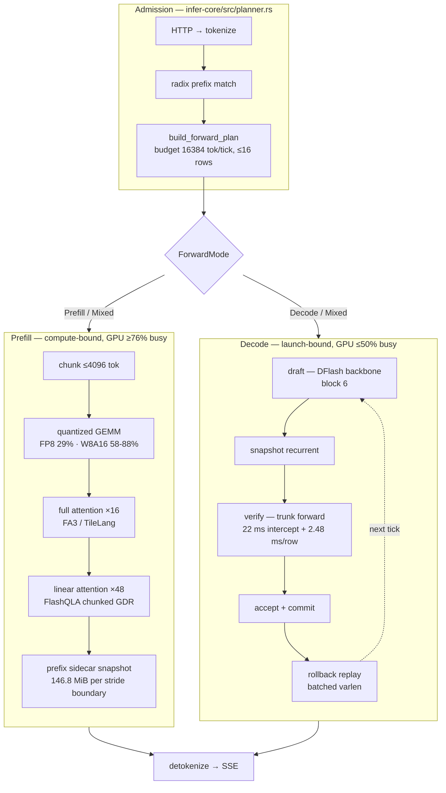

# Qwen3.6-27B — performance chain, 1×H20

Where a request's wall clock goes, stage by stage, with the measurement behind
each number. Companion to [`architecture-dsv4.md`](architecture-dsv4.md), which
describes the DSv4 execution paths; this document describes the Qwen3.6-27B
**cost** of those paths.

**Reading rules.**

- Every number carries its date, its commit, and how it was obtained. A number
  without those three is not in this document.
- Prefill numbers state **cold or warm**. The same 33K prompt runs 35.1 s cold
  and 0.525 s warm through the prefix cache (2026-08-01) — a prefill figure
  without that label means nothing.
- Decode and prefill are opposite regimes and never share a conclusion. Prefill
  is compute-bound at ≥76% GPU-busy; plain decode is ≤50% GPU-busy at ~1094
  launches per step. A measurement that does not name its phase supports no
  claim about the other
  ([error](experience/errors/2026-08-07-measured-prefill-concluded-about-decode.md)).
- Shares are **of the window that was measured**. A window aimed at one phase
  reports that phase's share of the window, not of the run
  ([correction](experience/errors/2026-08-07-named-a-call-site-whose-gate-was-off.md)).

**Model and device constants** used throughout:

| | |
|---|---|
| layers | 64 = **16 full-attention** + **48 linear** (gated delta) |
| full-attn KV cell | 65536 B/token (16 layers × 4 kv-heads × 256 head-dim) |
| recurrent state | 146.8 MiB per slot = 48 × (3 MiB gdr f32 + 60 KiB conv bf16) |
| weights, FP8 | 31.2 GB |
| H20 SMs | 78 |
| H20 HBM read | **3.5 TB/s achievable** (measured 2026-07-10), 4.02 TB/s spec |
| H20 FP8 / BF16 peak | ~296 / ~148 TFLOPS |

---

## 0. The chain

Prefill and decode rows share a tick (`ForwardMode::Mixed`), but the executor
still decomposes the mixed plan into per-row prefill submissions followed by a
batched decode dispatch (`infer-cuda/src/executor/qwen35.rs:2932`).

---

## 1. Prefill

### 1.1 FP8 weights — 33K cold, single request

`nsys`, 2026-08-01, 28.6 s wall / 24.0 s GPU-busy.

| kernel | launches | s | share |
|---|---:|---:|---:|
| `gated_delta_rule_prefill_recurrent` | 1152 | **9.37** | **33%** |
| DeepGEMM FP8, all shapes | 7936 | 8.33 | 29% |
| TileLang full attention | 368 | 3.93 | 14% |
| `pack_quantize` bf16→fp8 | 9600 | 1.50 | 5% |
| conv1d / norm / silu | 3840 | 0.55 | 2% |
| GPU idle (includes host tokenization) | — | ≤4.6 | ≤16% |

Plus **2328 `cuMemcpyDtoH` costing 1.58 s** — host round-trips inside the
prefill loop.

Per-part ceilings decide where work is worth doing:

| part | achieved | ceiling | verdict |
|---|---|---|---|
| DeepGEMM `gate_up` / `down` | 199 / 189 TFLOPS | ~296 FP8 | **64–67% — leave alone** |
| full attention | 54 TFLOPS | ~148 BF16 | 36%, and on TileLang rather than the FA3 decode already uses |
| `gated_delta_rule_prefill_recurrent` | — | — | not compute-bound: `<<<48, …>>>` on **78 SMs**, scanning the sequence serially inside each block |

The recurrence was the largest single line and the only one with headroom.
FlashQLA chunked GDR, parameterized over (H, Hg), took 33K cold prefill
**28.95 → 21.63 s (−26%)** and is default-on since `c2eb5de9e`; `b0368426a`
then routed batch==1 prefill to FA3 for a further −4%.

### 1.2 W8A16 weights — 33K cold, versus SGLang

`nsys --cuda-graph-trace=node`, 2026-08-05, H20 GPU 6, SGLang 0.5.13 on a
mechanically repacked GPTQ twin: **same int8 values, same `gptq_marlin`
kernel**. Prefill is not captured into a graph on either stack.

| bucket | ARLE (stub build) | ARLE (FlashQLA) | SGLang |
|---|---:|---:|---:|
| Marlin GEMM (8448 launches) | 18.660 s | 18.660 | 18.675 |
| full attention (FA3) | 1.632 | 1.633 | 1.529 |
| linear attention + conv1d | **7.231** | **0.441** | 0.314 |
| other | 0.361 | 1.108 | 0.422 |
| GPU idle | **3.877** | **3.967** | 0.190 |
| wall | 31.76 | 25.84 | 21.13 |

Three conclusions that hold for both weight paths:

- **Quantized GEMM is not a lever.** Identical kernel, identical launch count,
  15 ms apart across stacks. It is 58–88% of prefill on both.
- **`--chunked-prefill-size` is not a lever.** ARLE 2048 vs 4096 and SGLang
  4096 vs 8192 all land inside 0.07 s TTFT.
- **The remaining gap is 3.8 s of GPU idle** — ARLE 3.97 s against SGLang
  0.19 s, with GPU-busy time within 0.93 s. Scheduling or host-side, not a
  kernel.

Roofline: ~1.68 PFLOP for a 33K prefill (22.3 B GEMM params × 2 × 33e3, plus
0.21 PFLOP causal full attention over 16 layers) against 148 TFLOPS BF16 →
**11.4 s floor**. SGLang 54% MFU, ARLE 46% after the FlashQLA fix.

---

## 2. Decode

### 2.1 Plain decode step, FP8

`nsys` over 59 plain-decode steps, 2026-08-01, per step:

| | ms | share |
|---|---:|---:|
| `fp8_gemv_batch_kernel` × 400 launches | 13.8 | 66% |
| `gemv_handwritten_kernel` (bf16) × 97 | 4.3 | 21% |
| `gated_delta_rule_decode` × 48 | 0.80 | 4% |
| rms_norm / add / silu × ~250 | 0.79 | 4% |
| flash attention × 16 | 0.20 | 1% |
| GPU idle between launches (**1094 launches/step**) | ~4 | 16% |

Weight-read floor at 31.2 GB / 3.5 TB/s = **8.9 ms**. GEMV measured 18.1 ms ⇒
**~49% of achievable bandwidth**, independently reproducing the 51% found in
July.

### 2.2 Module ledger versus SGLang, W8A16

2026-08-03, both stacks `nsys`-decomposed, columns summing to measured ITL.
ARLE 25.08 ms/step versus SGLang 17.07 ms/step:

| module | ARLE | SGLang | attributed to |
|---|---:|---:|---|
| marlin | 13.20 (357 launches) | 12.31 (270) | qkv fusion, fixed-grid prologue × launches |
| bf16 gemv | 3.17 (52) | 1.11 (nvjet) | `gemv_handwritten_kernel` on fused `[96,5120]` in_proj_ba: ~52 µs at ~19 GB/s, one-block-per-row grid cannot fill 78 SMs; cuBLAS splitK does the shape in ~8 µs |
| GDN chain | 1.21 | 0.53 | kernel quality (fla-style) |
| FA3 chain | 0.93 | 0.45 | decode config |
| norms | ~parity | ~parity | — |
| idle | 5.66 | 2.08 | whole-step CUDA graph |

The kernel was exonerated by construction: SGLang decodes bs=1 inside a
whole-step captured CUDA graph while ARLE launched ~1094 kernels eagerly.

**Program outcome, all shipped and default-on the same day: 26.88 → 21.37 ms
(−20.5%).** `gemv → cuBLASLt` −1.28, qkv/qkvz fusion −0.59, whole-step decode
graph under paged KV −1.84 (per-slot persistent `PageMeta` refreshed outside
the graph, FA3 `seqlen_k` pinned to capacity, TileLang fallback refuses
capture). `--qwen35-decode-graph` is default-on for serve with an MMLU 84/100
license.

Remaining against SGLang's 17.07: ~4.3 ms = host tail (8 refresh H2Ds +
sampling D2H/sync + scheduler) + GDN kernel 0.7 + FA3 decode config 0.5 +
marlin prologue residue.

---

## 3. Speculative decode — the DSpark tick

`ARLE_DSPARK_PHASE=1`, 2026-08-07, `7b8a66603`, c=16, short prompts, 293 ticks,
mean 11.0 rows/tick.

| phase | ms/tick | share |
|---|---:|---:|
| draft | 12.75 | 21.6% |
| snapshot | 1.21 | 2.1% |
| **verify** | **42.64** | **72.3%** |
| commit | 2.40 | 4.1% |
| rollback (own log line) | 5.03 | — |

`commit` splits into tap 0.42, accept 0.02, cap 0.01, trunc 0.01, ext 1.94.
`rollback` splits into restore 0.85, replay 4.18.

**The phase timer synchronizes at each lap, so the total is inflated and only
the split is meaningful.** The same run measured 149.1 out tok/s against
236–243 unprofiled.

Two structural facts:

- **draft + verify = 94% of the tick.** Orchestration — snapshot, commit,
  rollback — is 6–14%. Per-row host bookkeeping inside commit is negligible
  (accept 0.02 ms, cap and trunc 0.01 ms each).
- **The verify intercept is the wall.** Decomposed against batch and context,
  verify = **22 ms intercept + 2.48 ms/row** at short context, the slope rising
  to 5.18 ms/row at 33K. The intercept is context- and batch-independent and
  equals a plain non-speculative decode step. **Verifying 8 speculative tokens
  costs the same as decoding 1** — speculation is working, and the intercept is
  what remains.

Consequence for kernel work: check a kernel's share of the intercept before
optimizing it. DSpark draft attention is 1.5 ms of a 35 ms step (4.3%), so a
−33% microbench win there is capped at −1.4% end to end — which is why three
kernel rewrites failed to transfer.

---

## 4. Costs outside the forward

Measured on the decode-heavy short-prompt shape, 2026-08-07.

### 4.1 GPU idle is not launch gaps

One 19.92 s decode window, GPU busy 10.07 s (50.5%), idle 9.86 s. Binning every
gap on the unified kernel+memcpy timeline:

| gap size | n | total | share of idle |
|---|---:|---:|---:|
| 0–5 µs | 410485 | 0.59 s | 6.0% |
| 5–20 µs | 18045 | 0.14 s | 1.5% |
| 20–50 µs | 643 | 0.02 s | 0.2% |
| 50–200 µs | 1328 | 0.12 s | 1.2% |
| **>1 ms** | **79** | **8.98 s** | **91.1%** |

**All 430k launch gaps together are 0.59 s, 3% of the window.** That is the
entire budget a CUDA graph on this path can recover. 91% of the idle is 79
stalls averaging 114 ms, of which **7.45 s sits in no CUDA API call at all**.

### 4.2 The prefix sidecar

`Qwen35RecurrentSnapshot` writes the whole recurrent state at every stride
boundary of every prefill so a later conversation can restore the hybrid
prefix. The payload is fixed at **146.8 MiB** by the model's 48 linear layers,
independent of how much prefix is cached.

| | per snapshot | per 512 s bench |
|---|---:|---:|
| count | — | 578 |
| payload | 146.8 MiB | **83 GB** |
| serialize, per element (`d626a1b03^`) | 84.45 ms | 48.25 s = **9.4% of wall** |
| serialize, bulk copy (`d626a1b03`) | 76.40 ms | 43.65 s |

Bulk copy is **−9.5% on the operation and 0.9% of wall** — an end-to-end null,
kept because it is strictly less work
([bench](experience/wins/2026-08-07-prefix-sidecar-serialize-bulk-copy.md)).
146.8 MiB in 76 ms is 1.9 GB/s, so the residual is allocating and
first-touching fresh heap; making this materially cheaper means not making the
copy.

**Open:** the sidecar's restore hit rate is unmeasured, so whether 83 GB per
bench is earned is unknown. This is the largest unpriced item in the chain.

### 4.3 Whole-slot park

`admit_via_oversubscription` parks the longest-running decode into the KV tier
whenever a waiter exists. Both park routes are **unreachable in a default
serve** — `--kv-oversubscription` defaults off, and the other route requires
`kv_tier_capacity() == 0` while the L2 host tier is on. The same per-element
serialization was fixed there in `a546ba80a` and remains **unmeasured** for
that reason. Park and promote now log elapsed ms and a running count.

---

## 5. Anchor numbers

Long-agent 32K × 8 turns, DSpark, `70760bc09`, 2026-08-07 — the row
[`baselines.md`](baselines.md) tracks:

| c | TTFT cold | TTFT warm | TPOT | total tok/s |
|---|---:|---:|---:|---:|
| 1 | 10.82 s | 0.84 s | 8.46 ms | 10453.0 |
| 8 | 1.60 s | 0.79 s | 62.49 ms | 31334.5 |
| 16 | 2.90 s | 1.22 s | **110.52 ms** | **33780.3** |

W8A16 against SGLang on identical weights and kernel, 2026-08-06:

| arm | TTFT p50 | prefill tok/s | ITL p50 | ITL p99 | e2e p50 |
|---|---:|---:|---:|---:|---:|
| ARLE | 23.01 s | 1434 | **16.70** | 20.50 | 27.4 s |
| SGLang | **21.03 s** | **1568** | 17.16 | **19.19** | **25.44 s** |

---

## 6. Lever register

Every lever that has been priced, with the measurement that settled it.

| lever | phase | measured share | status |
|---|---|---|---|
| whole-step CUDA graph | decode | 5.66 vs 2.08 ms idle | **shipped**, −1.84 ms, default-on |
| `gemv_handwritten` → cuBLASLt | decode | 3.17 vs 1.11 ms | **shipped**, −1.28 ms |
| qkv/qkvz fusion | decode | 0.9 ms of marlin busy | **shipped**, −0.59 ms |
| FlashQLA chunked GDR | prefill | 33% of GPU-busy | **shipped**, 33K cold −26% |
| batched DSpark verify core | decode | rows × 48 × 5 launches | **shipped**, c=8 TPOT −12.7% |
| batched rollback replay | decode | 4608 vs 144 launches/tick | **shipped**, c=16 TPOT −11.4% |
| sidecar bulk serialize | prefill | 9.4% of wall | **shipped**, −9.5% on the op, end-to-end null |
| GDN decode kernel | decode | 1.21 vs 0.53 ms | open, ~0.7 ms |
| FA3 decode config | decode | 0.93 vs 0.45 ms | open, ~0.5 ms |
| host tail (refresh H2D, sampling sync) | decode | part of ~4.3 ms residual | open |
| prefill GPU idle | prefill | 3.97 vs 0.19 s | **open, largest single gap** |
| sidecar write policy | prefill | 83 GB / 9.4% of wall | open, hit rate unmeasured |
| CUDA graph on the spec path | decode | **0.59 s / 3% of window** | **priced out** |
| quantized GEMM kernel | prefill | identical to SGLang ±15 ms | **priced out** |
| DeepGEMM FP8 | prefill | 64–67% of peak | **priced out** |
| `--chunked-prefill-size` | prefill | ±0.07 s TTFT | **priced out** |
| `--max-num-batched-tokens` | prefill | budget never binds | **priced out**, 16384 stays |
| prefill–prefill fusion | prefill | ~3% (15 redundant weight reads) | **priced out** |
| pinned readback staging | decode | wash on both phases | **null**, kept |
| DSpark draft attention | decode | 1.5 ms of 35 ms (4.3%) | **priced out**, 3 rewrites failed to transfer |

---

## 7. Reproducing

Bench parameters, gates, and the A/B contract live in
[`bench-and-trace-spec.md`](bench-and-trace-spec.md). Two notes specific to this
chain:

- **`ARLE_QWEN35_PROFILE` parent ranges are inflated.** Each leaf ends in
  `stop.synchronize()` and a parent absorbs every child's sync bubble. Only
  leaves are real. Count forwards as `input_norm` instances / 64.
- **`nsys` is not required to read its own database.** Every gap and API figure
  in §4.1 came from `sqlite3` over the `.sqlite` an earlier capture wrote —
  `CUPTI_ACTIVITY_KIND_KERNEL`, `_MEMCPY`, `_RUNTIME` are plain tables.

---

## Open items, ranked by unpriced size

1. **Prefill GPU idle, 3.8 s** against SGLang's 0.19 s on identical kernels.
   Largest measured gap in the chain and not yet attributed.
2. **Sidecar write policy** — 83 GB and 9.4% of wall per bench, restore hit
   rate unmeasured.
3. **Decode host tail, ~4.3 ms/step** — refresh H2Ds, sampling D2H and sync,
   scheduler.
4. **GDN decode kernel 0.7 ms and FA3 decode config 0.5 ms**, both against a
   measured SGLang reference.
