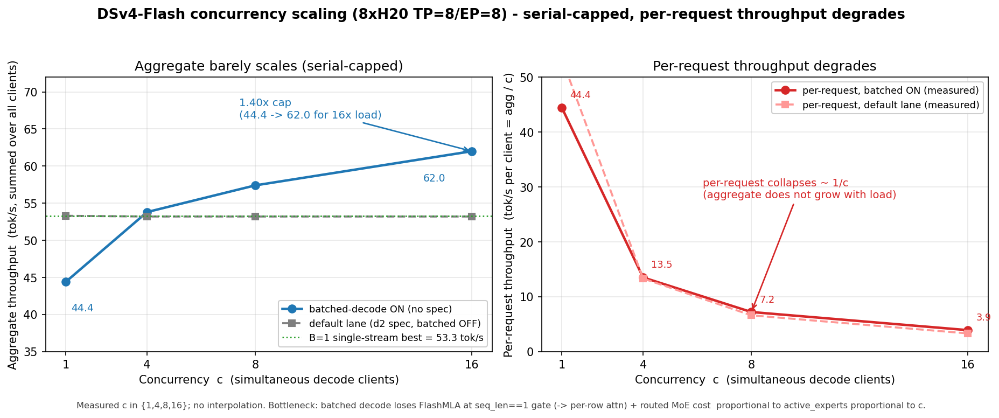

# DSv4 concurrency throughput — lever ranking (SGLang-grounded)

Status: **design** (2026-06-13). Supersedes the lever framing in
[`dsv4-dp-attention.md`](dsv4-dp-attention.md). Grounded in the measured
concurrency baseline
([wins](../experience/wins/2026-06-13-dsv4-concurrency-baseline-serial-capped.md))
+ a study of SGLang's DeepSeek-MLA decode path (`/sgl-workspace/sglang`).

## Latest performance (DSv4-Flash)

8×H20, TP=8/EP=8, d2 chain-fold default-on. All numbers measured (no
interpolation; only c∈{1,4,8,16} were run).

- **B=1 single-stream best: 53.3 tok/s** (d2 chain-fold; 53.37/53.30/53.32 ×3,
  σ≈0.04 — [chain-fold wins](../experience/wins/2026-06-13-dsv4-mtp-d2-chain-fold-53.md)).
- **Concurrency cap (batched-decode lane, opt-in): aggregate rises only
  44.4 → 62.0 tok/s for 16× the load = 1.40× ceiling** (per-request collapses
  3.9 tok/s at c=16 —
  [concurrency baseline](../experience/wins/2026-06-13-dsv4-concurrency-baseline-serial-capped.md)).
  The default serve (batched off) is **flat ~53 tok/s** aggregate across c (per
  request = agg / c) — pure serialization.

| c | agg tok/s (batched ON) | per-req (batched ON) | agg tok/s (default) | per-req (default) |
|---|---|---|---|---|
| 1 | 44.4 | 44.4 | 53.3 | 53.3 |
| 4 | 53.8 | 13.5 | 53.2 | 13.3 |
| 8 | 57.4 | 7.2 | 53.2 | 6.6 |
| 16 | **62.0** | 3.9 | 53.2 | 3.3 |

*Aggregate throughput barely scales (1.40× for 16× load, serial-capped) while
per-request throughput degrades ≈ 1/c — batched decode loses FlashMLA at the
`seq_len==1` gate (→ per-row attention) and routed-MoE cost ∝ active_experts ∝ c.*

- **Long context (32K/64K/128K) is WORSE — aggregate is FLAT (~1.0×), not 1.4×**
  ([long-ctx campaign](../experience/wins/2026-06-14-dsv4-longctx-concurrency-serial-capped.md),
  2026-06-14). Decode aggregate pins at ~44-48 tok/s for ALL c at every length;
  per-request collapses 1/c. Three more findings there: (a) **TTFT is linear in
  both length AND c** (128K c=8 = 214s) — but this is prefill being
  COMPUTE-bound (chunked prefill + mixed batching ARE default-on, `planner.rs`;
  c×prompt FLOPs on fixed GPUs), NOT a missing feature; only faster prefill
  kernels / more GPUs reduce it, so it is OUT of software-lever scope here;
  (b) **`--dsv4-batched-decode` showed no effect — but it was INERT, not a no-op**
  (⚠️ corrected 2026-06-14): the campaign ran under `--spec-type mtp`, which
  *disables* the batched lane (`executor.rs:1563`), so both arms ran MTP-per-row.
  The true batched lane (no-mtp) is **+48% @c=8** (45.6→67.6) at short ctx — the
  flat-aggregate finding above is the MTP-per-row path, not the batched lane
  ([Phase-A verify](../experience/wins/2026-06-14-dsv4-batched-flashmla-decode-phaseA.md));
  no-mtp long-ctx scaling is unmeasured; (c) slots clamp
  8→6; MTP acceptance degrades with ctx (tok/step 1.80→1.22 at 32K→128K). The
  decode-lever acceptance bar: **aggregate must RISE with c**.

**Lever ranking** (detail below): **#1 batched MLA decode** (wiring an existing
SGLang-shape kernel, not new infra) → **#2 whole-step CUDA graph** (couples with
#1) → **#3 MoE decode-kernel shape** (the fundamental ceiling) → **#4 DP-attention**
(orthogonal, removes the 2.7% collective floor only).

## The problem (measured)

DSv4 concurrent decode barely scales: batched aggregate **1.40× for 16× load**
(c=1→16: 44→62 tok/s); the default serve is flat ~53 (batched-decode opt-in,
off). The ceiling is **not** the GPU.

## Root cause (measured)

**B=1 per-stage GPU `cuda_ms`** (in-house stage profiler, real CUDA-event GPU
time, rank-0; the `INFER_TP_RANK=0` print-gate fix made it emit on the serve):

| stage | % of GPU |
|---|---|
| **mla_attn** | **41%** (the single biggest) |
| shared_expert (dense FFN, amortizes with batch) | 17% |
| moe_allreduce + moe_route (routed MoE) | 15% |
| attn_hc / ffn_hc params+norms | ~12% |
| **attn_allreduce (TP collective)** | **4%** |

Converging evidence:
1. **Attention is the biggest GPU stage (41% at B=1)** — and it is using its
   *best* kernel there (FlashMLA decode, `seq_len==1`).
2. **Batched decode is NOT per-row** — `forward_decode_batch` calls
   `mla_attention` once per layer (`calls=43/step`); the per-row loop
   (`dsv4.rs:2498-2544`) is **MTP-verify only**. The real gap: **FlashMLA
   decode is gated `seq_len==1` (attention.rs:4945)**, so at c=8 (seq_len=8)
   attention **falls off FlashMLA onto the general/prefill path** for 8 decode
   rows — the biggest GPU stage loses its optimized kernel exactly at batch.
3. **MoE ∝ active_experts ∝ c** (ckl `74b721db`, Qwen #88; same on DSv4): each
   active expert = ≥1 kernel block regardless of its token count; #active-experts
   grows with c (E=256/top-6: c=8 → ~45 distinct) → routed-MoE per-step time
   grows with c. EP=8 distributes it (~/8 per rank) → DSv4 gets 1.4× not flat.
4. **collective is only 4%** → DP-attn (which removes it) is the lowest lever.
5. **SGLang**: batched MLA decode = ONE `flash_mla_with_kvcache` for all B
   (`block_table`+`cache_seqlens`), inside a CUDA graph.

→ Two non-amortizing axes: **(a) attention loses its batched-decode kernel at
B>1** (biggest stage, fixable via a batched MLA decode kernel) + **(b) routed
MoE ∝ active_experts** (fundamental sparse-MoE-decode). Collective is negligible.

**Measurement note** (honest): the exact B=8 attn-vs-MoE *GPU* `cuda_ms` split
was not obtained — the nsys B=8 capture succeeded (7.5 GB trace) but the
projection was a processing runaway (21 GB SQLite). The B=1 GPU split (attn 41%
biggest) + the FlashMLA `seq_len==1` gate make the #1 lever certain without it:
attention is the biggest stage at B=1 *with* its best kernel, and degrades at
batch.

## Lever ranking

### 1. Batched MLA decode — most tractable win (#60; "Phase 5 batched FlashMLA")
- **SGLang**: `flashmla_backend.py` `forward_decode` issues one
  `flash_mla_with_kvcache(q=[bs*heads,…], block_table=[bs,max_pages],
  cache_seqlens=[bs], tile_scheduler_metadata, num_splits)` — all B requests'
  KV addressed by the `block_table` tensor; KV-index build is one batched Triton
  kernel (`create_flashmla_kv_indices_triton[(bs,)]`). No per-request loop.
- **Our gap**: attention is per-row (Step-A loop). MoE/MLP already batch.
- **Port**: a batched MLA-decode kernel taking a `[bs]` cache_seqlens + per-req
  KV page/index table, one launch for all rows. This removes the ~15.7ms/req
  marginal — the actual 1.4×→linear lever.

### 2. Whole-step CUDA graph w/ capture-safe MLA metadata — SECONDARY (#70)
- **SGLang**: captures the decode forward at bs=[1,2,4,8,…]; pads a real batch
  up to the nearest captured bs. Attention metadata is **device-resident,
  pre-allocated, updated in-place** before replay
  (`init_forward_metadata_replay_cuda_graph`: `create_…_kv_indices_triton`
  + `get_mla_metadata` then `.copy_()` into the captured buffers). The graph
  replays as ONE launch → kills host-launch.
- **Our gap**: eager (~36ms host-launch); our whole-step graph IMAs on the
  FlashMLA path (host-computed per-step offsets captured as constants).
- **Port**: the SGLang device-metadata pattern (derive every per-step offset on
  device, update captured buffers in-place) is exactly the fix for our
  capture-IMA blocker — and it must wrap the batched-decode kernel from lever 1.
- **Coupling**: levers 1+2 are ONE mechanism in SGLang (batched kernel inside
  the graph). Build them together; a captured per-row loop is pointless.

### 3. MoE ∝ active_experts — the FUNDAMENTAL half (#88 lessons)
- **Mechanism**: at decode each active expert = ≥1 kernel block regardless of its
  (tiny) token count; #active-experts ∝ c (E=256, top-6) → MoE per-step time ∝ c
  → non-amortizing. The moe-half (~20ms host, likely the bigger half).
- **Already mitigated**: EP=8 distributes active experts (~/8 per rank) → DSv4
  gets 1.4× not dead-flat (ckl's Qwen `fused_moe` without enough EP was flat,
  `74b721db`).
- **Further gains are hard**: batching can't fix it below expert saturation
  (c << ~43). Options: a decode-tuned grouped-MoE kernel (small-M-per-expert
  efficient), higher EP, or accept the sparse-MoE-decode floor. This is the
  hard ceiling on concurrent DSv4 decode throughput — track with the #88 MoE
  kernel-shape work. **Diagnose by the curve SHAPE** (flat ⇒ per-step ∝ c ⇒
  work ∝ active_experts), not Δ% (ckl's rule).

### 4. DP-attention — LOWER / orthogonal (#89)
- **SGLang**: `dp_attention.py` splits TP into `attn_tp × dp`; gather/scatter at
  the attn↔MLP boundary (`dp_gather_partial`/`dp_scatter`, MAX_LEN/SUM_LEN
  padding for rank-uniform collectives); scheduler entry = `attn_tp_rank==0`.
- **Why lower for us**: it removes the attention collectives (the ~7ms floor,
  2.7% at B=16) + lockstep skew, but does **not** reduce per-rank attention
  compute (TP `B×8 heads` == DP `B/8×64 heads`). It pays off when memory-bound /
  at very high concurrency, not for the compute-bound 1.4× gap. Detail +
  phased plan: [`dsv4-dp-attention.md`](dsv4-dp-attention.md).

## Recommended sequence

0. **First close the gap**: a clean rank-0 per-stage GPU `cuda_ms` profile (or
   nsys) at B=1 vs B=8 to rank attn-half vs moe-half. If moe-half dominates GPU
   time (host-time suggests it), the attention levers below cap out at the MoE
   floor and the #88 MoE-kernel work is the higher-ROI track.
1. **Batched MLA decode kernel** (#60) — the tractable win; removes the attn-half.
2. **Couple it into a whole-step CUDA graph** with SGLang's device-metadata
   capture pattern (#70) — kills the residual host-launch and unblocks our IMA.
3. **MoE decode-kernel shape** (#88 lessons) — the fundamental ceiling; the
   higher-ROI track if moe-half dominates. Independent of 1-2.
4. **DP-attention** (#89) — only after the above, re-baselined; orthogonal.

Each step gates on a c-sweep wall-clock A/B (TTFT + ITL + agg), multi-shape,
per the bench spec — no default flip on a single-shape ROI.
