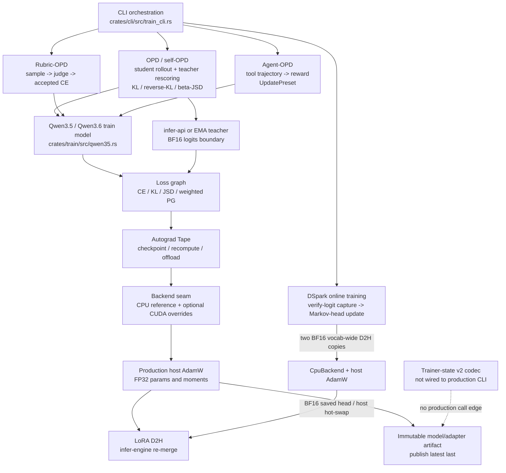
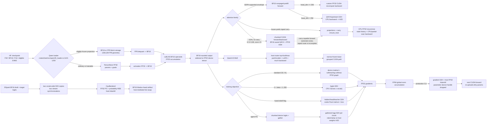

# ARLE Training Architecture, Algorithm, Precision, and Kernel Audit

**Date:** 2026-07-26
**Scope:** `crates/train`, `crates/autograd`, training-facing `infer-api` / `infer-cuda`, and the CUDA kernels reached by the training paths
**Method:** read-only source audit with independent architecture, algorithm, precision, kernel, test, and upstream-SOTA passes followed by adversarial verification
**Evidence boundary:** source and tests only; no CUDA execution, `nsys`, `ncu`, convergence run, or matched performance A/B was run for this report

---

## 1. Executive verdict

ARLE's training architecture is directionally correct, but the current production training modes are not collectively state of the art.

The strongest design decisions are:

- training extends the inference/runtime authority instead of maintaining a second model implementation;
- OPD, self-OPD, rubric RFT, and agent RFT share one model/autograd substrate;
- `UpdatePreset` keeps sampling, filtering, advantage, ratio, clipping, and aggregation policy in one low-entropy abstraction;
- ordinary trainable tensors, losses, gradients, and AdamW moments use an explicit FP32 contract, while BF16/FP8 is constrained to eligible frozen projections;
- model artifacts are written into a fresh immutable directory and published last;
- activation checkpointing preserves frozen/LoRA detach boundaries.

The principal limitations are:

1. Training steps do not share a finite-value transaction gate before optimizer mutation.
2. `every-round` importance-sampling denominators can be computed from a policy different from the rollout behavior policy.
3. Presets named GRPO, DAPO, Dr.GRPO, and GSPO do not implement the corresponding paper surrogate objectives.
4. The production frozen-prefix Gated DeltaNet carry path still falls back to CPU for the recurrent forward/backward unit.
5. Qwen3.6 MoE routing, permutation, LoRA work, and much of backward remain host-authoritative.
6. Generalized JSD and the path called `fused-distill` are host-eager reference implementations, not fused CUDA training paths.
7. Production checkpoints are artifact checkpoints, not restart-correct training checkpoints.
8. DSpark's probability objective has an inconsistent reduction scale and an incorrect total-variation explanation.

No unconditional, repository-wide P0 was identified. Eight structural P1 findings were confirmed. Two of those findings become **conditional P0s** for the affected run or claim:

- a ratio-weighted agent-training run using `--sync every-round` without generation-time behavior logprobs must stop, because its denominator is not the rollout behavior policy;
- an experiment presented as GRPO, DAPO, Dr.GRPO, or GSPO must not be used for paper-level attribution, because the implemented detached clamped-weight objective is not the named paper surrogate.

These are not global P0s because ordinary OPD, CE/RFT paths without importance ratios, `every-group` synchronization, and other training modes remain usable. They are P0s within their exact experimental preconditions because continuing produces an invalid objective or invalid scientific claim.

The smallest correct sequence is:

1. establish a common finite-step transaction and truthful behavior-policy denominator;
2. finish the already-partial carry-aware GDN CUDA unit;
3. align public algorithm names with the implemented surrogate;
4. wire the existing trainer-state codec into production checkpoint transactions;
5. only then expand MoE, distillation, and optimizer kernel coverage.

A framework rewrite is not justified.

---

## 2. Scope, severity, and evidence standard

### 2.1 Severity standard

Severity is assigned on two axes: the repository-wide engineering impact and the validity of a particular run or claim. A defect can therefore be P1 for the product while being P0 under an exact experimental precondition.

| Level | Repository-wide engineering meaning | Run / claim meaning |
|---|---|---|
| **P0** | A default or all production training paths are unusable or necessarily wrong; state/data is confirmed to be continuously corrupted; the main entry point cannot operate; no valid bypass exists | The active run is optimizing an invalidly constructed objective, or the resulting evidence cannot support the claim being made; stop the run or block publication immediately |
| **P1** | A core mode/configuration can produce wrong results; a central kernel or persistence contract is structurally incomplete; a valid bypass or unaffected main path exists | The experiment is invalid only when a named precondition is active, or a central gap blocks the target workload without breaking every training mode |
| **P2** | Important reliability, performance, capability, or evidence weakness with a contained scope | The run may remain useful, but its efficiency, fairness, fidelity, or interpretation is materially limited |
| **P3** | Documentation, status, or observability drift that does not itself change the computed result | The claim can be corrected without rerunning the underlying experiment |

An issue is not promoted to P0 merely because it is not SOTA or because its fallback is slow. A kernel gap becomes P0 only when it prevents the binding workload from completing or makes its result incorrect. A latent NaN path becomes P0 when a production run is shown to have mutated state after a non-finite value. Conversely, a configuration-specific objective error can be a conditional P0 even when the rest of the training product remains operational.

### 2.2 Conditional P0s identified by this audit

#### CP0-A: ratio-weighted agent training with `--sync every-round`

**Preconditions**

```text
ratio-weighted update preset
+ multiple training groups
+ --sync every-round
+ behavior logprobs not persisted at generation time
```

**Why it is P0 for that run**

The trajectory is generated by the serving policy, while the denominator can be recomputed after the training policy has changed. It is therefore not the behavior-policy probability of the sampled action. The importance ratio does not represent the declared estimator. Continuing the run accumulates updates under a different objective and cannot be repaired by interpreting the final metrics differently.

**Required action:** stop or reject this configuration. Require `--sync every-group` until behavior logprobs are captured with each rollout.

#### CP0-B: paper-level attribution to GRPO, DAPO, Dr.GRPO, or GSPO

**Preconditions**

```text
current detached clamped-weight preset
+ result described as implementing, reproducing, or comparing the named paper algorithm
```

**Why it is P0 for that claim**

The implemented gradient is not the papers' sign-sensitive PPO clipped surrogate, and GSPO's sequence-level importance-sampling objective is not reproduced by a label alone. The run may still test a useful clamped-weight policy-gradient estimator, but it cannot establish a result about the named algorithm. Publication, benchmark attribution, or algorithm-selection decisions using that name must be blocked or relabeled.

**Required action:** relabel existing runs by their actual objective or rerun after a paper-faithful surrogate and reference-gradient oracle are implemented.

### 2.3 Why there is no unconditional P0

The audit did not find evidence that every default production training path necessarily computes an invalid result, that all saved artifacts are corrupt, or that the main OPD path cannot run. In particular:

- standard dense OPD/KL does not depend on the agent importance-ratio path;
- `every-group` provides a valid synchronization bypass for the current behavior-policy bookkeeping;
- the current detached clamped-weight estimator is mathematically defined even though its paper names are inaccurate;
- carry GDN, MoE, generalized JSD, and host AdamW gaps primarily break device residency or scalability rather than the CPU reference's numerical definition;
- artifact checkpoints remain loadable even though they are not exact optimizer-state continuations;
- DSpark is an experimental side path rather than the default OPD objective.

The absence of an unconditional P0 is therefore not a statement that the P1 findings are optional. It means their blast radius is bounded by mode, configuration, or workload and that an unaffected path or valid bypass exists.

### 2.4 Finding classes

This report distinguishes four classes of finding:

- **Correctness defect:** the implementation can update the wrong objective, corrupt state, silently ignore a requested objective, or fail to resume the same training process.
- **Algorithm/SOTA gap:** the implementation is internally coherent but does not match the named or current reference algorithm.
- **Kernel coverage gap:** a valid path crosses a host boundary, silently falls back, lacks an important shape/dtype, or does not preserve device residency.
- **Evidence gap:** existing tests show that a path runs, but do not prove the critical objective, device path, recovery invariant, or quality effect.

Static source inspection can prove control flow, reduction definitions, synchronization boundaries, dtype conversions, unsupported shapes, and CPU fallback. It cannot prove the size of a performance loss or a model-quality effect. Accordingly, statements such as “not device-native” are conclusions; statements about expected wall-clock gain remain unlicensed until GPU measurement.

One test-review agent failed with a server error, but the initial test audit completed, the final synthesis re-read the cited tests, and every test-related finding below was independently checked against source. This is still a source audit, not a test execution report.

---

## 3. Current architecture



### 3.1 Ownership assessment

The architecture has the right high-level direction:

- `train` owns rollout, objectives, writeback policy, LoRA, and training artifacts.
- `autograd` owns tensor/tape semantics, backend dispatch, primitive backward rules, optimizers, and activation checkpointing.
- `infer-api` / `infer-cuda` supplies the real serving teacher and the LoRA re-merge boundary.
- CUDA execution is additive beneath the CPU numerical reference rather than being a separate training model.

This avoids the common failure mode where post-training uses a framework model whose masking, RoPE, recurrence, quantization, or MoE behavior drifts from deployment.

The main architecture weakness is that `crates/cli/src/train_cli.rs` owns too much lifecycle state. Optimizer construction, synchronization cadence, rollout capture, checkpoint publication, mode-specific recovery, and some capability validation are distributed among mode runners rather than crossing a single step/checkpoint transaction boundary. The result is not merely a large file: it is why finite checks, resume state, and behavior-policy identity differ between modes.

A new training framework layer would add entropy. The better move is to define two concrete transactions around the existing components:

1. **Step transaction:** loss materialization -> finite validation -> backward -> finite norm -> clipping -> optimizer mutation -> infer synchronization.
2. **Checkpoint transaction:** model/adapter -> optimizer -> schedule/step -> mode state -> atomic publication.

---

## 4. Detailed kernel and precision flow



### 4.1 Precision verdict

The precision model is conservative and understandable:

| State | Current precision | Assessment |
|---|---|---|
| Ordinary trainable parameters | FP32 | Stable, memory-heavy |
| LoRA parameters | FP32 | Stable; not a low-precision LoRA stack |
| Loss graph | FP32 | Good numerical default |
| Gradients | FP32 | Good numerical default |
| AdamW moments/update | FP32 host | Stable but not device-native |
| Frozen eligible projections | BF16 or block-scaled FP8 | Correctly constrained |
| CUDA GEMM operands | BF16 | Standard |
| GEMM accumulation | FP32 | Correct |
| Some saved GDN tensors | BF16 | Reasonable if parity is maintained |
| Global norm accumulation | FP64 | Numerically strong, but finite handling is incomplete |
| Teacher boundary | BF16 logits in relevant paths | Requires quality A/B; not inherently a defect |

This is not full AMP, QLoRA, an 8-bit optimizer stack, or a low-precision end-to-end training system. That is acceptable for the current product scope if described accurately. The immediate precision defect is not “too much FP32”; it is the missing non-finite transaction before mutation.

---

## 5. Ranked findings

## 5.1 P1 correctness: no common finite-step transaction

**Locations**

- `crates/train/src/opd.rs:2827-2831`
- `crates/train/src/opd.rs:3286-3304`
- `crates/train/src/opd.rs:4101-4104`
- `crates/train/src/grad_clip.rs:65-101`
- `crates/train/src/dspark_train.rs:512-544`

**Mechanism**

Several writeback callers materialize a scalar and proceed directly to backward and optimizer mutation without using the existing loss-value validation consistently. Global-norm handling lacks a common non-finite branch. DSpark reads the loss after optimizer mutation and folds readback failure into `0.0` with a default value.

**Impact**

A NaN/Inf loss or gradient can contaminate parameters and AdamW moments before the caller reports failure. DSpark can report a successful-looking zero loss after a failed readback.

**Required change**

Put the following sequence at the common mutation boundary:

```text
materialize loss
-> require finite loss
-> backward
-> compute norm
-> require finite norm
-> clip
-> optimizer step
```

Return an explicit non-finite outcome and skip the complete step. DSpark must read and validate loss before backward/step, and readback errors must propagate.

---

## 5.2 P1 correctness: `every-round` denominator is not the behavior policy

**Locations**

- `crates/cli/src/train_cli.rs:3301-3306`
- `crates/cli/src/train_cli.rs:3580-3610`
- `crates/cli/src/train_cli.rs:3699-3713`

**Mechanism**

Rollouts are generated by the serving policy. The training policy can then update between groups. `capture_rollout_logprobs` is invoked after generation, while `every-round` delays synchronizing the updated LoRA back to serving until the final group. Consequently, the reconstructed denominator can be the current training policy rather than the policy that generated the trajectory.

**Impact**

The importance ratio is no longer `pi_train / pi_behavior`; it may collapse near one and remove the intended off-policy correction.

**Required change**

Until generation stores behavior logprobs alongside each trajectory, ratio-weighted presets must require `--sync every-group`. `every-round` should fail closed for those presets rather than emit a warning and continue with a different objective.

---

## 5.3 P1 algorithm: named GRPO/DAPO/Dr.GRPO/GSPO presets do not implement their paper objectives

**Locations**

- `crates/train/src/update_strategy.rs:191-240`
- `crates/autograd/src/ops/fused_linear_distill.rs:742-779`

**Current objective**

The implementation uses a detached clamped weight:

\[
L(\theta) = -\operatorname{stopgrad}\left(A\,\operatorname{clip}(r,l,u)\right)
\log \pi_\theta(a|s).
\]

This is coherent as a CISPO-like weighted policy-gradient estimator.

A PPO-style clipped surrogate is instead based on a sign-sensitive minimum/maximum between unclipped and clipped ratio objectives:

\[
L_{\text{clip}}(\theta) =
-\min\left(rA,\operatorname{clip}(r,l,u)A\right),
\]

with the relevant saturation direction changing for negative advantage. The current implementation does not encode this branch, so it retains gradient in regions where a paper clipped surrogate should saturate.

GSPO additionally defines importance sampling at the sequence level, not merely by assigning a sequence aggregation label to a token-weight path.

**Impact**

Experiments may be useful, but they cannot be attributed to the named algorithms.

**Required change**

Keep `UpdatePreset`; add an explicit surrogate kind, for example:

```text
DetachedClampedWeight
PpoClippedSurrogate
SequenceClippedSurrogate
```

Before those objectives exist, rename presets to state their actual mechanism, such as `grpo-clamped-weight`. Add a reference oracle covering positive/negative advantage and ratios below, inside, and above the clip interval.

---

## 5.4 P1 kernel coverage: frozen-prefix carry GDN falls back to CPU

**Locations**

- `crates/autograd/src/ops/linear_attention.rs:491-566`
- `crates/autograd/src/ops/linear_attention.rs:700-952`
- `crates/autograd/src/ops/linear_attention.rs:939-940`
- `crates/autograd/src/ops/linear_attention.rs:1247-1302`
- `crates/autograd/src/backend_cuda.rs:3852-3905`

**Mechanism**

The no-carry CUDA path is restricted to the production-like `K=V=128`, `conv<=5` envelope. The taped carry path unconditionally materializes projections and carry on the host. Backward attempts CUDA only when carry is absent. The CUDA forward substrate can already receive carry, but the tape context discards the information required to close the corresponding backward unit.

**Impact**

Frozen-prefix OPD moves the generated recurrent segment and its gradients to CPU, executing an `O(B*S*Hv*K*V)` recurrence/recompute and breaking device residency around one of Qwen3.5's central operators.

**Required change**

Finish the existing tranche rather than replacing it:

1. route taped carry through the existing CUDA forward;
2. retain carry and initial convolution-window context in the tape;
3. extend CUDA backward to consume that context;
4. verify boundary convolution-weight gradients;
5. compare forward and backward against the CPU reference at multiple generated lengths;
6. add a path probe proving that the CUDA carry path actually fired.

This is the highest-priority kernel completion.

---

## 5.5 P1 kernel coverage: Qwen3.6 MoE training is host-authoritative

**Locations**

- `crates/autograd/src/ops/moe.rs:166-197`
- `crates/autograd/src/ops/moe.rs:357-590`
- `crates/autograd/src/ops/moe.rs:593-695`
- `crates/autograd/src/ops/moe.rs:742-868`
- `crates/train/src/qwen35.rs:1172-1175`

**Mechanism**

Router softmax/top-k, token packing, permutation, inverse scatter, LoRA row calculations, and substantial backward work use host-authoritative tensors. Only a narrow frozen-base forward/input-gradient path can remain resident on CUDA. Training tensor parallelism is not supported.

**Impact**

The sparse MLP cannot form a modern GPU MoE pipeline. The host work scales with tokens and experts and introduces repeated materialization boundaries.

**Required change**

Use the smallest dependency chain:

1. GPU top-k and routing metadata;
2. GPU permutation and inverse permutation;
3. reuse the existing grouped GEMM path;
4. add LoRA computation around grouped GEMM;
5. complete backward;
6. only then consider training TP.

No new MoE abstraction is required.

---

## 5.6 P1 kernel coverage: beta-JSD and `fused-distill` are host reference paths

**Locations**

- `crates/autograd/src/ops/fused_linear_distill.rs:18-98`
- `crates/autograd/src/ops/fused_linear_distill.rs:126-264`
- `crates/autograd/src/ops/fused_linear_distill.rs:268-360`

**Mechanism**

For interior beta values, generalized JSD reads both student and teacher logits to host and computes over all rows and vocabulary entries. Dense and sparse `fused-distill` paths read hidden states, output-head weights, and teacher data to host, then execute nested Rust loops. “Fused” describes graph-level composition, not a fused device kernel.

**Impact**

Enabling these flags can leave the GPU idle while performing `O(rows*vocab)` or `O(rows*vocab*hidden)` host work.

**Required change**

Keep standard dense KL as the production device path. Mark the existing alternatives as CPU reference and fail fast in production CUDA mode. If quality A/B licenses them, implement only chunked device GEMM plus fused reduction; do not create a second loss framework.

---

## 5.7 P1 correctness: production checkpoints are not restart-correct

**Locations**

- `crates/train/src/checkpoint.rs:58-223`
- `crates/cli/src/train_cli.rs:501-550`
- `crates/cli/src/train_cli.rs:3136-3141`
- optimizer construction examples at `crates/cli/src/train_cli.rs:1230`, `2021`, `2720`, `3188`, `4003`

**Mechanism**

A trainer-state v2 codec exists, but production modes do not call it. Production entry points construct fresh AdamW instances. Active save paths publish model or adapter artifacts, not the full continuation state.

Missing or reset state includes, depending on mode:

- AdamW moments;
- optimizer step and LR-schedule position;
- EMA teacher state;
- critic/baseline state;
- replay state;
- policy version;
- prompt/task sampler state;
- data ordering and relevant RNG state.

**Impact**

“Resume” does not continue the same optimization trajectory. It starts a new optimizer process from saved weights.

**Required change**

Wire the existing v2 codec into the artifact publication transaction. Start with optimizer, step/schedule, and the mode-specific state required for exact continuation. A mode that cannot restore its required state must reject exact `--resume` rather than imply restart equivalence.

---

## 5.8 P1 algorithm: DSpark probability objective has inconsistent scaling and explanation

**Locations**

- `crates/train/src/dspark_train.rs:8-15`
- `crates/train/src/dspark_train.rs:460-510`

**Mechanism**

The policy-gradient branch is divided by `weight_sum`. The probability-vector squared-distance branch is divided by `weight_sum * vocab_size`. Consequently, `alpha=0.5` does not mean comparable contribution from the two branches; the probability term receives an additional vocabulary-size reduction.

The source explanation also states the wrong relationship between total variation and maximal-coupling overlap. With

\[
TV(p,q)=\frac12\lVert p-q\rVert_1,
\]

maximal-coupling agreement is `1 - TV`, not `1 - 0.5*TV`. Moreover, an L2 probability loss does not generally share the same gradient direction as the L1/TV quantity relevant to acceptance.

**Impact**

Nominal alpha values are misleading, and the mathematical explanation does not justify the chosen surrogate. This is particularly important because existing evidence records decreasing surrogate loss without improved acceptance.

**Required change**

Correct the documentation and reduction first. Use a row-summed probability distance or calibrate alpha using measured branch gradient norms. DSpark training should remain experimental until an acceptance or accepted-tokens-per-step A/B shows a real effect.

---

## 6. P2 findings

## 6.1 DSpark capture and training cross synchronous host boundaries

**Locations**

- `crates/infer-cuda/src/executor/dspark_train.rs:102-170`
- `crates/train/src/dspark_train.rs:197-205`

Each verify step copies draft and target vocab-wide BF16 logits to host separately and synchronizes the stream after each copy. The trainer is explicitly constructed with `CpuBackend` and host AdamW.

This directly couples decode latency to PCIe transfer, full-stream synchronization, and CPU training throughput. The first improvement should be asynchronous event-backed ownership transfer rather than immediately porting the trainer. Porting the trainer is justified only after acceptance evidence establishes that the objective is worth optimizing.

---

## 6.2 Production AdamW remains host-resident

**Locations**

- optimizer construction: `crates/cli/src/train_cli.rs:1230`, `1454`, `2021`, `2720`, `3188`, `4003`, `4242`
- host optimizer path: `crates/autograd/src/optim.rs:26-43`, `130-201`

All production modes call `AdamW::new`, not the existing device-capable constructor. The host path materializes gradients, mutates host parameters, and invalidates device-authoritative handles; the next CUDA forward must upload changed parameters again.

Do not flip this blindly. First prove that the actual LoRA gradient producers remain device-resident, add D2H/H2D counters, and run a matched full-step A/B. A nominal device optimizer that still falls back would only relocate synchronization.

---

## 6.3 Unimplemented GKD options are exposed as runnable capabilities

**Locations**

- `crates/train/src/opd.rs:3948-3991`
- `crates/train/src/opd.rs:4563-4570`

`--gkd-entropy-weight>0` prints a TODO-like message and continues with an unweighted objective. `teacher-topk` is publicly configurable but rejected later during the training step.

Objective flags must never silently become no-ops. Validate at CLI construction and fail fast. Remove unfinished options from public help until they run end to end.

---

## 6.4 Rubric offload errors are swallowed and capped selection is order-biased

**Locations**

- `crates/train/src/rubric_opd.rs:366-375`
- `crates/train/src/rubric_opd.rs:396-423`

A critical offload result is converted to zero on error. The following CE step may then OOM and hide the actual resource-transition failure. Accepted pairs are appended in prompt/sample order and truncated at the cap, permanently favoring early inputs.

Propagate offload failures. Before applying the cap, use a deterministic seeded shuffle or reservoir sample, or explicitly name the behavior as a prefix cap.

---

## 6.5 Fixed-length termination and factor-wise EMA are approximations

**Locations**

- `crates/train/src/infer_student.rs:130-173`
- `crates/train/src/ema_self_teacher.rs:206-235`
- `crates/train/src/ema_self_teacher.rs:376-396`

The token-KL rollout disables EOS/stop behavior and forces fixed-length continuation. This distills states the deployed policy would never visit after termination. Keep fixed length as an explicit ablation, but make EOS-aware variable-length masking the deployment-aligned default.

Self-teacher EMA is applied independently to LoRA factors `A` and `B`. In general:

\[
EMA(B)\,EMA(A) \neq EMA(BA).
\]

This may still work, but it is a factor-EMA approximation, not an EMA of the effective adapter delta. Label it accurately and use model-quality evidence to decide whether a delta-space alternative is necessary.

---

## 6.6 Unsupported attention/GDN shapes silently cross to CPU

**Locations**

- `crates/autograd/src/backend_cuda.rs:3852-3907`
- `crates/autograd/src/backend_cuda.rs:5881-5915`

SDPA backward with `head_dim>256` and GDN outside its CUDA envelope return to successful host reference paths. For GDN batch sizes above one, the CUDA implementation also fans out through per-row slicing and concatenation.

Fallback is useful for the CPU reference but dangerous in production because a successful result hides a performance cliff. Add path metrics and a fail-closed production option. Implement only real model shapes; broad shape generality is not required.

---

## 7. Algorithm assessment against reference methods

## 7.1 Dense OPD/GKD

ARLE's main dense OPD path has the correct broad structure:

```text
student rollout
-> teacher re-scores the same sequence
-> mask deploy-relevant token positions
-> compute forward/reverse KL or configured divergence
-> student backward and LoRA update
```

Strengths include:

- student-generated on-policy sequences;
- forward and reverse KL support;
- temperature and batchmean semantics;
- consistent position weighting across chunks;
- a device implementation for the standard softmax/log-softmax route;
- teacher-boundary shape checks.

This is aligned with the core idea of GKD. It is not a complete SOTA distillation stack because generalized JSD and top-k teacher paths are incomplete/device-hostile, EOS semantics are not deployment-aligned by default, and recovery is not exact.

## 7.2 MiniLLM-style reverse-KL policy distillation

ARLE supports reverse KL, but “supports reverse KL” is not equivalent to implementing the full MiniLLM method. MiniLLM also uses a policy-gradient formulation, teacher-mixed sampling, and length normalization. ARLE should describe reverse KL as an available divergence unless those additional mechanisms are deliberately matched.

## 7.3 Rubric RFT

Rubric-OPD is a workable sequence-level rejection fine-tuning path:

```text
sample candidates
-> judge/self-consistency decision
-> optional correction
-> accepted sequence construction
-> masked CE
```

The core path is useful but not SOTA-licensed because selection fairness, judge consistency/calibration, fail-fast resource transitions, clipping/schedule coverage, and end-to-end quality evidence are incomplete.

## 7.4 Agent RFT

The target construction is strong: tool/environment tokens are retained as context but excluded from supervised targets, and the final prompt token remains responsible for predicting the first response token. The main issue is not target masking; it is surrogate identity and behavior-policy bookkeeping.

The current `UpdatePreset` abstraction should remain. Paper-faithful objectives should be added as explicit variants with numerical oracles, not by adding separate mode runners.

## 7.5 DSpark online training

The serve/training integration is mechanically real, but the current evidence does not license the algorithm:

- objective scaling is inconsistent;
- its TV/acceptance explanation is incorrect;
- capture blocks on two vocab-wide transfers;
- training runs on CPU;
- the existing convergence test mainly proves the probability-matching branch can reduce its surrogate;
- repository evidence records loss reduction without acceptance improvement.

The right status is **experimental, effectiveness not licensed**.

---

## 8. Kernel coverage matrix

| Area | Current implementation | Coverage verdict | SOTA verdict |
|---|---|---|---|
| Dense BF16 GEMM | cuBLAS, BF16 inputs, FP32 accumulation | Strong for current frozen-base/LoRA scope | Competitive |
| Standard CE/KL | Device matmul and softmax/log-softmax | Main path covered | Competitive but incomplete |
| beta-JSD | Full-logit D2H and CPU reduction | Reference only | Not SOTA |
| `fused-distill` | Host scalar loops after D2H | Name overstates implementation | Not SOTA |
| SDPA forward | BF16 nonpaged-prefill path | Covered inside envelope | Competitive for supported shapes |
| SDPA backward | CUDA through `head_dim<=256`; host above | Shape cliff is silent | Incomplete |
| GDN no-carry | CUDA only for `K=V=128`, `conv<=5` | Real production shape covered | Competitive within envelope |
| GDN carry | Taped production route forces host | Core gap | Not SOTA |
| Qwen3.6 MoE | Narrow frozen-base CUDA; host routing/LoRA/backward | Major device-residency gap | Not SOTA |
| Agent PG | Device logits/gather; ratio/clip crosses host | Hybrid path | Incomplete |
| AdamW | Device implementation exists; production uses host | Wiring gap | Not SOTA |
| Gradient norm | FP64 accumulation | Numerically strong | Missing finite transaction |
| Activation checkpointing | Recomputation and saved-input offload | Good structural coverage | Competitive |
| DSpark capture | Two blocking vocab-wide D2H copies | Decode-stream intrusive | Not SOTA |
| DSpark trainer | CPU backend + host AdamW | Reference/experimental | Not SOTA |
| Training TP | Rejected/unsupported | Scope gap | Not SOTA for large MoE training |

The word “coverage” must refer to more than symbol existence. A training kernel is covered only when:

1. the production call site dispatches to it;
2. its actual model shape and dtype are supported;
3. forward and backward both stay on device;
4. fallback is observable;
5. a test or path probe proves the kernel fired;
6. numerical parity is checked against the CPU reference;
7. performance claims are licensed by full-step GPU measurement.

By this definition, carry-aware GDN and training MoE are not covered.

---

## 9. Test and evidence audit

### 9.1 What the current tests establish

The repository has meaningful numerical foundations:

- finite-difference checks for primitive autograd operations;
- CPU backend as the numerical contract;
- backend parity tests within declared tolerance;
- loss/masking unit tests;
- LoRA and model-loader tests;
- activation-checkpoint reconstruction behavior;
- small OPD smoke coverage;
- DSpark surrogate-loss convergence coverage.

These tests are valuable. They do not prove the main production risks below.

### 9.2 Critical missing gates

#### A. Non-finite whole-step skip

Construct one step with NaN/Inf loss or gradient and prove:

- parameter bytes unchanged;
- AdamW moments unchanged;
- step/schedule unchanged;
- infer adapter not synchronized;
- an explicit non-finite result is returned.

#### B. Paper-surrogate gradient oracle

For positive and negative advantages, test ratios:

- below lower clip;
- inside interval;
- above upper clip.

Compare loss and derivative against direct scalar reference equations for each exposed surrogate.

#### C. CUDA carry GDN path and parity

Prove:

- CUDA carry kernel fired;
- no hidden `ensure_host` occurred inside the recurrent unit;
- forward parity;
- input/carry/conv-weight gradient parity;
- multiple generated lengths and convolution boundaries.

#### D. Save-exit-resume equivalence

Compare uninterrupted `N` steps with `K` steps -> save -> process exit -> resume -> `N-K` steps. Verify required state, final weights, moments, step/schedule, policy version, and mode-specific state under a deterministic fixture.

#### E. DSpark target metric

Do not accept “loss decreased” as the gate. Measure acceptance or accepted tokens per target step. The current fixture can make the policy-gradient advantage zero while the probability loss decreases.

#### F. GPU path probes

Tests that skip when `CudaBackend` cannot initialize are useful locally but are not device coverage. CI/pod execution must emit proof for GDN, SDPA, MoE, and policy-gradient kernel paths.

---

## 10. Recommended implementation order

## Phase 1: correctness identity

1. Add one finite-step transaction before every optimizer mutation.
2. Propagate DSpark loss readback errors and validate before backward.
3. Fail closed when ratio-weighted presets use `every-round` without captured behavior logprobs.
4. Remove or fail-fast unfinished objective flags.
5. Rename non-faithful paper presets or implement explicit paper surrogates.

**Exit gate:** the non-finite transaction test and surrogate-gradient oracle pass.

## Phase 2: complete the GDN CUDA unit

1. Wire taped carry to the existing CUDA forward substrate.
2. Preserve carry/initial convolution context on tape.
3. Extend backward ABI and implementation.
4. Add path probes and CPU parity across lengths.
5. Run full-step GPU measurement only after correctness is closed.

**Exit gate:** production frozen-prefix OPD fires CUDA carry forward/backward with parity.

## Phase 3: restart-correct persistence

1. Put trainer-state v2 in the same publish transaction as model/adapter artifacts.
2. Restore optimizer state and schedule position.
3. Add only the state required by each active mode.
4. Reject exact resume for modes whose state is still incomplete.

**Exit gate:** uninterrupted vs save/exit/resume equivalence.

## Phase 4: device-resident hot paths

Prioritize based on measured full-step contribution:

1. MoE routing/permutation;
2. production device AdamW wiring;
3. agent ratio/clip reduction;
4. beta-JSD or distill fusion only if quality results justify those objectives;
5. DSpark CUDA training only if acceptance improves.

Do not optimize DSpark merely because its current path is inefficient. First prove the objective changes the metric that DSpark exists to improve.

---

## 11. What should not be done

- Do not rewrite `train` around a new trainer framework.
- Do not split `UpdatePreset` into one loop per named algorithm.
- Do not generalize GDN kernels to every possible dimension before completing the actual 128x128 production carry path.
- Do not port DSpark training to CUDA before its acceptance effect is licensed.
- Do not switch to device AdamW until actual gradient producers remain resident.
- Do not call host graph composition “kernel fusion.”
- Do not claim a paper algorithm from matching high-level nouns such as “group,” “clip,” or “sequence.” Match the objective and gradient.
- Do not treat successful CPU fallback as CUDA coverage.

---

## 12. Final classification

| Subsystem | Classification | Reason |
|---|---|---|
| Overall product architecture | Competitive but incomplete | Correct runtime-led boundary; lifecycle transactions are fragmented |
| Dense OPD/GKD | Competitive but incomplete | Sound main objective path; incomplete divergence/device/recovery coverage |
| Self-OPD | Experimental/competitive substrate | Transactional rollback is good; factor EMA and quality evidence remain approximate |
| Rubric RFT | Usable, not SOTA-licensed | Valid sequence CE path; selection and evidence gaps |
| Agent RFT | Not paper-faithful today | Surrogate and behavior denominator differ from named methods |
| Precision model | Stable but conservative | Clear FP32/BF16/FP8 boundary; not a full AMP/QLoRA stack |
| GDN training kernels | Not SOTA today | Core frozen-prefix carry path falls back to CPU |
| Qwen3.6 MoE training | Not SOTA | Host routing/permutation/LoRA/backward and no training TP |
| Distillation kernels | Main KL competitive; alternatives not | beta-JSD and fused-distill are host reference paths |
| Optimizer path | Not SOTA | Production wiring remains host-resident |
| Checkpoint publication | Strong | Fresh directory and publish-last |
| Exact training resume | Not production-complete | Trainer-state codec is not wired |
| DSpark online training | Experimental, effect rejected so far | Objective/evidence and host synchronization gaps |
| Test evidence | Good primitives, insufficient production gates | Missing device-path, surrogate, finite-step, resume, and acceptance gates |

The codebase has enough correct structure to reach a strong training system without replacement. The immediate work is not breadth. It is closing four exact contracts: finite mutation, behavior-policy identity, carry-aware GDN device residency, and restart-correct state.

---

## 13. Primary external references

- Agarwal et al., [GKD: Generalized Knowledge Distillation for Auto-regressive Sequence Models](https://arxiv.org/abs/2306.13649).
- Gu et al., [MiniLLM: Knowledge Distillation of Large Language Models](https://arxiv.org/abs/2306.08543), with the [official implementation](https://github.com/microsoft/LMOps/tree/main/minillm).
- Yu et al., [DAPO: An Open-Source LLM Reinforcement Learning System at Scale](https://arxiv.org/abs/2503.14476), with the [official repository](https://github.com/BytedTsinghua-SIA/DAPO).
- Liu et al., [Understanding R1-Zero-Like Training: A Critical Perspective](https://arxiv.org/abs/2503.20783), with the [official Dr.GRPO implementation](https://github.com/sail-sg/understand-r1-zero).
- Qwen Team, [Group Sequence Policy Optimization](https://arxiv.org/abs/2507.18071) and the [official GSPO introduction](https://qwenlm.github.io/blog/gspo/).
- FLA team, [Flash Linear Attention](https://github.com/fla-org/flash-linear-attention), including the gated-delta-rule chunkwise forward/backward reference implementation.
- LinkedIn, [Liger Kernel](https://github.com/linkedin/Liger-Kernel), a useful reference for device-native fused training operations such as RMSNorm, RoPE, SwiGLU/GeGLU, and linear cross-entropy.

These references define comparison points; they do not substitute for ARLE-specific correctness and matched GPU measurements.
