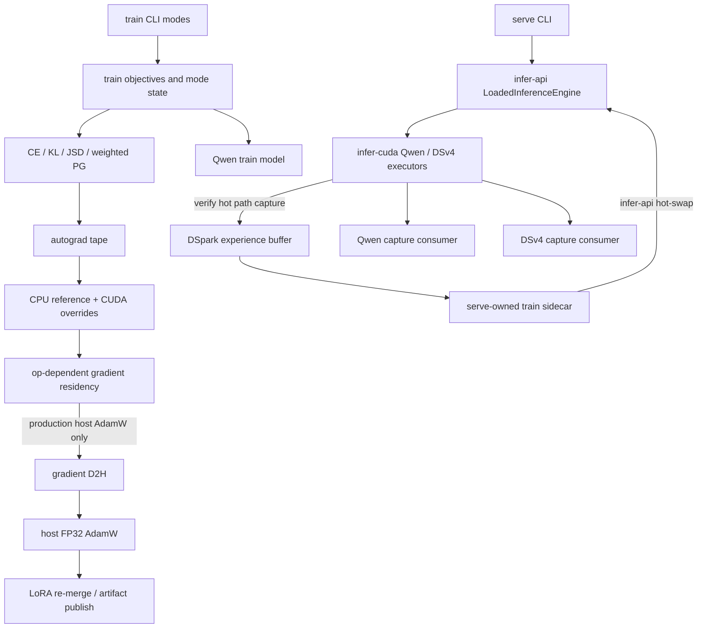
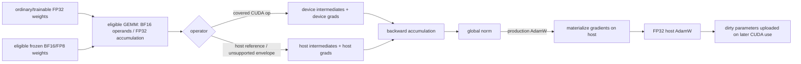

# ARLE Training Architecture, Algorithm, Precision, and Kernel Audit

**Date:** 2026-07-26
**Scope:** `crates/train`, `crates/autograd`, training-facing `infer-api` / `infer-cuda`, and CUDA kernels reached by training paths
**Method:** selected-reference source comparison plus adversarial source verification
**Evidence boundary:** the audit verdict below was based on the then-current source and existing tests. No CUDA performance or convergence claim is made.

**Post-audit update (2026-07-27):** the CP0-A behavior-denominator defect is fixed and runtime-accepted. Ratio-weighted online, stale, experience-replay, and offline-replay updates now consume the immutable generation-time `gen_logprobs` sidecar; malformed or absent evidence fails during shared preflight before model work. Focused local tests, CUDA/no-CUDA typechecks, an isolated H20 CUDA build, H20 offline replay positive/negative gates, and real online stochastic GRPO updates passed. The fresh gate trained 672 tokens from two variance-bearing trajectories (`is_ratio_mean=0.952895`, `is_ratio_max=9.580126`). The combined stale/replay gate then trained a stale four-trajectory / 1,756-token group (`mean=0.965588`, `max=4.973502`) and five age-1 replay updates of 1,756 tokens each; the final replay remained finite (`mean=0.965304`, `max=4.949177`) and the run exited 0. No performance or convergence claim is made.

The external comparison was intentionally selective. It covers GKD, MiniLLM, GRPO, DAPO, Dr.GRPO, GSPO, CISPO-like detached weighting, and FLA Gated DeltaNet at the level needed for the findings below. It does **not** claim complete method coverage for SAO, CISPO, DSpark/DFlash, ISO, perplexity evaluation, or `cc-convert`; those are excluded from paper-completeness claims unless explicitly discussed.

---

## 1. Executive verdict

ARLE has the right runtime-led training architecture, but several public algorithm identities and production lifecycle contracts remain incomplete.

Strong decisions:

- training reuses deployment model semantics instead of maintaining a second model implementation;
- OPD, self-OPD, rubric RFT, and agent RFT share one model/autograd substrate;
- `UpdatePreset` centralizes filtering, advantage, ratio, clipping ingredients, and aggregation;
- trainable parameters, gradients, losses, and AdamW state have a clear FP32 contract, while eligible frozen projections may use BF16/FP8;
- model artifacts are written to a fresh directory and published last;
- activation checkpointing preserves frozen/LoRA detach boundaries;
- generation-time behavior logprobs already exist as a serve-produced sidecar.

Primary gaps, classified by evidence rather than a fixed count:

- **P1 correctness:** no common finite-value transaction protects every optimizer mutation.
- **P1 correctness, fixed after the audit:** ratio-weighted online/replay updates now use the real generation-time sidecar as the behavior-policy denominator and fail closed on invalid evidence.
- **P1 algorithm identity:** GRPO/DAPO/Dr.GRPO/GSPO names are attached to a detached clamped-weight gradient, not their paper surrogates.
- **P1 kernel coverage:** host-taped GDN carry exists and CUDA recurrence has carry-forward substrate, but production taped carry forward/backward is not device-closed.
- **P1 kernel coverage:** Qwen3.6 MoE training is host-orchestrated around per-expert backend GEMMs.
- **P2 capability:** exact checkpoint continuation is unavailable.
- **P2 kernel/evidence:** beta-JSD and `fused-distill` are host reference paths.
- **P2 algorithm/evidence:** DSpark scaling, reduction calibration, and acceptance evidence are incomplete.

No unconditional repository-wide P0 was found. Two conditional run/claim blockers remain:

- **CP0-A:** a ratio-weighted update must not proceed unless its denominator is the generation-time behavior distribution, or sampling-distribution equivalence has been proved for that exact path.
- **CP0-B:** current runs must not be attributed to paper GRPO, DAPO, Dr.GRPO, or GSPO without relabeling or a paper-faithful surrogate.

The smallest correct order is:

1. finite mutation gate and sidecar-first behavior identity;
2. truthful algorithm names and gradient oracles;
3. close production taped GDN carry forward/backward on device;
4. define and implement exact-continuation schemas per mode;
5. then prioritize MoE, optimizer, distillation, and DSpark device work by measured full-step cost and licensed quality effect.

A framework rewrite is not justified.

---

## 2. Severity and evidence standard

| Level | Repository engineering meaning | Run / claim meaning |
|---|---|---|
| **P0** | Default or all production training is unusable or necessarily corrupt, with no valid path | The active run optimizes an invalid estimator, or the evidence cannot support its stated scientific claim; stop or block immediately |
| **P1** | A core mode can be wrong, or a central production device contract is structurally incomplete | Invalid under named preconditions; unaffected modes still exist |
| **P2** | Important capability, scalability, reliability, or evidence gap with bounded correctness blast radius | Results may remain useful, but fidelity, efficiency, or interpretation is limited |
| **P3** | Documentation or observability drift | Correctable without changing the computed result |

Static inspection can establish control flow, reductions, state schemas, synchronization, residency transitions, and unsupported configurations. It cannot establish performance magnitude, convergence, acceptance improvement, or paper-level quality parity.

### 2.1 CP0-A: behavior-policy identity — fixed after the audit

The audit found that serving already recorded the filtered generation-time probability, but training retained parallel sidecar and recomputed-denominator fields. Offline replay and fresh online updates reconstructed the denominator from the train model; stale updates alone promoted the sidecar. That was invalid whenever temperature or sampler filtering changed the distribution, and it made denominator identity depend on staleness.

The current worktree has one contract:

```text
behavior denominator = generation-time gen_logprobs sidecar
ratio-weighted survivor without aligned finite sidecar = error before model work
ratio-free CE/GKD = no sidecar requirement
```

`ScoredTrajectory` now has one `behavior_logprobs` field (`crates/train/src/update_strategy.rs:26-35`). `UpdatePreset::preflight` and the update seam share validation (`crates/train/src/update_strategy.rs:272-307`), while offline and online admission both bind `gen_logprobs` directly (`crates/cli/src/train_cli.rs:2458-2503,2651-2678,3575`). Staleness controls policy-version distance only. `capture_rollout_logprobs` remains solely for GSPO's current-policy sequence numerator (`crates/train/src/update_strategy.rs:447-454`).

Greedy online rollout cannot supply this evidence, so ratio-weighted presets reject `temperature <= 0` before expensive initialization; ratio-free training remains legal (`crates/cli/src/train_cli.rs:2857-2903`).

### 2.2 CP0-B: named-paper attribution

The current weighted policy-gradient path uses a detached clamped ratio factor. It can be a useful estimator, but it is not the sign-sensitive clipped surrogate of GRPO/DAPO/Dr.GRPO, nor the full sequence-level GSPO objective. Existing runs must be named by their implemented estimator or rerun after the objective and gradient match the reference.

### 2.3 Why there is no repository-wide P0

Dense KL/CE paths do not depend on policy ratios. CPU reference paths remain mathematically defined for GDN, MoE, and alternative distillation losses. Artifact checkpoints remain loadable. DSpark is optional. These facts bound the blast radius; they do not downgrade the conditional blockers.

---

## 3. Current architecture and ownership



DSpark is launched by serving, not `train_cli`: `crates/cli/src/serve.rs:218-234`. The verify hot path writes the shared experience buffer (`crates/infer-cuda/src/executor/dspark_train.rs:48-99`); the serve-owned sidecar drains it and hot-swaps through `LoadedInferenceEngine::update_dspark_markov_weights` (`crates/train/src/dspark_train.rs:750-805`). Qwen and DSv4 both contain capture consumers: `crates/infer-cuda/src/executor/qwen35.rs:2066`, `crates/infer-cuda/src/executor/dsv4.rs:1842,2139`.

The architecture weakness is fragmented lifecycle state, not the absence of another framework. Two transactions should exist across current components:

1. **Step transaction:** finite loss validation -> backward -> finite accumulated global norm -> clip -> optimizer mutation -> infer synchronization.
2. **Checkpoint transaction:** model/adapter -> optimizer -> schedule/step -> mode state -> RNG/sampler/replay state -> atomic publication.

---

## 4. Precision, residency, and backward flow



Backward residency is operator-dependent. D2H is not an inherent property of all backward rules; it is guaranteed at the current production host-AdamW mutation boundary. Production modes construct `AdamW::new` (`crates/cli/src/train_cli.rs:1230,1454,2021,2720,3188,4003,4242`), while the host optimizer mutates host tensors (`crates/autograd/src/optim.rs:26-43,130-201`).

| State | Current precision/residency | Assessment |
|---|---|---|
| Trainable parameters / LoRA | FP32 | Stable, memory-heavy |
| Loss graph / gradients | FP32 | Clear default; finite transaction incomplete |
| AdamW moments/update | FP32 host in production | Numerically conservative; forces mutation-boundary D2H |
| Eligible frozen projections | BF16 or block FP8 | Appropriately constrained |
| GEMM accumulation | FP32 | Correct |
| Some GDN saved tensors | BF16 with FP32 state | Requires parity gates |
| Global norm | FP64 host accumulation or backend clip path | Strong arithmetic, missing universal finite rejection |
| Teacher logits boundary | BF16 on relevant paths | Quality effect requires A/B |

This is not full AMP, QLoRA, or an 8-bit optimizer stack. The immediate correctness issue is non-finite mutation, not the amount of FP32.

---

## 5. Ranked findings

### 5.1 P1 correctness: no common finite-step transaction

**Evidence**

- a loss validator exists and rejects non-finite scalar losses: `crates/train/src/opd.rs:1063-1072`;
- some OPD paths invoke it before backward or step: `crates/train/src/opd.rs:1848`, `2265`, `4413-4421`, `4511-4521`, `4735-4757`;
- chunked KL explicitly sanitizes non-finite gradients and continues: `crates/train/src/opd.rs:657-677`, `4511-4521`;
- other paths reach optimizer mutation without the same loss/norm transaction: `crates/train/src/opd.rs:2827-2831`, `3294-3303`, `4099-4103`;
- DSpark performs backward and mutation before loss readback, then converts readback failure/absence to `0.0`: `crates/train/src/dspark_train.rs:512-544`.

**Required invariant**

```text
for each loss that will be backwarded:
    read/validate finite loss before that backward
accumulate all intended backward contributions
compute global norm over the complete accumulated gradient set
require finite global norm
clip
mutate optimizer exactly once
```

A non-finite loss or norm must skip parameters, moments, step/schedule, EMA, infer synchronization, and artifact publication. Sanitizing chunked KL gradients and continuing is a different algorithm and must not substitute for fail-closed production behavior.

### 5.2 Resolved correctness gap: behavior sidecar is authoritative

The CP0-A fix described in §2.1 removes the invalid post-generation denominator reconstruction. Focused tests cover missing, misaligned, and non-finite sidecars; zero-target and filtered trajectories do not acquire a false sidecar requirement. H20 offline replay proved that valid sidecars train across repeated epochs and malformed records fail before model initialization. Real online stochastic GRPO gates then covered both fresh and version-lagged experience-replay paths: the fresh run trained 672 tokens from two trajectories, while the combined run trained a `staleness=1` group for 1,756 tokens and five age-1 replay updates for 1,756 tokens each. Fresh, stale, and replay IS telemetry remained finite and the combined run exited 0, closing the runtime gate.

### 5.3 P1 algorithm identity: paper presets share the wrong surrogate gradient

**Evidence:** preset definitions are in `crates/train/src/update_strategy.rs:191-251`; the weighted path is described as detached weighting at `crates/train/src/update_strategy.rs:315-318` and implemented through `pg_token_weight` in `crates/autograd/src/ops/fused_linear_distill.rs:742-779`.

Current form:

\[
L(\theta)=-\operatorname{stopgrad}\!\left(A\,\operatorname{clip}(r,l,u)\right)\log\pi_\theta(a|s).
\]

The clamp affects the scalar weight but is detached from the ratio. Therefore the log-prob gradient remains non-zero on both sides of the interval whenever the detached weight is non-zero. In a PPO-style clipped surrogate:

- for **positive** advantage, the gradient saturates above the upper bound;
- for **negative** advantage, it saturates below the lower bound.

The current estimator does neither sign-dependent branch.

Ingredient-level comparison:

| Preset | Ingredient present | Material mismatch |
|---|---|---|
| GRPO | group advantage, per-token ratio, symmetric bounds | paper clipped surrogate absent; reference-policy KL term absent |
| DAPO | zero-variance-group filtering, overlong filtering, asymmetric clip bounds, token aggregation | paper clipped surrogate and advantage standardization absent; filtering is not DAPO's dynamic resampling to refill a fixed effective batch |
| Dr.GRPO | no std normalization, fixed normalization constant | paper's outer sample/group averaging is not represented by one global fixed-normalizer sum; clipped surrogate absent |
| GSPO | length-normalized sequence-ratio ingredient exists | scalar weighting/detach is not the paper objective; out-of-range behavior clamps to a non-zero saturated weight instead of the required sequence-level clipped-surrogate gradient |
| CISPO-like | detached clamped-IS weighting | closest description of the implemented gradient; paper-completeness was not fully audited here |

Keep `UpdatePreset`, but add an explicit surrogate kind rather than separate runners. Required gradient-oracle cases are positive/negative advantages with ratios below, inside, and above the interval.

### 5.4 P1 kernel coverage: GDN carry contexts are split

**Evidence**

- the host taped context already saves `initial_state` and `initial_conv_window`: `crates/autograd/src/ops/linear_attention.rs:489-497`, `646-676`;
- host backward re-seeds the saved carry: `crates/autograd/src/ops/linear_attention.rs:1151-1224`, `1288-1316`;
- the production taped carry forward still forces host materialization: `crates/autograd/src/ops/linear_attention.rs:499-564`;
- the device-forward result separately owns CUDA intermediates: `crates/autograd/src/backend.rs:336-388`;
- CUDA implements recurrent chunk carry inside the forward substrate: `crates/autograd/src/backend_cuda.rs:4664-4755`, `crates/autograd/src/backend_cuda/kernels/linear_attention.cu:1252`;
- carry presence bypasses device backward: `crates/autograd/src/ops/linear_attention.rs:1216-1249`.

The gap is not “carry is absent.” Carry exists in host tape context, and CUDA forward has carry propagation substrate. The gap is that external carry context and device-intermediate context are not one production tape record, so the taped carry path does not dispatch a device-resident forward/backward unit.

Required completion:

1. merge carry identifiers and device saved intermediates in one tape context;
2. connect the production taped carry call to CUDA forward seeding and convolution-window handling;
3. make CUDA backward consume that same boundary context;
4. verify output, input, recurrent-boundary, and convolution-weight gradients across multiple generated lengths;
5. prove by path probe that production frozen-prefix OPD fired carry-aware CUDA forward and backward without recurrent-unit `ensure_host`.

### 5.5 P1 kernel coverage: Qwen3.6 MoE is host-orchestrated

Router top-k/softmax, route metadata, packing, scatter, and substantial gradient assembly are host-mediated (`crates/autograd/src/ops/moe.rs:166-348,454-590,593-1125`). Frozen expert weights may remain resident for the grouped base forward/input-gradient helpers (`crates/autograd/src/ops/moe.rs:1753-1901`), but activations and trainable LoRA/gradient packing cross host-managed per-expert backend GEMM calls (`crates/autograd/src/ops/moe.rs:593-698,827-1091,1935-2180`). This is a host-orchestrated hybrid, not a fully host-computed MoE and not a device-native sparse pipeline.

Training TP also needs precise scope:

- a full-attention Qwen training TP substrate exists, including autograd all-reduce: `crates/train/src/qwen35.rs:180-250,311-320`;
- a distributed finite-difference verification executable exists: `crates/train/examples/a2_qwen35_tp_lora_fd.rs:1-13,191-264`;
- production CLI orchestration for training TP is absent;
- hybrid GDN and MoE training TP are explicitly unsupported by validation: `crates/train/src/qwen35.rs:212-224`.

The next dependency chain is GPU routing metadata -> permutation/inverse permutation -> resident grouped GEMM/LoRA -> backward -> production TP orchestration. Do not describe all training TP as nonexistent.

### 5.6 P2 kernel/evidence: beta-JSD and `fused-distill` are host references

Interior beta-JSD reads logits to host and reduces over rows/vocabulary; dense/sparse `fused-distill` reads hidden/head/teacher data to host and executes scalar loops: `crates/autograd/src/ops/fused_linear_distill.rs:18-98,126-360`. “Fused” is graph composition, not a fused CUDA kernel.

This is P2 because standard dense KL remains the production device path. Mark these paths as reference/experimental in CUDA production. Port only after a quality result licenses the objective and a profile shows the path matters.

### 5.7 P2 capability: exact checkpoint continuation is unavailable

The v2 codec stores a bounded schema: scalar step/schedule fields, grad accumulation, one RNG seed, and AdamW moments (`crates/train/src/checkpoint.rs:58-75,85-138`). Production mode runners construct fresh AdamW instances and artifact saves do not call the codec (`crates/cli/src/train_cli.rs:501-550,1230,1454,2021,2720,3188,4003,4242`).

The gap is an **exact-continuation capability**, not merely an unwired codec. The current schema itself does not cover every mode's required state, including as applicable:

- EMA/self-teacher state;
- critic/baseline state;
- replay contents and priorities;
- policy version and synchronization position;
- prompt/task sampler and data-order state;
- all relevant RNG streams;
- DSpark baseline/ISO/publish cadence state.

Required change: define a per-mode continuation manifest, extend the schema for that manifest, save it in the same publication transaction, and reject “exact resume” for modes that cannot restore it. “Wire the existing codec” alone is insufficient.

### 5.8 P2 algorithm/evidence: DSpark reduction and acceptance claim are uncalibrated

The implemented branches use different reductions:

- PG: divide by `weight_sum`;
- probability squared error: divide by `weight_sum * vocab_size`.

See `crates/train/src/dspark_train.rs:460-510`. The source TV comment is also wrong at `crates/train/src/dspark_train.rs:470-472`.

For distributions \(p,q\), maximal-coupling agreement is \(1-TV(p,q)\), where \(TV=\tfrac12\|p-q\|_1\). This statement applies to a **sampled maximal coupling**; it is not a general identity for every speculative acceptance rule. An L2 probability loss is neither TV nor guaranteed to have its gradient direction.

Do not prescribe row-sum as mathematically mandatory. The correct finding is a calibration/evidence gap: the branch scales and `alpha` interpretation require gradient-norm calibration or a target-metric ablation. Repository notes that an earlier A/B did not improve acceptance are prior repository evidence, **not a rerun by this audit**.

### 5.9 P2: DSpark capture/training remains synchronous and host-backed

The verify capture performs separate draft/target D2H operations and stream synchronization (`crates/infer-cuda/src/executor/dspark_train.rs:102-170`). The trainer uses `CpuBackend` and host AdamW (`crates/train/src/dspark_train.rs:184-205`). This is a scaling gap, not evidence of a wrong numerical result. First license acceptance improvement; then measure capture and trainer cost before selecting async transfer or CUDA training work.

### 5.10 P2: unfinished flags have asymmetric failure behavior

- positive `gkd_entropy_weight` emits a warning/TODO and continues as a no-op: `crates/train/src/opd.rs:3948-3991`;
- negative entropy weight has no validated semantic contract;
- `teacher_topk` is accepted into configuration and rejected only at the first writeback step after expensive model/teacher initialization: `crates/train/src/opd.rs:1147-1170,4565-4570`; construction sites include `crates/cli/src/train_cli.rs:1297-1303`.

Validate all objective flags before expensive initialization. A requested objective must either run or fail closed; warning-and-continue is not acceptable.

### 5.11 P2: EOS and EMA are explicit algorithm choices, not neutral details

Token-KL rollout forces exact length by setting `ignore_eos=true` and clearing stop IDs (`crates/train/src/infer_student.rs:130-169`). This is an explicit approximation to the deployment distribution. Keep it only as a named fixed-length objective or align default rollout/masking with deployment termination.

EMA updates LoRA `A` and `B` parameters elementwise (`crates/train/src/ema_self_teacher.rs:206-235,376-396`). This is an **exact EMA in the chosen factor-parameter space**. Since `EMA(B)EMA(A) != EMA(BA)` in general, delta-space EMA is a different candidate algorithm, not a correction to an inexact parameter EMA. Compare them only through a quality experiment.

---

## 6. Algorithm comparison

### 6.1 GKD and ARLE's lambda blend

ARLE's dense path has the core GKD shape: student-generated rollout -> teacher scores the same sequence -> token divergence -> student update. With `gkd_lambda = 0`, the student rollout is the fully on-policy endpoint of rollout-source choice for this implementation. It is not a divergent failure mode.

For general `gkd_lambda`, ARLE blends KL with a hard-token CE/SFT anchor (`crates/cli/src/args.rs:1527-1534`). That is an ARLE-specific KL/SFT objective blend. It is not the GKD paper's mixture of student- and teacher-generated sequences, so lambda must not be described as paper GKD mixture interpolation.

### 6.2 MiniLLM

MiniLLM targets **token-distribution reverse KL** but optimizes it with a **sequence-level policy-gradient estimator**, together with its sampling and normalization design. ARLE's direct token-distribution reverse-KL loss supports the same divergence direction; it does not thereby implement the MiniLLM sequence-level estimator.

### 6.3 Rubric RFT

The sample -> judge -> accepted masked-CE path is coherent. Its open issues are selection fairness, swallowed offload errors (`crates/train/src/rubric_opd.rs:366-423`), judge/evidence quality, and exact continuation—not target-mask construction.

### 6.4 Agent RFT

Tool/environment tokens remain context while being excluded from supervised targets. The central issues are behavior-policy identity and surrogate naming. `UpdatePreset` should remain the common data model; add explicit surrogate semantics rather than new runners.

### 6.5 DSpark

The integration is real and serve-owned. Its status is **experimental; scaling and effectiveness not licensed by this audit**. Source proves the path exists and identifies reduction/synchronization behavior. It does not prove acceptance improvement.

---

## 7. Kernel and capability matrix

| Area | Current implementation | Classification |
|---|---|---|
| Dense BF16 GEMM | BF16 operands, FP32 accumulation | Competitive within current scope |
| Standard CE/KL | Device matmul and softmax/log-softmax | Main path covered |
| beta-JSD | full-logit D2H + CPU reduction | P2 reference path |
| `fused-distill` | host loops after D2H | P2 reference path; name overstates kernel fusion |
| SDPA | CUDA in supported envelope; host fallback outside it | Shape coverage incomplete |
| GDN no-carry | CUDA production envelope | Covered within declared shape |
| GDN carry | host carry tape + CUDA carry substrate, contexts not merged | P1 production device-closure gap |
| Qwen3.6 MoE | host orchestration around resident frozen-base/backend GEMMs | P1 device-residency gap |
| Agent PG | device logits/gather, host-managed weighting path | Hybrid; algorithm identity incomplete |
| AdamW | device-capable substrate exists; production uses host constructor | P2 wiring/performance gap |
| Activation checkpointing | recomputation and offload support | Strong structural coverage |
| Exact continuation | bounded v2 codec, no complete production mode schema | P2 capability gap |
| DSpark capture | blocking vocab-wide host transfers | P2 scaling gap |
| DSpark trainer | CPU backend + host AdamW | P2 experimental path |
| Training TP | full-attention substrate + verification executable | Capability exists; production CLI and hybrid GDN/MoE unsupported |

Kernel coverage requires production dispatch, actual shape/dtype support, forward/backward closure, observable fallback, path proof, parity, and measured performance before performance claims.

---

## 8. Existing tests check these properties when executed

No tests were run for this audit revision. The repository contains tests for primitive autograd, CPU numerical contracts, selected backend parity, masking/loss behavior, LoRA/loaders, activation checkpointing, small OPD flows, and DSpark surrogate convergence. CUDA tests may skip when a GPU/backend cannot initialize; a skipped test is not device-path evidence.

Critical gates still needed:

1. **Whole-step finite skip:** non-finite loss or accumulated norm leaves parameters, moments, schedule, EMA, infer state, and publication unchanged.
2. **Behavior sidecar:** completed locally and on H20 for offline replay and a real online stochastic ratio update.
3. **Surrogate gradient oracle:** positive/negative advantages, ratio below/inside/above bounds, including GSPO sequence-level cases.
4. **Production GDN carry:** path probe plus forward/input/carry-boundary/conv-weight parity across lengths.
5. **Save-exit-resume equivalence:** uninterrupted versus process-exit continuation for each mode claiming exact resume.
6. **DSpark target metric:** acceptance or accepted tokens per target step, not only surrogate loss.
7. **GPU path proof:** non-skipped execution evidence for claimed CUDA GDN, SDPA, MoE, TP, and PG coverage.

---

## 9. Recommended implementation order

### Phase 1: mutation and estimator identity

1. enforce finite validation before every loss backward;
2. enforce finite global norm after all accumulation and before any mutation;
3. remove gradient sanitization as a silent production continuation policy;
4. ~~switch ratio estimators to generation-time behavior logprobs;~~ **completed**
5. ~~fail closed when sidecar evidence is absent or invalid;~~ **completed**
6. move entropy/top-k capability validation before expensive initialization.

**Exit gate:** whole-step finite-skip and sidecar-authority tests pass.

### Phase 2: algorithm identity

1. add explicit surrogate semantics to `UpdatePreset`;
2. implement paper-faithful clipped gradients where names are retained;
3. add missing objective ingredients or rename presets to their actual estimator;
4. describe GKD lambda as ARLE's KL/SFT blend and MiniLLM at estimator precision.

**Exit gate:** scalar loss/gradient oracles pass for every public preset.

### Phase 3: production GDN carry closure

1. merge host carry and device-intermediate tape contexts;
2. connect external carry to CUDA forward;
3. close carry-aware CUDA backward;
4. prove production path and parity.

**Exit gate:** frozen-prefix OPD fires device carry forward/backward without recurrent-unit host materialization.

### Phase 4: exact continuation

1. specify per-mode continuation manifests;
2. extend—not merely wire—the v2 schema;
3. publish model and complete trainer state transactionally;
4. reject exact resume for incomplete modes.

**Exit gate:** deterministic save/process-exit/resume equivalence.

### Phase 5: measured hot-path work

Prioritize by measured full-step contribution and licensed objective value: MoE routing/permutation and LoRA closure; production device AdamW; alternative distillation; DSpark transfer/trainer scaling. Full-attention TP should receive production orchestration before claiming general training TP; hybrid GDN/MoE TP requires separate support.

---

## 10. What should not be done

- Do not rewrite `train` around a new framework.
- Do not split one update loop per paper name.
- Do not treat `--sync every-group` as a universal substitute for generation-time behavior probabilities.
- Do not continue a ratio-weighted update with missing behavior evidence.
- Do not call a detached clamped weight GRPO/DAPO/Dr.GRPO/GSPO without matching its gradient.
- Do not describe GKD lambda as the paper's rollout-mixture coefficient.
- Do not call factor-space EMA approximate; call delta-space EMA a different candidate algorithm.
- Do not prescribe a DSpark row-sum reduction without calibration evidence.
- Do not port DSpark to CUDA before acceptance benefit is licensed.
- Do not generalize GDN dimensions before closing the actual production carry path.
- Do not call host-orchestrated GEMMs a device-native MoE pipeline.
- Do not say training TP is absent; distinguish the existing full-attention substrate from missing production orchestration and unsupported hybrid/MoE TP.
- Do not call host graph composition kernel fusion.
- Do not treat successful CPU fallback or GPU-skipped tests as CUDA coverage.
- Do not claim performance effects from this source-only audit.

---

## 11. Final classification

| Subsystem | Classification | Evidence-based reason |
|---|---|---|
| Overall architecture | Competitive but incomplete | correct runtime authority; fragmented step/checkpoint transactions |
| Dense OPD/GKD | Competitive substrate | on-policy student endpoint at lambda 0; general lambda is ARLE KL/SFT blend |
| MiniLLM relation | Divergence overlap only | token reverse KL exists; sequence-level PG estimator is not implemented |
| Self-OPD | Experimental/competitive substrate | exact factor-parameter EMA; deployment/quality and continuation gaps |
| Rubric RFT | Usable, not fully licensed | coherent masked CE; selection/resource/evidence gaps |
| Agent RFT | Denominator contract fixed; named claims still blocked | generation-time sidecar is authoritative; detached surrogate remains mislabeled |
| Precision | Stable but conservative | clear FP32/BF16/FP8 boundary; finite transaction incomplete |
| GDN training | P1 device-closure gap | host carry context and CUDA intermediates are not one production taped unit |
| Qwen3.6 MoE | P1 host-orchestrated hybrid | frozen weights may remain resident; routing/activation/gradient orchestration is host-mediated |
| Distillation alternatives | P2 reference paths | beta-JSD and `fused-distill` are host-backed |
| Optimizer | P2 production wiring gap | host AdamW binds mutation-boundary D2H |
| Artifact publication | Strong | fresh directory and publish-last semantics |
| Exact continuation | P2 capability gap | current schema and production wiring do not cover complete mode state |
| DSpark | P2 experimental/evidence gap | serve integration is real; reduction, scaling, and target-metric evidence incomplete |
| Training TP | Partial capability | full-attention substrate and verification executable exist; CLI/hybrid/MoE support absent |
| Test evidence | Useful when executed, not run here | GPU tests can skip; production identity gates remain missing |

The immediate unresolved contracts are finite mutation, truthful surrogate gradients, and carry-aware GDN device closure. Behavior-policy identity is now enforced by the generation-time sidecar. Exact continuation follows as a schema design task, not a codec wiring task.

---

## 12. Primary external references

- Agarwal et al., [GKD: Generalized Knowledge Distillation for Auto-regressive Sequence Models](https://arxiv.org/abs/2306.13649).
- Gu et al., [MiniLLM: Knowledge Distillation of Large Language Models](https://arxiv.org/abs/2306.08543) and the [official implementation](https://github.com/microsoft/LMOps/tree/main/minillm).
- Yu et al., [DAPO: An Open-Source LLM Reinforcement Learning System at Scale](https://arxiv.org/abs/2503.14476) and the [official repository](https://github.com/BytedTsinghua-SIA/DAPO).
- Liu et al., [Understanding R1-Zero-Like Training: A Critical Perspective](https://arxiv.org/abs/2503.20783) and the [official Dr.GRPO implementation](https://github.com/sail-sg/understand-r1-zero).
- Qwen Team, [Group Sequence Policy Optimization](https://arxiv.org/abs/2507.18071) and the [official introduction](https://qwenlm.github.io/blog/gspo/).
- FLA team, [Flash Linear Attention](https://github.com/fla-org/flash-linear-attention), including gated-delta-rule chunkwise references.

These are selected comparison points, not a claim that every named upstream method or auxiliary ARLE subsystem was exhaustively audited.
